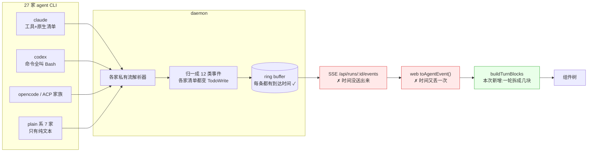
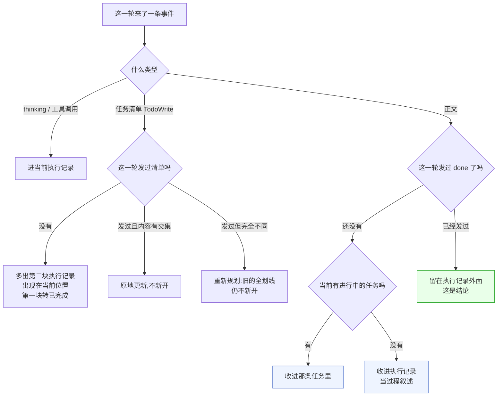
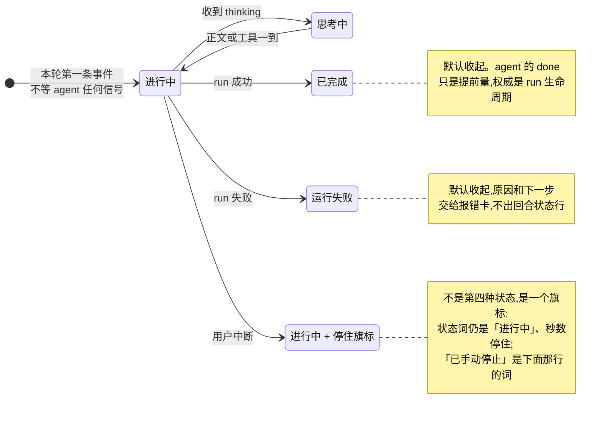
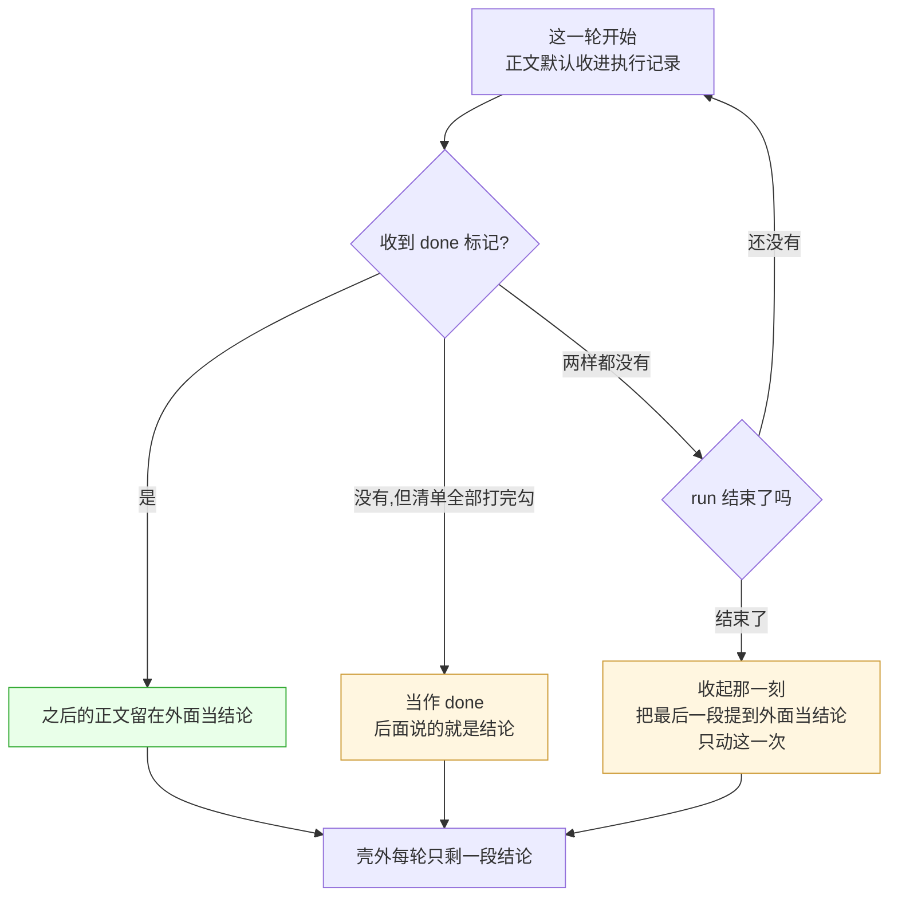

# 20260823 ChatPanel 重构 Dev Design

> 按 Plane「Dev Design 模板」(`pages/fc9ec07b`)重梳一遍。**Plane 页面**:`pages/70da5c18-9004-4a21-b723-b502d8e5cc60`(2026-08-23 发布,内容与本文件同源;改了本文件要重新同步过去)。
> **图**:PNG 与重出脚本在 `docs/design/chat-panel-diagrams/`。本文里的图用 mermaid 源码写(GitHub 直接渲染);Plane 不渲染 mermaid,那边是同一份源码渲成 PNG 传上去的 —— 改图先改这里的源码,再重出 PNG 换掉 Plane 上那张。
> **权威规格仍是 `chat-panel-next.md`**(决策 D1–D43、对齐状态 §13 是开工闸门);本文是它的架构视角复述 + 模板要求但那边没有的几节(情景分析、上线、稳定性)。两边冲突时以 `chat-panel-next.md` 为准,并回填本文。

---

## 一、概要

### 背景

ChatPanel 是用户唯一能看到 agent 在做什么的地方,现在有三个问题:

1. **过程读不懂。** OD 的 skill 引导让 agent 把读、搜、查全塞进 `Bash`:真实录制 claude-shop 一轮 84 次 `Bash` / 8 次 `Read`;codex 14 条命令全叫 `Bash` 且没有 description。照工具名分类,整列都是「运行命令」。
2. **进度看不出。** 任务清单在界面上有两处(钉在输入框上方的 TodoCard + 消息里的工具组),同一份清单显示两遍;哪一步在跑、跑了多久、哪一步空转,都看不出来。
3. **代码扛不住。** `ChatComposer.tsx` 6014 行 · `ChatPane.tsx` 5123 行 · `AssistantMessage.tsx` 4245 行 · `styles/chat.css` 2951 行,样式非单一所有者,测试绑死全局类名。

设计交付了新稿(24 个组件 / 84 个状态),这次按它 1:1 重做,顺带把通用部件沉淀成组件库。

### 价值

- 一轮的**过程**收在一块可折叠的「执行记录」里,**结论**留在外面 —— 用户想读结论不用翻过程,想核过程点开就有。
- 每个动作说人话:「读取 规格.md 0.4s」「搜索 `gap` 2 处」「改写 settings.html +7 −3」,而不是一行 `Bash`。
- 任务清单只显示一处,逐条打勾,能看出做到哪一步、每步花了多久。
- 失败有下一步(联系支持 / 导出日志 / 从失败处重试),不再只是一行红字。

### 范围

**动**:`apps/web` 的 chat 组件树与 `runtime/chat` 纯函数、`packages/components` 的 Button 等通用原子、`packages/contracts` 两个事件字段、`apps/daemon` 三处(工具时间戳透传、ACP `todowrite` 归一、生图任务接口)。

**明确不动**:云端(vela / powerformer 后端)· 暗色解禁(D20,产品已裁决强制亮色)· Plan 卡(组件 6,S9 搁置)· 场景稿那张「执行中 2/4」进度卡(D33)· 附件上传管线与队列的后端逻辑 · skill 本身(D7)。

### 名词解释

| 词 | 意思 |
|---|---|
| **执行记录 / 壳** | 一轮里装「过程」的可折叠块:thinking、工具调用、任务清单分段、过程叙述。头上是状态词 + 耗时。它是**通用容器,没有类型**(D11) |
| **过程叙述 vs 结论** | 同样是 agent 说的话:`done` 之前的是过程叙述(收在壳里),`done` 之后的是结论(留在壳外)。D43 |
| **`done`** | agent 自己发的「活干完了,下面是结论」信号,走**正文里的自闭合标记**(草案 `<done/>`),不走工具参数。D43 |
| **run 生命周期 vs agent done** | 收起执行记录以 **run 终止**为准(100% 可靠);`done` 只是提前量。§5.6 |
| **平铺 vs 分段** | agent 发了任务清单 → 壳内按 todo 分段;没发 → 所有动作平铺。**平铺是基线,分段是增强** |
| **召回** | 上一轮的 todo 在这一轮的清单里又出现(判据 = 内容交集,D17);召回只控制划线,能不能展开只看**本轮有没有内容**(D25) |
| **产物 vs 附件** | 产物 = 这一轮交出去的东西(大卡,可发布 / 导出);附件 = 用户发进来的文件。顺手生成的 csv / md 两者都不是,只在工具行里出现文件名 |

### 设计难点

1. **27 家 agent 的能力参差**,而 UI 只有一套。有的不发工具事件(plain 系 7 家)、有的没有任务清单、有的 thinking 全是空串(claude 实测 1167/1167)、有的拿不到工具耗时(codex 的 `tool_use` 与 `tool_result` 同时到达)。**兜底不是异常分支,是主路径**(§5.6)。
2. **流式下位置不能回溯挪动。** 一段话先显示在壳外、后来又挪进壳里,用户会看到文字跳一下 —— 候选 E 就是因为这个代价被否的。所有落块规则必须「一次到位」,只有 run 结束那一刻允许有一次重排。
3. **时间信息在链路里丢过两次。** daemon 的 ring buffer 每条事件都盖了 `record.timestamp`,但 SSE 只发 `(event, data, id)`、web 的 `toAgentEvent()` 也不带 —— 数据一直都在,只是没送出来。

### 关联材料

- 权威规格 `specs/current/chat-panel-next.md`(§13 对齐状态 = 开工闸门)· 排期 `chat-panel-next-plan.md`
- 评审文档(飞书 `WwIsdvv0Aot72PxtpKNclC3jnge`)· 设计与产品第 1 轮评审意见(飞书 `QeXWwN6XFi8rOLk8EjScz6u9n7d`)
- 设计稿:PR #7170 head **`1bbdce0b06`**(24 组件 / 84 态),仓库内 `docs/design/chat-panel-next.html`(组件稿)与 `chat-panel-scene.html`(场景稿)
- **场景模拟器 `docs/design/chat-sim/`** —— 技术评审以它为载体(D27),不以文档里的状态机图为准
- Plane「ChatPanel 优化」module `e0f1dc97`(work item 2185–2205)

---

## 二、架构设计【必填】

### 跨哪几个仓

**不跨仓,全部在 `open-design`。** 与 vela 的关系只是数据源:AMR 是 vela CLI 的 ACP stdio 模式,事件经 `apps/daemon/src/agent-protocol/acp/` 解析进来 —— 归一的 bug 在 **OD 这边**(`updates.ts:415` 的 `acpToolNameFromKind`),不需要 vela 配合。不新增任何外部服务依赖。

### 落在哪个包

```
packages/contracts        ← 先动:两个可选字段(工具开始/完成时间)
   │  web 不能 import daemon,跨 web/daemon 的东西只能走这里
   ├── apps/daemon
   │      agent-protocol/acp/updates.ts     ACP todowrite 归一(一行分支)
   │      runtimes/*-stream.ts              解析时盖开始时间
   │      server.ts / SSE                   把时间随事件送出去
   │
   └── apps/web
          runtime/chat/         纯函数(无 JSX/DOM):buildTurnBlocks、tool-kind、todos
          components/chat/primitives/   L1 原子:Foldable / StatusMark / ToolRow / SayText
          components/chat/              业务组件:ExecutionShell / TodoSegment / 产物卡 / 报错卡 …
          providers/daemon.ts   toAgentEvent():把新字段带进来

packages/components       通用原子(Button `mod-sm` 等),chat 专用的不放这里
```

**为什么这么分**:`apps/web` 不能 import `apps/daemon/src`(根 AGENTS.md 的硬约束),两者集成只能走 HTTP API + `packages/contracts`。所以凡是跨 web/daemon 的改动,**契约先定、再动两边**;契约文件同时是并行开发的分界线,改它 = 打断并行,必须先同步全体(§6)。

`runtime/chat/` 是纯函数层,这样落块规则可以脱离 React 单测,也让模拟器(`docs/design/chat-sim/sim.js`)能作为它的原型直接对照。

### 谁会调它

`AssistantMessage.tsx` 与 `ChatPane.tsx` 是唯一接入点 —— 也是**唯一的串行瓶颈**:四条线(地基 / 数据 / 组件 / 收口)可以并行,最后都汇到这里。

### 决策与代价(为什么这么放)

| 决策 | 代价 / 放弃了什么 |
|---|---|
| **D7 维持 `Bash`,靠嗅探 command 做可视化** | 嗅探永远只是猜(管道、变量、复合命令都要规则)。放弃的方案是改 skill 让 agent 用专用工具 —— skill 是产品行为,影响面远大于改 UI |
| **D9 / T10 Claude 的清单来源** | 原计划经 MCP 注入 todo 工具;但 daemon 已有 Claude 原生 `TaskCreate`/`TaskUpdate` → `TodoWrite` 的归一路径(带测试),三条真实录制却零出现。**T10:实测复核之后再定**,在此之前不按「必须注入」排期 |
| **D10 + D11 执行记录永远出现、且无类型** | 推翻了我原本的「有过程才出壳」和「壳分两类」。代价:plain 系整轮是一张空壳(T6 待定是否结束时移除) |
| **D29(F)+ D42(A)+ D43** | 第一张壳钉在本轮正文上方;发清单多出第二张;`done` 之前的正文进壳。代价:位置规则有三条,实现时容易漏 —— 用模拟器 15 个场景兜住 |
| **D20 暗色结构就位不解禁** | 新组件只消费 `--chat-*` 语义层,亮暗两个作用域都定义、暂时同值。将来解禁只改这一段映射,组件零改动;代价是现在多一层间接 |
| **B17 钉住的 TodoCard 退场** | 清单只在执行记录里出现一次。代价:根 `AGENTS.md` 的 `PinnedTodoSlot` 约定要同 PR 改掉,`latestTodoWriteInputForPinnedCard` 等只服务钉卡的逻辑随之下线 |
| **D8 `thinking-orbs` 装 npm 包** | 不内联 25KB 引擎。稿子内联只是为了单文件可双击 |

### 开工前要先解的六个障碍

样式非单一所有者(`viewer/routines.css` 带父级特异性覆写 `.app .chat-log`)· 测试绑死全局类名 · `splitTaskActivity` 把整条消息压成一个扁平 TaskActivity **且特意排除 TodoWrite** · primitive 迁移未收口(`packages/components/styles.css` 用裸 `button` 选择器作用全局)· token 分散三处 · i18n 每个新 key 固定改 20 个文件(`types.ts` + 19 个语言文件)。

---

## 三、流程设计【必填】

### 主流程(一切正常)

| # | 谁触发 | 输入 | 输出 | 交给谁 |
|---|---|---|---|---|
| 1 | 用户点发送 | 文本 + 附件 | `POST /api/chat` | daemon |
| 2 | daemon 起 run | prompt | 子进程 stdin | agent CLI |
| 3 | agent | — | 各家私有流(stream-json / JSONL / ACP JSON-RPC / 纯文本) | daemon 解析器 |
| 4 | daemon 解析器 | 私有流 | **归一成 12 类 `PersistedAgentEvent`**,盖 `record.timestamp` | ring buffer + SQLite |
| 5 | daemon | 事件 | SSE `/api/runs/:id/events` | web `providers/daemon.ts` |
| 6 | web | 事件数组 | **`buildTurnBlocks`** 落块 | 组件树 |
| 7 | 组件树 | blocks | DOM | 用户 |


**图 1 · 从 agent 到界面:红色两处是时间信息丢失点,绿色是本次新增**



第 6 步的落块规则(本次核心,D29 + D43):

```
[壳 1]  thinking + 探路工具调用 + 过程叙述(done 之前的正文),钉在本轮正文上方
[壳 2]  agent 一发清单就出现在当前位置:执行计划 N 步 + 每条 todo 一个抽屉
          todo 进行中期间的工具 / thinking / 正文,全部收进那条 todo
          一条 todo 关闭 → 后续内容进下一条
   产物卡     写产物文件那一刻就出现(先是生成中的灰占位),run 结束定格
   结论正文   done 之后 / 清单全部关闭之后,回到壳外
   回合状态行 → 下一步引导
```

**图 2 · 一条事件到了,它落在哪里(D29 + D42 + D43)**



### 异常流程(8.1 与 8.3 直接取用这一节)

| 在哪一步失败 | 停在哪 | 那一刻的数据状态 | 界面 |
|---|---|---|---|
| SSE 断(第 5 步) | 事件流中断,run 仍在跑 | 已收到的事件完好,后续缺口 | 输入框上方出重连行「第 N / 共 M 次」;恢复后整行消失、不留「已恢复」;用尽换成「重新连接」交回给人 |
| run 失败(第 3 步 agent 崩 / 非零退出) | run 终止 | 已落的事件保留;产物可能写了一半 | 壳头转「运行失败」**默认收起**,下面出报错卡(原因 + 联系支持 / 导出日志 / 从失败处重试),**不出回合状态行** |
| 用户中断 | run canceled | 进行中的 todo 停在半路 | 壳头保持「进行中 · 31s」秒数停住;下面「已手动暂停任务」+ 回合状态行「已手动停止」 |
| agent 从不发 `done` | 正常结束 | 全部正文都在壳里 | **兜底**:run 结束那一刻把最后一段叙述提出来当结论(只在收起那一刻重排一次) |
| agent 从不发清单 | 正常结束 | 无分段 | 平铺形态(基线) |
| agent 从不标 `in_progress`(codex) | 正常结束 | 清单只有 pending → completed | **隐式进行中**:第一条未完成的视为当前(D36) |
| `tool_use` 没有配对的 `tool_result` | 调用还没回来 | 半条 | 不落行(D3:无「执行中」档);生图行例外,它出一张落一张 |
| thinking 全是空串(claude) | — | 只有「在想」这个事实 | 壳头换「思考中」(球 + 扫光 + 三点),无箭头无正文;正文 / 工具一到撤回 |
| 产物写了但 run 失败 | run 终止 | 文件在,`end.artifactPaths` 不一定有 | 生成中的卡定格;`end` 给了名单就以名单为准 |
| 额度不足 / 耗尽 | run 起不来或中途停 | — | 升级卡(余额 < 5 出提示;为 0 出「现在无法开始新任务」) |

### 状态机

**执行记录(壳)**:只有三态 —— `进行中` / `已完成` / `运行失败`;手动停止**不是第四态**,是壳上的 `stopped: boolean` 旗标(状态词保持「进行中」,「已手动停止」是下方回合状态行的词)。

```
进行中 ──run succeeded──▶ 已完成(默认收起)
   │  └──agent done──▶ 提前收起(仍以 run 终止为准)
   ├──run failed────▶ 运行失败(默认收起,报错卡接手)
   └──run canceled──▶ 进行中 + stopped(秒数停住)
```

**图 3 · 执行记录只有三态,手动停止是旗标不是第四态**



**todo 分段**:`pending → in_progress → completed`;`stopped`(中断时正在跑的)、`abandoned`(重新规划时旧清单全部划线并转完成态)。

**done 分界**:`未发 → 已发`,单向;`<question-form>` / `<artifact>` 出现即隐式已发;清单全部关闭即隐式已发。

---

## 四、情景分析【必填】

### 等价类划分

| 维度 | 等价类 | 组内怎么变都一样 / 组间必须分别验 |
|---|---|---|
| **agent 能力** | ① 全事件(claude / codex / opencode:工具 + 清单)② ACP 家族(8 家,`acp-merge`)③ AMR(vela ACP,终端输出打码)④ plain 系(7 家,只有纯文本) | 每类各验一轮;plain 系是空壳主路径 |
| **清单来源** | ① agent 原生(codex `todo_list` / opencode 等 `write_todos` / claude `TaskCreate`)② 无清单 → 平铺 ③ (待 T10)MCP 注入 | 清单来源不同但 daemon 已归一成 `TodoWrite`,UI 只认归一后的形状 |
| **运行结果** | 成功 / 失败 / 用户中断 / 断线未恢复 | 四条各自有不同的收尾 UI |
| **正文位置** | done 之前(进壳)/ done 之后(壳外)/ todo 进行中(进 todo) | 三个落点 |

### 边界值分析

| 量 | 取值 |
|---|---|
| 工具调用数 | 0(plain 系)/ 1 / 84(claude-shop 实测一轮) |
| 单次工具耗时 | < 100ms(调用与结果同批到达,**当未知不显示**,不能出「0.0s」)/ p50 159ms / max 1.7s(claude-shop 实测 47 次调用) |
| todo 条数 | 0(不出清单卡)/ 1 / 4 / 重新规划后两组并存 |
| todo 内容 | 有内容(可展开)/ **无内容**(划线 + 不可展开,D35)/ 正在跑但还没产出(不划线) |
| 正文长度 | 0 字(整轮只有工具)/ 一句 / 整屏总结(claude-brief 那轮 566 条 delta) |
| 附件 | 0 / 1 / 多个 + 超长文件名(截断阈值 S12 待设计答) |
| 产物 | 0 / 1 / 多个(谁上大卡 = S5 待定)/ 视频 / 音频 |
| 生图 | 0/4 → 2/4 → 4 张收成一行;部分失败不收行 |
| 一轮内壳数 | 1(无清单)/ 2(发了清单)/ **不会有第 3 张** |

### 状态转换

- 中断 → 说「继续」→ 清单被召回:已完成那条划线且不可展开,进行中那条接着做、展开只有**本轮新增**。
- 做到一半 → `todo_abandon(reason)` → 发新清单:旧的全部划线转完成态,**不开新壳**,理由按壳内纯文本渲染;一块里出现两组任务。
- 断网 → 重连 1/5 → 恢复 → 再断 → 5/5 → 交回给人 → 点「重新连接」→ 恢复。
- 余额充足 → < 5 美金(升级卡)→ 0(无法开始新任务)。
- 同一 todo:`pending → in_progress → completed` vs `pending → completed`(从没进行过)—— 后者是**无内容 todo**,形态不同。

### 成对组合(示例,不是全排列)

| 运行结果 | 有无正文 | 工具结果 | 有无清单 | 预期 |
|---|---|---|---|---|
| 成功 | 有 | 全成功 | 有 | 两张壳,壳外一段结论,产物卡 + 反馈行 + 下一步 |
| 成功 | 无 | 全成功 | 无 | 一张壳(收起),壳外无正文,只有反馈行 |
| 失败 | 有 | 有失败行 | 有 | 壳头「运行失败」收起 + 报错卡,**无回合状态行** |
| 中断 | 有 | 有半条 | 有 | 壳保持「进行中」秒数停住 + 暂停行 + 「已手动停止」 |
| 成功 | 有 | 工具失败但原因枚举不出来 | 无 | 失败行只给「失败」按钮(写法一);能枚举的走写法二(原因跟在名字后面)—— **两种写法是否有意区分 = S1 待设计答** |

### 漏过的维度

| 维度 | 这次的答案 |
|---|---|
| **权限** | 共享项目的只读成员能不能看执行记录 / 点「从失败处重试」/ 导出日志?**未验证,需产品定** —— 已知只读成员可创建评论(近期修复),但 chat 侧的只读边界没走查过 |
| **数据归属** | 历史 run 的事件在 SQLite,随项目走;换 workspace 之后还看不看得到 —— 与本次渲染无关,但**回归范围要覆盖**(切 workspace 后打开旧会话) |
| **生命周期** | 每轮执行记录**只装本轮内容**(D24),历史轮次不重复渲染;run resume / 「从失败处重试」之后,新一轮是新的壳 |
| **跨端同步** | 刷新 / 重启后从 `GET /api/runs/:id/events` 重新取全量事件重建 —— **落块必须是纯函数、可重放**,这是 `runtime/chat/` 独立于 React 的原因之一 |
| **呈现状态** | 空态(无箭头 + 动画 + 可变文案)· 错误态 · 加载中 · 超长内容(终端输出截到 40 行)· 被中断 —— 每一种在模拟器里都有对应场景 |

**不涉及**:计费权益(本次不改额度逻辑,只显示已有的升级卡)· 跨端推送。

---

## 五、详细设计

### 5.1 落块规则 `buildTurnBlocks`

- **现状**:`splitTaskActivity` 把整条消息压成一个扁平 TaskActivity,且特意排除 TodoWrite;正文一到就封掉当前块,claude 真实一轮出现 3 块「已完成」,标题重复且没有信息。
- **备选**:A 文本一来就封口(现行)· B 只有清单到达或轮结束才封口 · D 中间块折叠成一行摘要 · E 文本先落外面、后面还有动作就收进壳里(场景稿的做法)· **F 现方案**。
- **权衡**:B 的「新内容长在已读内容上方」在流式里很难受;E 要把已经显示的一段话挪进壳里,是一次可见的跳动;A/D 的多块标题对用户没有信息量。F 取 E 的「一轮一块、过程与结论分开」,但用 `done` 标记**提前**决定落点,避免回溯挪动 —— 代价是多一条 agent 侧约定(要写进 system prompt)。

### 5.2 工具类别嗅探

按 `command` 判类:`write > read > search > exec > noise` 取最高优先级;先剥 `/bin/zsh -lc '…'` 外壳(codex 每条命令都这样包),`sed -n '1,220p' 文件` 认成「读取 + 文件名」,`find` 只在有 `-name/-iname/-path` 时才算搜索。9 条真命令验证 9/9。

- **备选**:改 skill 让 agent 用专用工具(拒绝,D7)· 按工具名分类(退化成一整列「运行命令」)。
- **代价**:嗅探规则要跟着 agent 习惯演进,规则本身要有测试(`tool-kind.test.ts`)。

### 5.3 `done` 分界的通道

- **通道 ①(工具参数)**:只有能被 OD 注入 MCP 的 **13 家**可用(`claude-mcp-json` 2 家:claude / codebuddy;`opencode-env-content` 2 家:opencode / byok-opencode;`mimo-env-content` 1 家;`acp-merge` 8 家:devin / hermes / kilo / kimi / kiro / reasonix / trae-cli / vibe);codex、cursor-agent、copilot、qoder、pi、AMR、plain 系拿不到。**而且各家原生清单是它们自己的工具,我们加不了字段**。
- **通道 ②(正文里的自闭合标记)** ← **选它**(D43)。和 `<question-form>` 同一套机制,所有 agent 通用,不依赖 MCP;代价是要写进 system prompt(产品行为),而且模型可能忘发 → 两档兜底(清单全关 / run 结束提最后一段)。
- 为什么自闭合而不是把结论包起来:包起来要等闭合标签到了才能显示,结论会整段憋住,不符合流式。


**图 4 · done 分界与两档兜底:没发 done 也不会把结论埋掉(D43)**



### 5.4 工具耗时

- **现状**:SSE 只发 `(event, data, id)`,web 的 `toAgentEvent()` 也不带时间 —— 而 daemon ring buffer 每条事件都有 `record.timestamp`,诊断统计已经在用它算单工具耗时。
- **做法**:契约上给 `tool_use` 加 `startedAt`、`tool_result` 加 `completedAt`(都可选),四个单点(contracts / SSE / 落库 / web)各改一处,**27 家 runtime 全部受益**。
- **坑(W10)**:codex 的 `tool_use` 在 `item.completed` 才发出,与 `tool_result` 同时到达 —— 起点不能在发出口盖,要在 `item.started` 记;拿不到开始时间的**不显示耗时**,不估算。

### 5.5 逐字化开(流式)

单字 0.4s、字间错开 0.01s,壳外正文与壳内思考流同一套(D30)。三条实现硬约束(全部踩过,评审反馈「整体闪烁」就是它们):

1. 判断新字**只看可见文本的 diff**,不能看这一帧收到多少字符 —— delta 可能整条落在被藏起来的 `<question-form>` 里,屏幕上一个字没变却把段尾重播一遍(实测 641 帧里 358 帧在重播)。
2. 每帧重画**先拆掉上一帧的逐字标记再重裹**,否则一层套一层(实测嵌到 234 层),每层重放一次。
3. markdown 一闭合(`**` → `<b>`)文字会变短,前缀对不上时按尾部对齐搬运起跑时间。

### 5.6 产物卡提前出现

- **现状**:产物卡只在轮末出现,用户看着不动的界面不知道有没有结束,然后卡突然冒出来(产品评审原话)。
- **做法**:写产物文件那一刻就出卡(灰占位呼吸闪烁、右上角不出动作),run 结束定格;轮末拿 `end.artifactPaths` 核对,名单里没有的撤掉。
- **实现来源**:产品代码走 daemon 已有的 `live_artifact` 事件 + `run-artifact-fs.ts` 的产物 diff(`primaryArtifactChangeForRun` 按 projectKind 判断 html / 图 / 视频 / 音频),**不要**把模拟器那套「看写了什么后缀」的推断搬进去,那只是没有事件源时的替身。

### 5.7 暗色

新组件一律消费 `--chat-*` 语义层,不直连全局 token、不写 `[data-theme]` 分支;亮暗两个作用域都定义、暂时同值。设计稿 token 与 `tokens.css` 逐字节一致(亮 93 / 暗 50,零漂移)。4 处真硬编码需抽 token(升级金额橙、`.mk.is-run` 两个荧光绿、`.memo-ic`)。

### 5.8 分层与契约

`packages/components`(通用 primitive)→ `chat/primitives/`(chat 原子)→ `chat/`(业务组件)→ `runtime/chat/`(纯函数)。两个契约文件是并行分界线,动它们要先同步全体。

---

## 六、数据结构变更

| 变更 | 位置 | 兼容性 |
|---|---|---|
| `tool_use.startedAt?: number` | `packages/contracts/src/api/chat.ts` + `sse/chat.ts` | **只加不改**,可选字段;老客户端忽略,新客户端拿不到时不显示耗时 |
| `tool_result.completedAt?: number` | 同上 | 同上 |
| ACP `todowrite` 归一 | `apps/daemon/src/agent-protocol/acp/updates.ts:415` | 改的是解析结果的工具名(`Todowrite` → `TodoWrite`),不改存储结构 |

**老数据**:历史 run 的 SQLite 事件没有新字段 → 前端 `undefined` 时不显示耗时(和「< 100ms 当未知」同一条路径),不需要回填、不需要迁移。

三段式(扩 / 迁 / 缩)**本次用不上**:两个字段都是纯 additive,没有要删的旧结构。这也让第七节的「后端先上、对旧客户端无感」天然成立。

---

## 七、上线方案【跨仓必填】

**不跨仓** —— 只动 `open-design`,不改 vela。但 web 与 daemon 在同一个客户端里一起发,仍要写清顺序与影响:

- **契约先行**:`packages/contracts` 的两个可选字段先合,daemon 与 web 再各自消费。合了契约但两侧都没消费时,行为与今天完全一致。
- **daemon 先上、web 后上**是安全的(多送两个字段,web 不读就没影响);**反过来也安全**(web 读不到就不显示耗时)。所以两侧可以任意顺序合,不需要开关。
- **最老的仍在使用的客户端**:不受影响 —— 本次不改任何请求/响应的必填形状,老客户端连新字段都看不见。
- **打包客户端的版本错位**要盯:`render-slides` 那次的教训是 desktop sidecar 与 web 版本不一致会出「unknown desktop sidecar message」。本次没有新增 sidecar 消息,但**提测必须在打包客户端里走一遍**,不能只在 `tools-dev` 里验。
- **放量**:纯渲染改动,建议随版本正常发布,不做灰度开关 —— 但 **B17(钉住的 TodoCard 退场)是用户可见的行为变化**,需要产品确认是否要开关兜一版。
- **影响半径**:出故障连累的是整个对话面板(用户唯一的主界面)。所以 8.1 的「坏了会怎样」必须逐条有兜底,不能靠回滚。

---

## 八、稳定性

### 8.1 坏了用户会看到什么【必填】

| 情况 | 用户看到 | 处理动作 |
|---|---|---|
| 落块规则出错(某类事件没归到任何块) | 过程内容不见了,或同一条工具行出现两次 | 落块是纯函数,**必须有 ErrorBoundary 兜住整块执行记录** —— 坏掉时退回「一行状态 + 原始事件可展开」,不能白屏整个对话 |
| SSE 断且重试用尽 | 输入框上方「重新连接」按钮,执行记录停在断线时的样子 | 用户点重连;run 在 daemon 侧继续跑,重连后补齐 |
| run 失败 | 壳头「运行失败」+ 报错卡(人话原因) | 联系支持 / 导出日志 / 从失败处重试 |
| agent 忘了发 `done` | 结论仍在壳外(兜底把最后一段提出来) | 无需用户动作;但**壳收起那一刻会有一次重排**,要盯着别晃 |
| 工具耗时拿不到 | 那一行不显示耗时 | 无需动作(不编数) |
| 生图部分失败 | 大图格保留,失败格上有「重试」 | 单独重试那一张 |
| plain 系整轮空壳 | 一张什么都没有的「已完成」 | T6 待定:结束时是否移除 |

### 8.2 监控与告警【必填】(上线时搬进 runbook)

**会因为什么失败**:落块函数抛异常(事件形状意外)· 某家 agent 的事件归一失效(改版)· `done` 标记从不出现(prompt 没生效)· 耗时字段一直缺失(SSE 改动没生效)· 组件渲染异常。

**看哪个数字**(用户旅程,不是主机状态):

| 指标 | 判据 | 来源 |
|---|---|---|
| 一次 run 走到成功的比例 | 现有 `run_finished`(PostHog,含 `result` / `failure_category`) | 已有 |
| **执行记录渲染异常率** | ErrorBoundary 触发次数 / run 数,**按 agent 分** | **本次新增埋点** |
| **`done` 标记出现率** | 发出过 `done` 的 run / 总 run,按 agent 分 —— 低于预期说明 prompt 没生效或模型不听 | **本次新增埋点** |
| **工具耗时缺失率** | 没有 `startedAt` 的 `tool_use` 占比,按 agent 分 | **本次新增埋点** |
| 清单分段命中率 | 出现过 `TodoWrite` 的 run 占比,按 agent 分(同时验证 T10) | **本次新增埋点** |

**告警**:两个窗口一起看 —— 1 小时窗抓突发(渲染异常率突增),6–24 小时窗抓慢漏(某家 agent 的清单命中率掉到 0 = 归一失效)。阈值先写「观察中」,两周基线后回来补。

**出了问题谁先知道**:目前是**用户投诉** —— 因为前端渲染异常今天完全没有埋点(daemon 有两套可观测面,web 侧只有 run 级别)。所以上面三条新增埋点必须进任务拆解,不能等出事再加。

### 8.3 回滚预案【必填】

纯渲染改动 + 两个可选字段 → **回滚 = 回退客户端版本**,没有数据迁移要撤。契约字段留着也无害(没人读)。唯一不可回滚的是**用户已经习惯的新界面**,属于产品面,不属于技术回滚。

### 8.4 回归测试范围【必填】

从「谁会调它」和数据变更推出来,不是凭印象:

- **直接波及**:`AssistantMessage.tsx` / `ChatPane.tsx` 的全部现有能力(消息渲染、滚动跟随、折叠、重试、复制、新开会话)· `PinnedTodoSlot` 下线之后的 TodoWrite 行为 · `splitTaskActivity` 的所有既有调用方。
- **共用同一份数据**:诊断导出(读同一批事件)· run resume / 「从失败处重试」· 历史会话重新打开(事件重放)。
- **共用同一个组件**:`packages/components` 的 Button 被全站消费 —— `mod-sm` 改动要全站回归。
- **跨面**:切 workspace 后打开旧会话 · 共享项目的只读成员视角 · 打包客户端(不只 `tools-dev`)。
- 能自动化的转 e2e(`e2e/tests/dialog/`),绿灯链接贴回 Plane;转不了的(动画、流式手感)列人工走查,用**模拟器 15 个场景**逐个比对。

### 8.5 安全与隐私

- 本次不新增任何接口,不改鉴权面。
- **AMR 的终端输出维持打码**(D19)—— 打码是为了防 Langfuse 侧泄密,不能因为「新 UI 要显示终端」就放开。
- `done` 标记走正文:标记本身不含用户数据;但**要确认标记不会被原样显示给用户**(剥不干净就会看到 `<done/>`)。
- 埋点只上报计数与 agent id,**不上报正文、命令内容、文件名**。

### 8.6 破坏性变更评估

| 变更 | 原因 | 影响面 / 通知 |
|---|---|---|
| **钉住的 TodoCard 退场**(B17) | 同一份清单不能同时显示两处 | 用户可见;根 `AGENTS.md`「Chat UI conventions」那段要同 PR 改;`latestTodoWriteInputForPinnedCard` 等下线 |
| 全局 chat 类名迁移到 CSS Module | 样式非单一所有者,`viewer/routines.css` 带父级特异性覆写 | 绑死类名的测试要一起改(已知 `ChatPane.connect-repo.test.tsx`) |
| `ExecutionShell.status` 去掉 `stopped`,改成旗标 | 壳只有三态 | 契约变更,组件线全体同步 |

能不能避免接下来更长时间内不再破坏:能 —— 这三处都是**一次性收口**(两处显示合并成一处、样式收进 Module、契约对齐设计稿三态),收完之后新增能力都是加组件,不再动这几处。

---

## 八点五、已落地的部分(2026-08-24 开工第一天)

用户 2026-08-24 放行开工。按「契约先定 → 纯函数 → 组件」的顺序,今天落的是前两段:

| 做了什么 | 在哪 | 怎么证明 |
|---|---|---|
| 契约:`tool_result` 加可选 `completedAt`(与已有的 `tool_use.startedAt` 配对);L0 契约按 D28–D43 重写(壳三态 + 停住旗标、搜索行 `hits`、工具行 `elapsedMs`) | `packages/contracts/src/{api,sse}/chat.ts`、`apps/web/src/runtime/chat/contract.ts` | 根 `pnpm typecheck` 通过;daemon 8647 项测试全绿(纯 additive) |
| 工具语义嗅探:命令分类、codex 的 `/bin/zsh -lc` 剥壳、单文件读还原、搜索模式抽取、标题回落 | `apps/web/src/runtime/chat/tool-kind.ts` | `tool-kind.test.ts` 44 项,含规格 §2.2 的 9 条真命令 |
| 耗时 / 改动量 / 产物类型的写法(`< 100ms` 一律当未知) | `apps/web/src/runtime/chat/format.ts` | 同上 |
| **落块规则**:D10 / D11 / D29 / D35 / D36 / D42 / D43 / D26 / D14 / D24 / D25 / D3 全部实现 | `apps/web/src/runtime/chat/build-turn-blocks.ts`(纯函数,无 JSX / DOM) | `build-turn-blocks.test.ts` 39 项 + `build-turn-blocks.real-traces.test.ts` 11 项(**回放 codex / claude / opencode 真实录制**)。做过变异验证:删掉 D36 的隐式点亮 → 3 项红;关掉 D43 的正文分流 → 8 项红 |
| 工具时间戳的两个丢失点补上 | `apps/daemon/src/runtimes/tool-timing.ts`(唯一出口)+ `apps/web/src/providers/daemon.ts` | daemon 6 项 + web 2 项;去掉透传即红 |
| 完成勾的黑边(D40)在产品接缝里也修了 | `apps/web/src/components/chat/ChatRoot.module.css` 的 `--chat-tick-img` | 与模拟器同一张图(底圆 r=9) |

| L1 原子:`Foldable` / `StatusMark` / `ToolRow` / `SayText` / `FileButton` + 图标(路径逐字取自设计稿) | `apps/web/src/components/chat/primitives/`,样式共用 `record.module.css` | `primitives.test.tsx` 19 项(jsdom) |
| i18n:执行记录的动词与状态词 `chat.record.*`(12 个 key) | `apps/web/src/i18n/types.ts` + 19 个语言文件 | `types.ts` 缺 key 就过不了 typecheck,这就是强制点 |

**还没动的**:执行记录组件(壳 + 清单分段的组装)、接入 `AssistantMessage` / `ChatPane`、82 格陈列页、生图 / 产物 / 报错卡等业务组件。也就是说**界面上还看不到变化** —— 今天落的是它下面两层(数据 + 原子)。

**当天的验证口径**:`pnpm guard` 通过 · 根 `pnpm typecheck` 通过 · `apps/web` 全量 634 文件 / 6778 项全绿 · `apps/daemon` 8647 项全绿 · 本次新增 198 项(嗅探 44 + 落块 39 + 真实录制回放 11 + 原子 19 + 时间戳 6 + SSE 透传 2,其余为既有用例)。两条核心规则做过变异验证。

---

## 九、遗留技术债

| # | 事项 | 指向 |
|---|---|---|
| 1 | **T10** Claude 原生 `TaskCreate/TaskUpdate` 是否可用 —— 决定 D9 的 MCP 注入还做不做 | 实测后回填规格 |
| 2 | **T6 / T4 / T2** plain 系空壳是否移除 · 元工具行怎么写 · 提测范围一次到位还是分两批 | §13 |
| 3 | **S1 / S2 / S5 / S7 / S8 / S12–S22** 设计盲区(失败行两种写法、溢出、多产物谁上大卡、无清单平铺形态、单行命令的输出在哪看、文件名截断阈值、平铺时叙述的颜色…) | 设计答复后回填 |
| 4 | **Plan 卡(组件 6)**:「第 N / M 步」胶囊浮在输入框上方 + 悬停出清单 | S9,本期不做 |
| 5 | **暗色解禁**:`--chat-*` 结构已就位,等设计出暗色方案 | D20 |
| 6 | i18n 每个新 key 固定改 20 个文件(`types.ts` + 19 个语言) | 障碍 6,本次不解 |
| 7 | daemon 29 个文件带 `@ts-nocheck`(含 `server.ts` 11595 行不参与类型检查) | 与本次无关但会影响改 SSE 时的信心 |
| 8 | 前端渲染面**今天零埋点** —— 8.2 的三条新增只是起步 | 上线后补基线 |

---

## 十、References

- 权威规格 `specs/current/chat-panel-next.md`(D1–D43 / §10 踩坑 20 条 / §13 对齐状态)
- 排期 `specs/current/chat-panel-next-plan.md` · 评审 `chat-panel-next-review.md`(飞书 `WwIsdvv0Aot72PxtpKNclC3jnge`)
- 场景模拟器 `docs/design/chat-sim/`(`README.md` 有标记对照表与评审回合记录)
- 设计稿 PR **#7170** head `1bbdce0b06`;第 1 轮评审意见飞书 `QeXWwN6XFi8rOLk8EjScz6u9n7d`
- 运行错误全量梳理 `specs/current/run-error-catalog.md` + 报错体验设计方案 `docs/design/run-errors/error-ux-design.md`(报错卡的文案与后续动作以那份为准)
- Plane「ChatPanel 优化」module `e0f1dc97`(work item 2185–2205)
- Dev Design 模板:Plane `pages/fc9ec07b`
