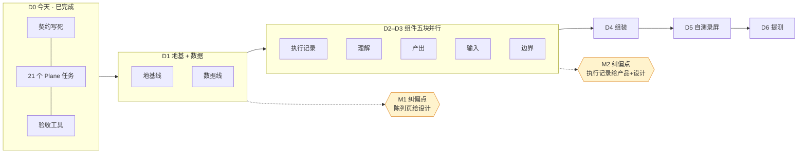
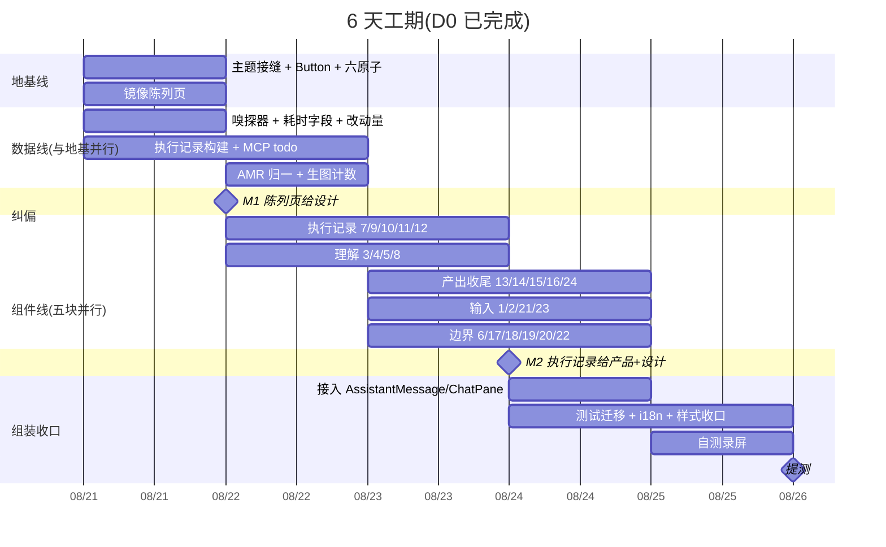
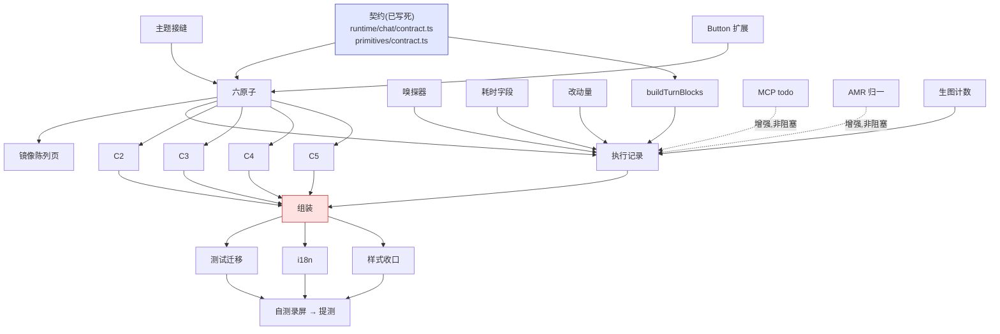
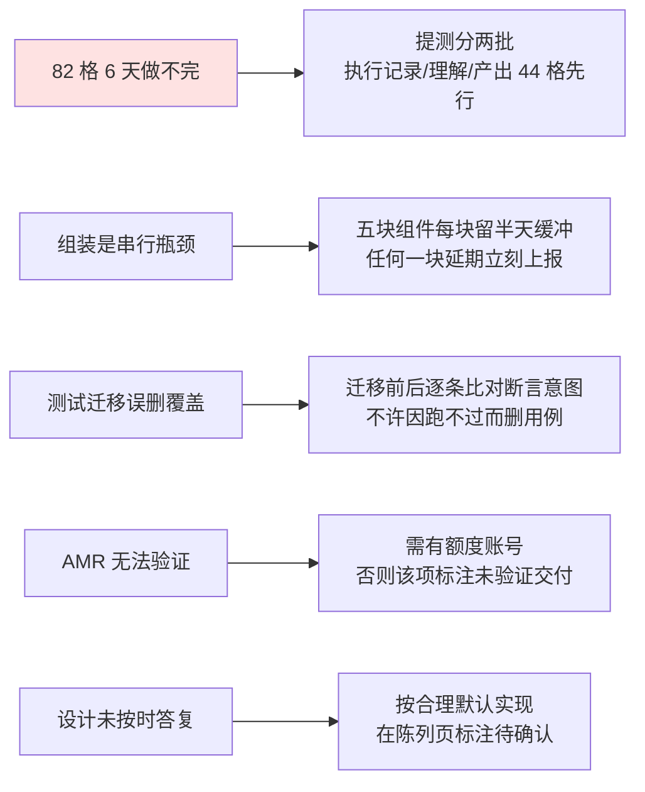

# ChatPanel 重构 · 交付计划

> **今天** 2026-08-20(周四) · **提测** 2026-08-26(周三) · **可用工期 6 天**
> 技术设计见 `chat-panel-next.md`(基线、规格、决策记录)。本文只讲**怎么排、什么时候给谁看**。

---

## 1. 交付路径全景

**两个纠偏点的位置是刻意的**:都在「投入还不大、改起来还便宜」的时候。M1 之后才铺开 24 个组件,M2 之后才做组装。

---

## 2. 时间轴

---

## 3. 依赖图:什么必须等,什么可以抢跑

**红色 = 唯一串行瓶颈。**五块组件必须全部就位才能组装,所以组件线任何一块延期都会顶到组装。

**虚线 = 增强非阻塞。**MCP todo 与 AMR 归一没做完,执行记录照样能跑(走平铺 / 无分段降级),不会卡住组件线。这是刻意设计的解耦。

---

## 4. 纠偏节点:给谁看、看什么、答什么

### M1 · 08-22 · 陈列页给设计

| | |
|---|---|
| **交付** | 镜像陈列页 + 六个原子 + 已实现状态 |
| **看的人** | wangchenglong |
| **看什么** | 逐格比对实体与实现,重点看折叠、状态点、工具行三个原子对不对 |
| **要答的** | 失败行两种写法 · 搜索类图标 · 意图澄清溢出 · 生图 loading |
| **为什么在这** | 此时只做了原子,**改一个原子等于改所有用它的组件**。等 24 个组件都做完再发现原子偏了,返工面是全部 |

### M2 · 08-24 · 执行记录给产品 + 设计

| | |
|---|---|
| **交付** | 三种 agent(claude / codex / opencode)各跑一轮的完整录屏 |
| **看的人** | 用户(产品) + wangchenglong(设计) |
| **看什么** | 设计看形态是否 1:1;**产品看降级形态能不能接受** |
| **要答的** | 无 todo 时的平铺形态是否 OK · 无耗时/无 description 时的样子 · 提测范围是否砍到 44 格 |
| **为什么在这** | 执行记录是主命题,也是降级形态最集中的地方。**降级是主路径不是特例**,产品必须在这里看到真实的样子 |

> ⚠️ **这两个节点要设计和产品真的抽时间来看。**如果要到最后才看,前面所有阶段性交付都是空转 —— 不如闷头做完一次性交付。**建议提前约好时间。**

---

## 5. 录屏策略:两级,别每个任务都录流程

| 级别 | 录什么 | 频率 | 成本 |
|---|---|---|---|
| **状态录屏** | 陈列页里该组件全部状态,滚一遍 | 每个组件任务 | 低,可脚本化 |
| **流程录屏** | 真实跑 agent 的完整一轮 | 只在 M2 与提测 | 高,但最有说服力 |

**为什么不每个任务都录流程**:录屏会过期,改一次组件就废一次。状态录屏由陈列页驱动,重录成本极低,才适合高频。

录屏与自测结论贴到对应 Plane work item 的**评论**里(带时间戳,能看出迭代过程)。

---

## 6. 风险与应对

| 风险 | 判断 |
|---|---|
| **R1 最可能发生** | 82 格 + 9 个动画 + 组装 + 录屏,6 天很紧。**建议现在就定分批,而不是到 D5 再砍** |
| R2 组装瓶颈 | 五块组件彼此零依赖(契约保证),但组装必须等齐 |
| R3 测试迁移 | 真正风险不是工作量,是把「测试过时」和「真回归」搞混 |
| R4 AMR | 已知无法本地验证,不阻塞其他 |
| R5 设计答复 | 4 项待答(见技术设计 §9.1),都不阻塞骨架 |

---

## 7. 每日收口

每天结束时更新三处,保证任何时刻换人都能接上:

1. **Plane** — 任务状态 + 当天自测结论(评论)
2. **技术设计 §9 决策记录** — 当天新增的人工纠偏
3. **技术设计 §10 踩过的坑** — 当天发现的错误做法

> dev-guardrail:**接手的人必须仅凭文档就能重建完整上下文,不依赖任何参与过原始对话的人。**
