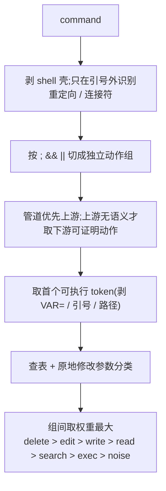
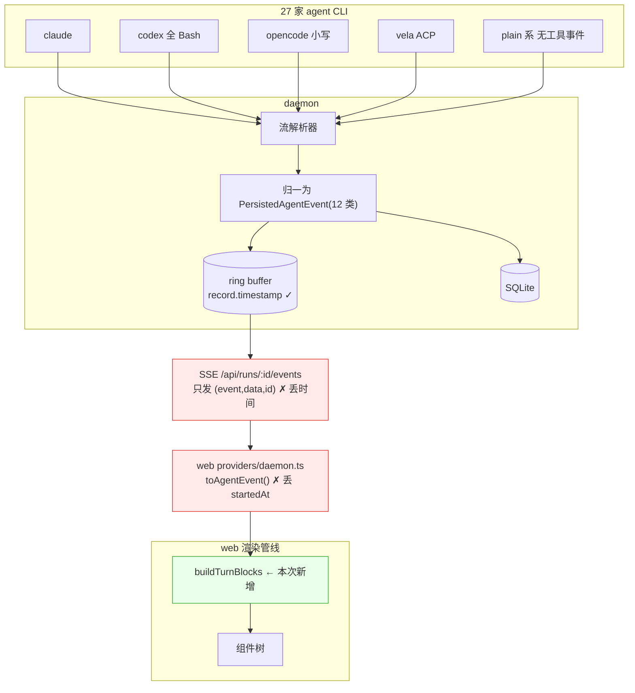
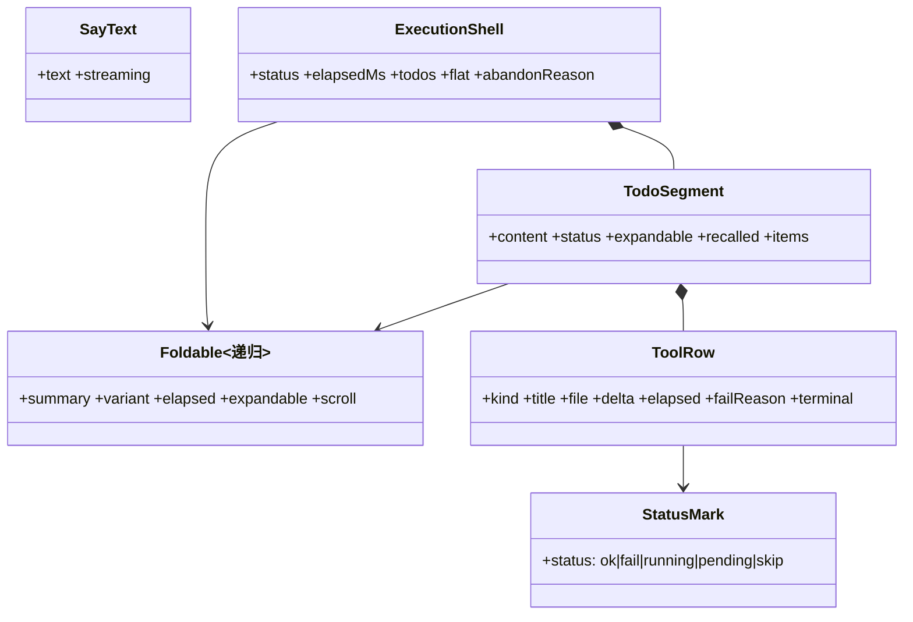

# ChatPanel 重构技术设计

> **分支** `feat/chat-panel-next-impl` · **提测** 2026-08-26 · **状态** 契约已定,待开工
> 本文是这次重构的**唯一技术权威源**。飞书验收视图与 Plane 任务都引用本文,不重复写规格。

---

## 0. 接手须知(新人从这里开始)

三个文件按顺序读,读完就能接手,不需要问任何参与过原始讨论的人:

| 顺序 | 文件 | 作用 |
|---|---|---|
| 1 | 本文 | 基线、规格、决策、踩过的坑 |
| 2 | `apps/web/src/runtime/chat/contract.ts` | L0 领域层输入输出(并行分界线) |
| 3 | `apps/web/src/components/chat/primitives/contract.ts` | L1 原子层 props |
| 4 | `apps/web/src/components/chat/AGENTS.md` | 怎么加 / 改 / 验组件 |

**动手前必读 §9 决策记录与 §10 踩过的坑。**§10 里每一条都是已经犯过一次的错,重犯的代价是返工。

**开工闸门在 §13 对齐状态。**状态不是 READY 就不许写实现代码;被 T3 挡住的那几项,在 T3 落进 §9 之前一行都不能写。2026-08-21 我违反过一次(停掉了三个刚派出的实现 agent),记在 §10 #14。

验收与验证工具:

| 工具 | 位置 | 用途 |
|---|---|---|
| 状态矩阵 | `docs/design/chat-matrix/` | 84 个状态的清单与覆盖矩阵(文件名仍叫 `matrix-82.html`),自包含 HTML 双击可开;`python3 build-matrix.py ../chat-panel-next.html` 重建 |
| **场景模拟器** | `docs/design/chat-sim/` | **真实事件逐帧播放**,看流式效果。`sim.js` 的 `build()` 是 `buildTurnBlocks` 的已验证原型(含 T3 四种策略),翻成 TS 即可。`simulator.standalone.html` 单文件可直接发人 |
| 评审文档 | `chat-panel-next-review.md`(飞书 `WwIsdvv0Aot72PxtpKNclC3jnge`) | 第 2 版,结论清单;第 1 版在飞书历史版本 |
| **Dev Design** | `chat-panel-dev-design.md` | 按 Plane「Dev Design 模板」(`pages/fc9ec07b`)重梳的架构视角:架构 / 流程 / 情景分析 / 上线 / 稳定性 / 技术债。**决策仍以本文件为准**,那边冲突时回填 |

---

## 1. 基线与材料权威性

### 1.1 唯一基线

**PR #7170 的 head `1bbdce0b06`**(wangchenglong,2026-08-21 03:57):`docs/design/chat-panel-next.html`(组件稿,**24 个组件 / 84 个状态**,md5 `28ea4c65…`)与 `docs/design/chat-panel-scene.html`(场景稿,八屏,已与组件稿同步)。本仓库这两个路径放的就是这两份原文(内容与 PR 一致,合并时不会冲突)。
同一 PR 还提了生成源码 `docs/design/chat-panel/src/`(`components.css` / `body-components.html` / `body-scene.html` / 各交互脚本,`build.mjs` 生成两份 HTML)——**以后对比设计稿改动直接 diff 源文件**。

版本链:`e954620f11`(8/20 16:51,82 态)→ `pv-components.html`(8/20 21:02,83 态)→ `1bbdce0b06`(8/21 03:57,84 态)。每一跳的差异见 §1.5。设计师说 PR head 是最新的,后续更新以 PR 分支为准。

用户口径:**按 wangchenglong 的交付物 1:1 对齐**。

### 1.2 已作废的材料(别再看)

| 材料 | 为什么作废 |
|---|---|
| `design/chat-panel-next` 分支的同名文件 | 旧两天,23 组件 78 状态,**产物卡设计与新稿相反** |
| `chat-panel-next-dark.html` / `version/v2/docs/drafts/chat-next.html` | 停在更早的版本,含已删组件 |
| 飞书《ChatPanel 前端组件盘点》 | 多条已被评审录音与新稿推翻 |

> ⚠️ 设计稿现在有两个来源,而**设计分支上那份是旧的**。后续设计更新走哪个分支需与 wangchenglong 确认。

### 1.3 新稿相对旧稿的三处变化

1. **新增组件 24「音频产物」**
2. **产物卡片的动作位置两天里翻了两次**:旧稿 / 评审决议是「三个动作全摆卡面」→ `e954620f11` 收进右上角「⋯」→ 8/20 21:02 版又回到卡面(`.acts` 压在图下缘,非 HTML 少「发布」;视频卡是「查看」+「⋯」)。**用户拍板:按 21:02 版,不再问设计**(D28)
3. 意图澄清删「选的不是推荐项」(11→10 态);反馈组件新增「点过『新开会话』· 原地落一条分界」(6→7 态)

### 1.4 新稿不是静态视觉稿,带 9 个交互脚本

旧稿零 JS,新稿有真实交互与动画。**这是工作量的主要变化来源。**

| 交互 | 组件 | 实现 |
|---|---|---|
| Thinking 那颗球 | 3 | **`thinking-orbs@0.3.1`(MIT)** — 25KB 纯 2D canvas 引擎 |
| 推理流定高自动滚动 | 3 | 自写,思路取自 hextaui 的 useAutoScroll |
| 视觉方向 叠放⇄网格 | 5 | 稿子明说「**必须真的能点**」 |
| 计数翻滚(旧位上移/新位顶上) | 6、7 | 自写 |
| 总结文案逐字化开 | 13 | 自写,思路取自 motion-primitives TextEffect |
| 产物展开 / 音频播放 / 时长格式化 | 14、24 | 自写 |
| 附件加载态几何 | 2 | 自写 |

**依赖决策**:`thinking-orbs` **装 npm 包**(已拍板)。稿子内联 25KB 引擎只是为了「双击能打开单文件」,我们是 React 应用可直接用其组件。新增根依赖需按 CONTRIBUTING 的 dependency policy 走。

### 1.5 2026-08-20 21:02 版相对 `e954620f11` 的改动(按组件 diff 标记 + 按选择器 diff CSS + 逐段 diff 脚本得出)

| 处 | 改了什么 | 对我们的影响 |
|---|---|---|
| 工具行(7/9/10/11/12) | `.ti` 里放回了**图标**:读取=眼睛、新建/改写=笔、搜索=放大镜、执行=提示符、生成=图片;`.ti:empty` 才退回 5px 圆点 | **B9 改写**:类别 = 动词 + 图标;`toolKind` 的值直接选图标 |
| 工具行 · 搜索 | 新增「搜索 <模式> N 处」行(`.fn` 是模式,`.ms.mod-num` 是命中数) | **S4 / D23 由设计答复**:搜索是一等类别,不再并入读 |
| 工具行 · 执行 | 新增「执行 <命令> 耗时」单行(`.fn` 是命令,aria「查看 … 的输出」) | **S8 有了依据**:没有 description 时按此行;有 description 仍用 C11 的折叠块 |
| 命令块(11) | 去掉 `.code-h` 头(语言标签 + 复制键)和对应脚本;`.term.mod-cmd` 去掉分隔线 | 实现少一块 |
| 流式光标 | `.caret` 连同样式、Thinking / 总结文案 / 终端里的用法**全部删除**;`--stream-ink: #a3a3a3` 给思考流正文。**文字的流式效果是另一套、两版都有**:壳外正文(组件 4 开始执行文案、13 总结文案)用 `[data-reveal] .rv` 逐字化开,单字 0.4s、字间错开 0.01s,JS 把文本节点拆成单字 span、元素子节点整块算一个字 | L1 契约 `SayTextProps.streaming` 失去设计依据,待改;壳外正文流式 = 只对新到的字做逐字化开(W9) |
| 1 用户消息 | 6→7 态:超长折 6 行、文末「…」;hover 时「…」后浮出箭头「查看全部」;hover 时间在复制前、**重试常驻**;`--bub-bg` 新 token | 组件 1 重做 |
| 2 附件行 | 脚本新增两端翻页箭头(`.att-wrap` / `.att-nav`,只在真有被遮住时出现) | 组件 2 交互 +1 |
| 5 意图澄清 | 按钮「确认」→「下一步」(10 态全部) | **D2 措辞改为「下一步」** |
| 14 产物卡 | 动作又回到卡面:`.acts`(预览 / 发布 / 导出)压在图下缘,非 HTML 少「发布」;视频卡改成 `.vview「查看」`+「⋯」,自绘播放条整套删除 | §1.3 第 2 条反转;**三次摇摆,请设计确认这是最终版** |
| 17 Queue | 每条多一个动作「引导对话」 | 组件 17 +1 动作 |
| 19 报错 | 「复制详情」→「导出日志」 | B18 文案 |
| 23 选中文字 | 「添加到对话」条挪进 `<mark>` 内部 | 组件 23 结构 |
| 3 / 13 | 只删了光标 | — |

没变的:token(除上面两个新增)、字体、orb 引擎、组件 2/4/6/8/9/10/12/15/16/18/20/21/22/24 的标记。

**`1bbdce0b06`(8/21 03:57)相对 21:02 版**:

| 处 | 改了什么 | 影响 |
|---|---|---|
| 6 Plan 卡 | 1→2 态:新增「收起 · 只留『第 N / M 步』,悬停浮出整张清单」(`.pmini` / `.pdemo`) | 组件 6 +1 态 |
| 14 产物卡 | **第四次翻**:动作挪到右上角,两枚图标「发布 / 导出」,「预览」按钮没了(整张卡就是预览入口);非 HTML 右上角只剩「导出」;视频卡面什么都不压,右上角同样没有「发布」 | **D28 改为按 `1bbdce0b06`** |
| 12 生图 | 未生成的格子从「幕布」换成「像素液体」(`.shot.is-load .liquid`,脚本 `pixel-liquid.js`) | 组件 12 加载态 |
| 20 暂停 | `.stopline` 加了图标 | 组件 20 |
| 18 升级 / 19 报错 | `.up .why`、`.errb .ops` 排布微调;重试按钮转圈动画(`.rt.is-spinning`) | 组件 18 / 19 |
| 7 / 9 | 标记微调(9 多一态的行) | — |
| 场景稿 | 八屏全部同步到新组件(图标、折行、附件翻页、命令块无头) | 场景稿不再比组件稿旧 |
| 脚本 | 交互脚本 +2.7k(重试转圈等),生图占位换成像素液体脚本 | — |

---

## 2. 能力匹配矩阵(设计稿要求 × 底层供给)

| # | 设计稿要求 | claude | codex | opencode | AMR | plain 系 7 家 | 结论 |
|---|---|---|---|---|---|---|---|
| 1 | 工具分类图标 | `Read/Write/Edit/Bash` | **14/14 全叫 `Bash`** | 小写 `read/write/…` | ACP kind 归一 | **无工具事件** | 需嗅探 + 纯文本降级 |
| 2 | 写入 `+N -M` | 客户端推导 | 客户端推导 | 客户端推导 | 客户端推导 | 不适用 | **无一家原生给 diff** |
| 3 | 每行耗时 | ✗ | ✗ | ✗ | 部分 | ✗ | 需 daemon 补字段(§4) |
| 4 | 跑完才落行 | 可做 | 可做 | 可做 | 天然 | 不适用 | **实测 tool_use/tool_result 按 id 去重后 9:9 完全配对** |
| 5 | 按任务分段 | **无 TodoWrite** | `TodoWrite` ✓ | `todowrite` ✓ | 被 title-case 破坏 | 无 | 见 §5.1 |
| 6 | 终端输出可折叠 | 可 | 可 | 可 | **打码给不了** | 不适用 | AMR 降级 |
| 7 | Thinking 独立段 | 有 | 有 | **无**(直连) | 有 | 部分无 | 无则不渲染 |

### 2.1 实测:Bash 吞掉了读 / 写 / 搜索

> **样本口径**:`web-prototype` 场景下 Claude Code 的两轮观察(第一轮 9 次去重调用、第二轮 5 次),**不是跨 agent / 跨任务类型的统计**。换任务类型比例可能不同。

第一轮 9 次调用里 Bash 占 7 次,分别在干:`ls` 列目录、`find` 找文件、**`cat` 读文件 ×2**、`$OD_BIN` 查规范、**`grep` 检查产物**、`ls` 复核。

**结论:不只是 codex,Claude 在 OD 的 skill 引导下同样把读/搜索/检查全塞进 Bash。**照工具名分类会退化成一整列「跑命令」。

### 2.2 嗅探规则(已用 9 条真命令验证 9/9 通过)



| 类别 | 首 token |
|---|---|
| `read` | cat / head / tail / less / sed(非 `-i`) / awk / jq / wc / nl / stat / file / du / diff / pwd |
| `search` | grep / rg / find / fd / ls / tree / locate |
| `write` | tee / touch / mkdir / cp / install,或引号外的输出重定向 |
| `edit` | sed -i / perl -pi / mv / ln / chmod / patch / apply_patch,以及可静态证明的内联脚本读后写回 |
| `delete` | rm / rmdir / unlink |
| `exec` | 其余,含 `$VAR` 形式 |
| `noise` | echo / printf / cd / export / true — 不计入判定 |

**先剥 shell 壳**:codex 把每条命令包成 `/bin/zsh -lc '…'`(`bash -c "…"` 同理),分类和标题都看里面那条;`sed -n '1,220p' 文件` 是 codex 读文件的惯用写法,认成读取。

**两条易错点**(原型第一版就踩了):
1. **管道取上游,不取权重最大**。`find … | head -50` 主导动作是 `find`(search),按权重会误判成 read
2. **顺序执行取权重最大**。`echo … && grep … || echo …` 里 echo 是噪音

验证集见 `apps/web/tests/runtime/chat/tool-kind.test.ts`。**新命令形态出现时先加用例再改规则。**

**2026-08-28 本地会话补样**:只读统计 stable / beta / prerelease 会话里 332 条 shell command,
不落会话正文、绝对路径或凭据。旧规则有 246 条最终仍回落成「执行 …」;补齐复合命令目标、
引号感知切分、内联 Python / Node 静态写入、原地改写和删除后,只剩 83 条保守归为 `exec`;
其中主要是 OD CLI / 渲染导出、等待、只做计算的脚本,应继续显示「执行」。

**标题与图标分工**:行标题优先用 `Bash.input.description`(**claude 有,codex 实测没有**),没有时回落到命令本身;嗅探结果**只用来选图标**。

**设计稿只有四类图标,实测需要五类** — `ls`/`find`/`grep` 属「搜索·浏览」。**待设计确认**是否给独立图标;在此之前实现侧并入「读」,但嗅探器保留 `search` 分类值,将来拆出只改图标映射一行。

### 2.2b 真实节奏(2026-08-21 通过本地 daemon 真实录制 codex 一轮,`docs/design/chat-sim/recordings/codex-todo.jsonl`,219s,32 条 SSE)

| 观察 | 数字 | 对实现的含义 |
|---|---|---|
| codex 的 `tool_use` 与 `tool_result` **几乎同时到达** | 间隔 p50 4ms、最大 56ms | json-event-stream 在 codex 的 `item.completed` 时才一起发出两条。**在发出口盖 `startedAt` 对 codex 等于 0 耗时**——W6 的时间戳方案必须改成:解析器收到 `item.started` 时记下开始时间,`tool_use` 带它出来;拿不到就不显示耗时,不能显示 `0.0s` |
| 两次工具调用之间(模型在想 + 工具在跑) | p50 18.8s、p90 117s | 执行记录里「进行中 · 秒数在走」大部分时间对着同一条记录;空态 / 进行中态的动画要耐看 |
| 文本到达方式 | 整轮只有 4 条 `text_delta`,间隔 p50 65s | codex 把正文整段吐出,不是逐字;逐字化开(W9)是对整段做入场,不是跟着 delta 走 |
| `tool_use` 重复 | 9 条 use 对 5 条 result,同一调用发两次 | 踩坑 #3 的再次印证:按 id 去重是必须的 |
| 清单 | 2 次 `TodoWrite`:开头全 pending,118s 后两条 completed | 清单期间内容大多在 pending 阶段就发生了——「收进当前进行中的 todo」在没有 in_progress 的清单上落不到任何一条,按 D29 ④ 走壳层 |

| claude(`claude-brief.jsonl`,两轮,755s) | 工具耗时 p50 218ms / p90 636ms;两次工具之间 p50 57s / p90 330s;文本 delta 间隔 p50 1.4s | claude 的 `tool_use` 在 assistant 消息到达时发出、`tool_result` 在执行完才到,耗时是真的;但同一条 assistant 消息里并发的几次调用,结果会同批到达 → 后面几条算出 0ms,所以 <100ms 一律不显示 |
| claude(`claude-shop.jsonl`,两轮带附件,1645.5s) | 工具耗时 p50 159ms / p90 542ms;两次工具之间 p50 10.4s / p90 123.7s;文本 delta 间隔 p50 1.4s | 68+ 次工具调用、`od media generate` 四次全部失败(本地没配生图 provider)→ 组件 12「部分失败」态的真实样本;附件(两图一文)随第二轮发出 |

> **thinking 全是空串**:三条 claude 录制的 `thinking_delta` 共 1167 条,delta 全为 `""`;首条 thinking 与首条 text / tool 之间隔 4s(claude-shop)到 34s(claude-brief)。daemon 原样透传,空串来自 claude-code(`--include-partial-messages` 下只发「在想」的节拍,不发内容)。这意味着:壳头的「思考中」只能由事件驱动(W11),而 thinking 正文(组件 13)在 claude 上**永远没有内容**,只有 opencode(不吐 thinking)之外的少数 agent 才可能有。S21 待设计答复。
| claude(`claude-ask.jsonl`,两轮,74s) | agent 真的发了 `<question-form>`(JSON:`description` / `submitLabel` / 每题 `label` `type` `required` `defaultValue`,每个选项带 `label` + `description`);第二轮回答后又发了一份(textarea + radio + checkbox) | 组件 5 的真实数据形态;**选项的 `description` 设计卡上没有落点**(S18);`thinking_delta` 大量是空串,空 delta 不能成段 |

录制方法:`docs/design/chat-sim/record-run.py`(POST `/api/chat`,SSE 逐条盖到达时间;`--append` + `--conversation` 录多轮,`--attachments` 带附件)。每录一条新 agent,把数字补进这张表。

`qwen` / `deepseek` / `grok-build` / `aider` / `antigravity` / `atomcode`(走 `plain-stream`)与 `qoder`(走 `qoder-stream`)**完全不吐工具事件** — 两个解析器里 `tool_use` 均为 0 处。
`cursor-agent` 走 `json-event-stream`,**有 9 处 tool_use,是吐的**。

| 缺什么 | 必须的形态 |
|---|---|
| 无 TodoWrite | 执行记录单段平铺 |
| 无工具事件 | 只渲染正文,壳内为空态 |
| 无 thinking | 不渲染该段,不占位 |
| 无耗时 | 不显示,**不用 `0s` / `—` 假值** |
| 终端被打码 | 命令行仍可折叠,内容区说明「输出不可见」 |

---

## 3. 数据流架构



红色 = 时间信息的两处丢失点。daemon 内部 ring buffer 每条事件已盖 `record.timestamp`,诊断统计也已在用它算单工具耗时 —— **数据一直都在,只是没送出来**。

---

## 4. 三处底层改动(全在客户端,不涉及云端后端)

| 改动 | 位置 | 规模 | 收益面 |
|---|---|---|---|
| ① `tool_result` 带完成时间 | contracts + SSE + 落库 + web 各一处 | 四个单点 | **27 家 runtime 全部受益** |
| ② `todowrite` 归一 | `agent-protocol/acp/updates.ts:432` 附近 | 一行分支 | AMR 拿回分段 |
| ③ 生图逐张计数 | web 新增消费 `GET /api/projects/:id/media/tasks` | 一个 hook | 生图 `2/4` |

> ② 根因:`acpToolNameFromKind` 对未知 kind 做 title-case,`todowrite` → `Todowrite`(w 小写),而 web 的 `isTodoWriteToolName` 认 `TodoWrite`(W 大写),四个候选名全部落空。
> **此条仅有代码推演,尚无实跑证据** — 本地 AMR 账号 `AMR_INSUFFICIENT_BALANCE`,需有额度账号验证。

---

## 5. 任务进度规格(本次重构的核心模块)

### 5.1 实测:Claude 在 OD 里没有 TodoWrite

两轮实跑,第二轮 prompt 硬性要求「务必先调用 TodoWrite(这是硬性要求)」,结果 **Bash 24 次 / ToolSearch 12 次 / TodoWrite 0 次**。Claude 自己在正文里给出结论:

> 先说一件必须说清楚的事:**这个运行环境里没有 `TodoWrite` 工具**。我用 `ToolSearch` 按名字和关键词各查了一次,返回的可用工具里都(没有)

**对照实验(排除 OD 因素)**:OD 之外直接跑裸 `claude -p`,同样要求调用 TodoWrite,回答一致 —— 「既不在已加载的工具列表里,也不在可延迟加载的工具里」。

> **各家的清单从哪来(2026-08-23 查解析层)**:清单都是 agent **自带的工具**,daemon 在解析层归一成同一种 `TodoWrite` 事件 —— codex 的原生 `todo_list`(`json-event-stream.ts:594`)、opencode / cursor-agent / mimo / byok-opencode 的 `write_todos`(同文件 324 行)、Claude 的 `TaskCreate` / `TaskUpdate`(`claude-stream.ts` `emitCanonicalTaskSnapshot`)。**因为那把工具是人家 CLI 定义的,我们加不了字段** —— 这就是「done 走 todo 工具同一个参数」只对我们自己注入的工具成立的原因(T9)。Claude 那条归一路径的存在同时意味着 D9 的前提要复核(T10)。

**结论:与 OD 无关,是 Claude Code `-p` 非交互模式本身不提供。**`defs/claude.ts` 的 `buildArgs` 无任何工具裁剪参数,本次运行的项目目录下也没有 `.mcp.json`。**这不是 bug,是能力边界。**

分段锚点可用性:**codex ✓(实测 `TodoWrite`)· opencode ✓(`todowrite`)· claude ✗(待 MCP 注入)· AMR 被破坏 · plain 系 ✗**
→ **平铺是基线形态,分段是增强。**

### 5.2 壳子模型(11 条,逐条与产品确认)

| # | 规则 |
|---|---|
| 1 | **壳子是通用容器,没有类型**。变的只是内部渲染:有 todo 就分段,没有就平铺 |
| 2 | **执行记录永远出现**,不等 agent 发任何信号 |
| 3 | **第一张壳钉在本轮正文上方**(main 现状,T8 拍板 A / D42);没有清单之前所有 thinking / 工具调用都进它;**`done` 之前的正文也进它**(过程叙述,`.think` 段落),`done` 之后的正文才在壳【外】、壳的下方(D43) |
| 4 | agent 发出 todo = **多出第二张壳**,出现在当前位置(已有正文之后),第一张转已完成;此后的工具、thinking、**正文**都收进当前进行中的 todo;todo 关闭则进下一个;全部关闭后工具输出接在 todo 后面、正文回到壳外下方(D29) |
| 5 | agent 一上来就发 todo → **不出空壳**,第一张壳本身变成 todo 分段 |
| 6 | 中途重新规划 → **不开新壳**,旧 todo 全部划线;进行中的先转完成态再划线 |
| 7 | 作废理由 → `todo_abandon(reason)`,reason **按壳内纯文本渲染**(复用 thinking 落下的段落样式),不做新样式 |
| 8 | done 信号走**正文里的自闭合标记**(D43,通道 ②,和 `<question-form>` 同一套机制),不走 todo 工具的参数 —— 各家原生清单是它们自己的工具,我们加不了字段(§5.1 注)。它有两个作用:**分界**(之后的正文是结论)与**提前收起**(第 10 条) |
| 9 | 召回判定 = **新旧 todo 清单的内容交集**。不做语义判断、不限轮数 |
| 10 | 收起以 **run 生命周期为准**,agent 的 done 只是提前量 |
| 11 | 中断 → `in_progress` 那条标停止态 |

一轮的骨架因此固定为:`[壳 1 · 探路] 正文… [壳 2 · 清单] 正文…`,最多两张;壳 2 只在发了清单时出现。

**每一轮的执行记录只装该轮产生的内容,历史轮次不重复渲染。**
上一轮的内容用户往上翻可见;同一条工具调用不会在屏幕上出现两次。

**展开能力判定**:唯一判据是 **本轮有没有该 todo 的内容**,与是否召回无关。

| todo 情况 | 本轮有内容 | 划线 | 可展开 |
|---|---|---|---|
| 召回 · 上一轮就完成的 | ✗ | ✓ | ❌ |
| 本轮一次关掉、从没进行过的(同一份 TodoWrite 里 pending→completed,名下无内容) | ✗ | ✓ | ❌ 与上一行同一形态(D35) |
| 召回 · 本轮继续做的 | ✓ | ✓ | ✅ 展开的是**本轮新增**部分 |
| 召回 · 本轮继续做并做完的 | ✓ | ✓ | ✅ 按状态判会误收,故不按状态判 |
| 本轮全新执行的 | ✓ | ✗ | ✅ |
| 还没跑的 | ✗ | ✗ | ❌ |
| 中断时正在跑的 | ✓ | ✗ | ✅ 有部分内容 |

→ 契约中 `expandable` 由「本轮 items 是否非空」推导,`recalled` 只控制划线样式,**两者解耦**。

### 5.3 一轮的骨架

```
[壳 1]               thinking + 探路工具调用 + 过程叙述(done 之前的正文),钉在最上面
[壳 2]               执行计划 N 步 + 每条 todo 一个抽屉;todo 期间的正文也在 todo 里
   产物卡              写产物文件那一刻就出现,先是生成中的灰占位(D37)
   普通文本            结论(done 之后 / 清单全部关闭之后,回到壳外)
   反馈行 → 下一步引导
```

与实测的 Claude 真实行为完全吻合:`ls/find/cat 探路` → `"我先看一下当前目录"` → `"方向已定,计划四步:…"` → `写文件/检查/复核` → `"counter.html 已生成"`。

### 5.4 空态(用户补充,设计稿未画)

执行记录刚出现、还没有任何内容时:**去掉折叠箭头**(里面没东西可展开),只有一个动画 + 一行可变文案(进行中 / 思考中)。

### 5.5 MCP todo 工具

给 Claude 注入,**三种用法收敛成一个工具**(agent 只需记住一个,漏用概率最低):写清单 / 标 done / 作废带 reason。

⚠️ **实施要点**:MCP 工具名是 `mcp__<server>__<tool>` 格式,`isTodoWriteToolName` 的四个认名匹配不上,**必须同时放宽匹配或在 daemon 归一**。只做注入不改匹配 = 白做。

⚠️ **prompt 要写明顺序**:必须「先调作废工具、再说后面的话」,否则 agent 习惯性先解释一大段,理由又落回旧抽屉里。

### 5.6 兜底不是异常分支,是主路径

**核心原则:UI 状态由 run 生命周期驱动(可靠),agent 信号只用来提升体验(锦上添花)。**

| 信号 | 谁驱动 | 可靠性 |
|---|---|---|
| 执行记录收起 | **run 生命周期** | 100% |
| 提前收起 | agent 的 done | 发了就早点收 |
| 中断标记 | **run 状态变 canceled** | 100% |
| 分段 | agent 的 todo | 有就分,没有就平铺 |

这样即使 agent 从不发 done,UI 也完全正确,只是收起时机推迟到整轮结束。**plain 系 7 家永远走这条路,所以这是主路径之一。**

---

## 6. 组件模型与契约

**契约文件即并行分界线。**改动它们 = 破坏并行,必须先同步全体。

- `apps/web/src/runtime/chat/contract.ts` — L0 领域层(纯函数,无 JSX/DOM)
- `apps/web/src/components/chat/primitives/contract.ts` — L1 原子层 props



分层落点:通用 primitive → `packages/components`;chat 原子 → `chat/primitives/`;业务组件 → `chat/`;纯函数 → `runtime/chat/`。

---

## 7. 暗色策略

产品当前**强制亮色**,且是产品裁决过的 —— `appearance.ts` 原文:

> workspace surfaces have no dark tokens, so **a dark app is a broken app**

链路:`layout.tsx` 预水合无条件写 `data-theme="light"` → `FORCED_APP_THEME='light'` → config 读时 coerce → 设置入口已删 → `force-light-theme.test.ts` 锁死。

**本次做法**:新组件一律消费 `--chat-*` 语义层,**不直连全局 token、不写 `[data-theme]` 分支**。亮暗两个作用域都定义、暂时同值。设计出暗色方案时只改这一段映射,组件零改动,且不推翻产品裁决。

设计稿 token 与 `tokens.css` **逐字节一致**(亮色 93 / 暗色 50,零漂移),直接映射即可,不引入新色值。

**4 处真硬编码需抽 token**:`.up .h .amt b`(升级金额橙)、`.mk.is-run` 两个荧光绿、`.memo-ic`。视频控件那 4 处 `#fff` 压在画面上,属合理硬编码。

---

## 8. 改造范围与并行编排

### 8.1 现状体量

`ChatComposer.tsx` 6014 行 · `ChatPane.tsx` 5123 行 · `AssistantMessage.tsx` 4245 行 · `styles/chat.css` 2951 行

### 8.2 六个障碍(拆之前要先解)

| # | 障碍 |
|---|---|
| 1 | chat 样式非单一所有者 —— `viewer/routines.css` 覆写 `.app .chat-log` / `.app .composer`,带父级特异性 |
| 2 | 测试绑死全局类名(实测 `ChatPane.connect-repo.test.tsx` 断言 `.chat-connect-repo`) |
| 3 | `splitTaskActivity` 把整条消息压成**一个扁平** TaskActivity,且**特意排除 TodoWrite** |
| 4 | primitive 迁移未收口 —— `packages/components/styles.css` 用裸 `button` selector 作用全局 |
| 5 | token 分散三处(`tokens.css` 色/圆角/动效、`base.css` 字号/间距、`material.css` 材质) |
| 6 | i18n 每个新 key 固定改 20 文件 |

### 8.3 并行编排(四条线,一个串行瓶颈)

```
地基线   主题接缝 ─ Button ─ 六原子 ─ 镜像陈列页
数据线   嗅探 ─ 耗时 ─ 改动量 ─ 执行记录 ─ MCP todo ─ AMR ─ 生图
                      ↓ 契约已写死,两线汇合
组件线      执行记录 · 理解 · 产出 · 输入 · 边界   ← 五块彼此零依赖
                      ↓
组装线            接入 AssistantMessage / ChatPane   ← 唯一串行瓶颈
                      ↓
收口线      测试迁移 · i18n · 样式收口 · 自测录屏提测
```

**地基线与数据线无依赖,可同时开工。**任务清单见 Plane「ChatPanel 优化」module(21 个 work item)。

---

## 9. 决策记录

> dev-guardrail 要求:**每一次人的纠正都必须落进本表**,不能只活在对话里。
> 接手的人仅凭本表就能知道「为什么是这样,以及推翻了什么」。
> 拍板人 = 用户(杨瑾龙),标注「问过设计」的是他转述 wangchenglong 的答复。

| # | 决策 | 依据 / 推翻了什么 |
|---|---|---|
| D1 | **基线 = wangchenglong 交付稿,1:1 对齐** | 设计稿有两个来源,设计分支上那份旧两天 |
| D2 | 意图澄清单选:**选中后点「下一步」**(8/20 21:02 版把「确认」改成了「下一步」),不是点即发 | 设计稿写「点错了还能换」;飞书文档写的「点选项即发送」作废 |
| D3 | ~~工具调用**无「执行中」档**,跑完才落行~~ **已作废(产品 2026-09-02,OPEND-2419)** —— 调用发出去就落行,不等结果 | 原依据「设计稿明写」;推翻它的是产品原话:「调用时不管成功没,都要立刻渲染,所有状态啥的东西都要尽快反应在界面上,不然用户会吐槽卡住了啥的」(实现见 `e8bd2a726d`)|
| D3′ | D3 作废的**两条边界**,别只记住前半句:①**还在跑**的调用要落行、要转球、要有实时秒数;②**轮次已经停了**的那几行,数据上仍是 `pending`(如实记录),但**不许再画成转圈的球** —— 退成中性灰。空壳规则(B47 / U4)**没有被这次翻转碰过**,只是再也做不出空壳了 | ①的原话见 D3 那行;②逐字写在 `runtime/chat/contract.ts` 的 `ToolRow.pending`:「那是『永远停在 running』这个新 bug」。守卫:`tests/components/assistant-message-tool-status.test.tsx`(跑完 / 缺 runStatus / 失败三档各一条正反对照);B47 自己的守卫仍在 `tests/runtime/chat/empty-shell.test.ts` |
| D52 | **进行中的计时覆盖到「所有」工具调用**,含生图批次行(组件 12 的大格那一档,稿子没给耗时槽)。2026-09-02 那次裁决当时只覆盖思考中 / 工具行 / 步骤行三类 | 产品口述 2026-09-03:「工具调用最好都有显示的逐渐增长的计时,**尽可能所有都有**,包括 thinking,这样用户能感受到当前哪里卡住了」。生图是最慢的一类动作,原来那几分钟一个数字都没有。起点取一批里最早那个任务的 `startedAt`(S19 合并成一行时同理,**不是几次相加**),终点仍是全轮共用的 `liveEndMs`,门槛仍是 `UNKNOWN_ELAPSED_BELOW_MS`(<100ms 当「不知道」,不显示也不估算)。红测:`tests/runtime/chat/live-row-elapsed.test.ts` + `tests/components/chat/live-row-elapsed.test.tsx` |
| D4 | Plan 卡**不阻塞**,只留执行中一态 | 评审录音:「是不阻塞的」「应该是没有这个第一个卡片的」 |
| D5 | 手动暂停**只给一行文案**,不显示剩余步数 | 评审录音 |
| D6 | 联系支持改**全局弹窗** | 评审录音,压过设计师「比较阻断」的顾虑 |
| D7 | **维持 Bash,靠嗅探 command 做可视化** | 不改 skill —— skill 是产品行为,影响面远大于改 UI |
| D8 | `thinking-orbs` **装 npm 包**,不内联 25KB 引擎 | 稿子内联只是为了单文件可双击;我们是 React 应用 |
| D9 | 执行计划卡数据源:**经 MCP 给 Claude 注入 todo 工具** | Claude 的 `-p` 模式无 TodoWrite(含裸 CLI 对照组实证) |
| D10 | **执行记录永远出现**;普通文本在壳外,thinking/工具在壳内 | **推翻我的方案** —— 我原本设计成「有过程才出壳子」 |
| D11 | **壳子是通用容器,无类型** | **推翻我的方案** —— 我原本分成了「壳子1 / 壳子2」两类 |
| D12 | agent 发 todo = 开新壳,一轮内多壳,壳间夹普通文本 | 用户明确选 B 方案 |
| D13 | 一上来就发 todo → **不出空壳** | |
| D14 | 重新规划**不开新壳**,旧 todo 全划线(进行中的转完成态再划线) | 问过设计 |
| D15 | 作废理由用 `todo_abandon(reason)`,**按壳内纯文本渲染**,不做新样式 | **推翻我的 C 方案** —— 我原本设计成客户端回溯把文本提出来,用户指出「不符合流式,会突然蹦出一段文字」 |
| D16 | 计划被作废**沿用完成态**(`is-done`) | 设计稿另有 `is-skip` 红叉态,已告知用户,用户选 `is-done` |
| D17 | 召回判定 = **todo 内容交集**,不做语义判断、不限轮数 | 用户原话「都召回吧,只要是当前聚焦的任务」 |
| D18 | 收起以 **run 生命周期为准**,agent done 只是提前量 | 兜底不是异常分支,是主路径 |
| D19 | AMR 终端输出**维持打码**,不放开 | 打码是防 Langfuse 泄密;AMR 上走降级形态 |
| D20 | 暗色:**结构就位不解禁**,`--chat-*` 亮暗同值 | 不推翻产品的强制亮色裁决 |
| D21 | **执行记录空态**:去掉折叠箭头,只有动画 + 可变文案(进行中/思考中) | **推翻我的误判** —— 我按「无动作则不渲染」标了不适用,但 D10 已定「永远出现」 |
| D22 | 提测 **2026-08-26**,必须并行开发,风险开工前全暴露 | 用户红线:「不接受第三天突然说某个交互做不了」 |
| D23 | 「搜索」是一等类别:动词「搜索」+ 放大镜图标 + 「N 处」 | 8/20 21:02 版设计稿给了;此前「先并入读」的过渡做法作废 |
| D24 | **每轮执行记录只装本轮内容**,历史轮次不重复渲染 | 用户指出:重复渲染会让同一条工具调用出现两次 |
| D25 | `expandable` 判据 = **本轮有无内容**,与 recalled 解耦 | **推翻我原规格**「跨轮召回的一律不可展开」—— 反例:上一轮中断的 todo 这一轮继续做,应当可展开 |
| D26 | **同一份清单的状态更新不新建卡片** | 真实数据:opencode 连发 3 次 `todowrite` 推进状态,按原 D12「发出 todo 就开新卡」会误开 4 张卡。判据同恢复 —— 内容有重叠即为更新 |
| D32 | **模拟器要覆盖全部 24 个组件**;真实录制的每条数据尽量把主要组件都带出来(附件、思考、清单、生图、产物卡、反馈行、下一步引导……);只有真实跑不出来的边界(整轮失败、断网重连再恢复再断、中断、作废)才用构造场景;空态这类不再单独成场景,它们在每条真实数据开头自然出现 | 用户 2026-08-21:「所有组件都要模拟」「没有真实数据的可能是一些边界情况的模拟」「空态啥的都应该收拢进真实运行数据里」 |
| D33 | **场景稿里那张「执行中 2/4」任务进度卡(清单式:已完成划线 + 正在跑的球 + 待办虚线圈)不用,不实现、不模拟**。进度最终形态按 S9:「第 N / M 步」胶囊浮在输入框上方,悬停出清单;本期不做 | 用户 2026-08-21 看 scene.html 截图:「这里面这个不对哈,不要用这个」;与 S9「plan 卡先不管」同源 |
| D34 | **生图两种形态的切换时机**(组件 12):还没全部出完 → 大图格形态(球 + 「生成配套插图 2/4」+ 一排大格,未出的格是像素液体占位);全部生成完成 → 收成一行(图标 + 「生成配套插图 · 4 张」+ 小缩略图条 + 耗时)。有失败的按「部分失败 · 单独重试」态(大图格 + 失败格带重试),不收行 | 设计同学 2026-08-21 回复用户「第一个是还未生成完,第二个是已经全部生成完成」(用户转述);S3 的 loading 格已由 21:02 版像素液体答复 |
| D35 | **没有内容的已完成 todo = 划线 + 不可展开**,与「召回 · 上一轮就完成的」同一形态;划线样式借 Plan 卡做完那一步的画法(`--text-muted` + 线)。TodoWrite 入参是一级平铺(`todos:[{content,status,priority?}]`,无任何嵌套字段),所以「计划里还有计划」在数据上不可能出现,之前那张截图纯粹是模拟器把它画成了卡片级 `.tool` 行(设计稿定义为上一步的子项、缩进 22px) | 用户 2026-08-21:「我们计划应该只有一级平铺」「直接划个线,不让展开不就完了」;§5 展开能力表 |
| D36 | **隐式进行中**:清单里没有任何 `in_progress` 时,第一条未完成的 todo 就是当前 todo,收这段时间的全部输出;agent 之后把它标成 completed 就关闭,下一条未完成的接上。清单后续更新里它仍写 pending 不退回。codex 原生清单只有做完 / 没做完两档(daemon 映射成 pending),没有这条规则 codex 整轮的工具落不进任何 todo(T7 的由来) | 用户 2026-08-21:「上一条做完了,下一条不就是进行中吗?这不是自动的吗?」;T7 选 (b) |
| D43 | **T9 拍板:恢复 done 分界,done 走「正文里的标记」(通道 ②)**。① `done` 之前的正文是**过程叙述**,收进当前执行记录(有清单时收进当前 todo,同 D29 ③),用设计稿的 `.think` 段落画;`done` 之后的是**结论**,回到壳外 —— 于是壳外每轮只剩一段结论。② 标记写在正文里、**自闭合**(草案字样 `<done/>`,字样待产品定),和 `<question-form>` 同一套机制:所有 agent 通用,不依赖 MCP 注入,plain 系也能用;代价是要写进 system prompt(产品行为)。用自闭合而不是把结论包起来,是因为包起来要等闭合标签才能显示,结论会整段憋住,不符合流式。③ `<question-form>` / `<artifact>` 出现即**隐式 done**(它们是交给用户看的东西,不是过程叙述)。④ 兜底两档:**清单全部关闭 = done**(D29 ④ 本来就这么写,免费);整轮没发过 done 的,**run 结束那一刻**把最后一段叙述提出来当结论 —— 只在收起那一刻做一次,不在流式中途挪动(中途挪动正是候选 E 被否掉的代价)。plain 系整轮文本是一段,提出来等于全部留在壳外,和今天一样 | 用户 2026-08-23:「那 done 就统一用通道 2 吧」;D29 ① 的「正文一律在壳外」随之改写。通道对比:能被 OD 注入 MCP 的只有 13 家(`claude-mcp-json` claude/codebuddy · `opencode-env-content` opencode/byok-opencode · `mimo-env-content` mimo · `acp-merge` devin/hermes/kilo/kimi/kiro/reasonix/trae-cli/vibe),codex / cursor-agent / copilot / qoder / pi / AMR / plain 系拿不到(`runtimes/types.ts` 的 `externalMcpInjection`),而各家原生清单是它们自己的工具、我们加不了字段(§5.1 注) |
| D44 | **轮次一终止,壳里不能再有东西「正在跑」**:没被 agent 关掉的 `in_progress` todo 收成 `stopped`(中性灰、不再转球),不谎报成 `completed` | 2026-08-24 镜像陈列页发现:agent 收尾常忘发最后一次清单,于是壳头写「已完成」、里面那条还在转。标成完成 = 替 agent 说了它没说过的话;`stopped` 的语义正好是「没跑完就结束了」,手动停止走的也是这一条 |
| D45 | **组件 5 视觉方向按新稿重写**:预览图扇形叠放、左右翻页、右上角切网格、底部「换一批 / 随机」。现有的色板 + 字体样本 + 参考名那一套作废 | 用户 2026-08-25:「#21 就按新的设计稿实现」 |
| D46 | **组件 3 思考块的滚动形态要做**:运行中推理文字自己往上走。落点仍在执行记录壳内(D29 不变),即壳内的思考正文区限高 + 自动贴底 | 用户 2026-08-25:「做」。壳内 vs 独立块这一层未再细说,按 D29 落在壳内;若设计要求独立块再改。**2026-08-27**:实现曾把限高窗套在整只壳 body 上,吞掉壳内原有内容 —— 规格原文「壳内的思考正文区」没写错,是实现读错了;思考块的身份/缩进/收起见 `chat-panel-feedback.md` §F-15 |
| D47 | **组件 8 记忆卡改成可折叠**:收起只留「已记住 N 条偏好」,展开列出那 N 条 —— 展开的内容**就是现在铺在行内的那几条**,不需要新数据 | 用户 2026-08-25 附截图指认:「展开的不就是原本的这几个东西吗?」 |
| D48 | **工具行行首用图标**(读=眼睛 / 写=铅笔 / 搜索=放大镜 / 执行=`>` / 生图=图片),不是 5px 圆点。稿子里新旧两版并存时,**以带图标的新版为准** | 用户 2026-08-25:「图标」。此前 Unsupported additions 里"设计稿没有图标"那条记录作废(已在该表标注更正) |
| D51 | **command 动作识别必须用本地 OD 真实会话补样**,Bash 能证明读取 / 新建 / 改写 / 删除 / 搜索时不再回落成「执行 …」;多目标、glob、动态路径只显示动词,不伪造可点文件 | 用户 2026-08-28 真机指认「还有很多 运行 xxxx 后面一大堆」,并明确要求用本地 OD 会话 command 做样本,不臆造规则 |
| D42 | **T8 拍板:维持 D29 的位置规则(候选 A)**。每轮第一张执行记录钉在本轮正文上方;发清单时照旧多出第二张,出现在当前位置。评审提的「先吐正文再出工具」不通过改位置解决。模拟器里候选 B(`?anchor=flow`,空壳跟着流走)连同实现一起撤掉 —— 定了的事不留开关(同 T3 定 F 之后撤掉策略切换栏) | 用户 2026-08-23 拍板「A」 |
| D37 | **产物卡在「写产物文件」那一刻就出现,先是生成中的灰占位(呼吸闪烁),run 结束才定格成正式卡**;位置 = 出卡那一刻的位置,不挪到轮末。判据:本轮往 `.html/.htm`、图、视频、音频文件里写(Write / Edit / 带 `>` 重定向的命令),且这次调用没失败;轮末拿 `end.artifactPaths` 核对,名单里没有的撤掉。设计稿组件 14 没有「生成中」这一态,占位样式是模拟器加的(`.art.is-pending`,标注示意) | 产品 2026-08-21 评审:「产物生成过程中,可以给产物的图形做一个灰色占位图的闪烁动效?现在它停在这儿,不知道它有没有结束,然后产物突然就出来了」 |
| D38 | **轮末顺序按场景稿:产物卡 → 总结正文 → 回合状态行 → 下一步引导**;记忆卡(组件 8)紧跟用户消息,不排在轮末 | 设计 2026-08-21:「下一步行为应该在产物下面」;场景稿 891468→892467→892617→896219 的实际顺序(`arts → say → fb → nexts`),记忆卡在 882742(用户消息之后) |
| D39 | **「发布」补图标、「导出日志」换图标**:发布借设计稿自己那枚上传图标(原来挂在报错卡「导出日志」上),导出日志换成设计稿的导出图标(组件 14 产物卡「导出」那枚)。两枚都取自稿子,不手抄;设计稿更新后撤掉这层借用 | 设计 2026-08-21:「发布按钮期望同样有一个 icon」「导出日志用的上传的 icon」 |
| D40 | **完成勾的黑边是稿子里那张图的问题,不是渲染问题**:`--tick-img` 由两枚**一样大**的圆叠出来(底下 `#202020` 实心圆,上面 `#00FF08` 的圆把勾镂空),圆周上的半透明像素透出底下的深色。15px 下实测边缘像素 `rgb(23,210,28)`,底圆缩到 `r=9` 后是 `rgb(59,246,64)`(绿混白)。模拟器先在 `page.css` 覆盖 `--tick-img`(只改底圆半径,别的一个数没动),稿子更新后删掉覆盖 | 设计 2026-08-21:「完成的 icon 有黑边」 |
| D41 | **中途作废的演示要跑到有总结为止**:新清单推进完 + 壳外一句总结,否则演示停在「刚重新规划完」,看不出作废之后会怎样 | 设计 2026-08-21:「中途作废的演示,最后没有吐出总结文案」 |
| D31 | **设计稿里所有虚线边框都不实现**:它们只是稿子用来划分区域的,不是真实 UI | 用户 2026-08-21 问过设计后转述 |
| D30 | **思考流正文也逐字化开**:执行记录里 thinking 落下的文字,和壳外正文用同一套 `[data-reveal] .rv` 入场 | 用户 2026-08-21 拍板;设计稿只给 `.say` 挂了 `data-reveal`,这是在设计之上的补充 |
| D29 | **T3 拍板:方案 F**。① 每轮第一张执行记录钉在正文**上方**(和 main 现状一样),没有清单之前所有 thinking / 工具调用都收进它,正文一律在卡片下方,正文不封口、不进卡片;② agent 一发清单,**多出第二张卡片**(出现在当前位置,即已有正文之后),按设计稿分段;第一张卡片随之转「已完成」;③ 发清单之后的全部输出——工具、thinking、**正文**——收进当前进行中的 todo;一个 todo 关闭,新输出进下一个进行中的 todo;④ todo 全部关闭后,剩余工具输出接在 todo 后面(仍在第二张卡片内),正文回到卡片外面的下方;⑤ 第一张卡片还是空的时候就来了清单,不留空卡,它本身变成清单卡(D13 不变) | 用户 2026-08-21 拍板。A(现行)/ B / D / E(场景稿做法)四个候选全部作废;E 里「正文收进卡片夹在步骤之间」的做法只在 todo 期间成立,且是收进 todo 内而不是卡片层 |
| D28 | **产物卡动作按最新版(PR #7170 head `1bbdce0b06`)**:动作在右上角,两枚图标「发布 / 导出」,没有「预览」按钮(整张卡就是预览入口);非 HTML 只剩「导出」;视频卡面不压任何东西。之前的 21:02 版(动作压在图下缘)作废 | 用户 2026-08-21 拍板「就按给你的最新的」;同日设计师指明 PR head 为最新 |
| D27 | 场景模拟器作为评审与验证载体 | 文档里的状态机图看不出流式效果;真实事件逐帧播放能直接暴露问题(D26 就是这么发现的) |

### 9.1 待设计答复

| 事项 | 卡在谁 |
|---|---|
| 失败行两种写法(`失败 1.2s` vs `· 目录只读 0.2s`)是否有意区分 | wangchenglong |
| 意图澄清 · 文字/选项溢出 | wangchenglong(用户已转达) |
| 生图 loading 态 | wangchenglong(在补) |
| 搜索类是否给独立图标(D23) | wangchenglong |
| 产物卡「数量极端」:多产物时谁上大卡 | 待定,否则实现时只能自行拍板 |

---

## 10. 踩过的坑(每条都已犯过一次,重犯 = 返工)

| # | 坑 | 正确做法 |
|---|---|---|
| 1 | **用「有没有画独立状态格」判断 hover/focus 覆盖率**,误报 29 条(18 focus + 11 hover) | 这类微交互设计师写在 CSS 里,**要查 CSS 规则**。设计稿有 `:hover` 49 处、全局 `:focus-visible`,一个都不缺 |
| 2 | 检测脚本把**裸伪类选择器**(`:focus-visible` 去掉伪类后为空)当作不匹配跳过 | 空选择器 = 全局规则,匹配一切元素 |
| 3 | **按 `kind` 统计 tool_use/tool_result**,得出「一半工具没有结果」的错误结论 | **按 id 去重**后是 9:9 完全配对。事件流里同一 id 会有重复条目 |
| 4 | 把「正文全排在工具之后」当成要修的 bug | **那是无 todo 时的正确形态**(D10):普通文本本来就在壳外 |
| 5 | 提取状态实体时用 `find('<div class="st-b">')` **精确匹配** | 实际有 `<div class="st-b" style="…">`,需用正则允许属性。否则误报 5 个「设计漏画」 |
| 6 | 把「Claude 是最主力 agent」当事实,并据此排优先级 | **无数据支撑**。而且与实现无关 —— 不论谁是主力,平铺与分段都要做 |
| 7 | 拿单轮 9 次调用的比例当「实测结论」写进文档 | 必须标样本口径(场景、agent、轮数) |
| 8 | 直接采信 subagent 结论未复验 | Fable 把 `cursor-agent` 误归入「不吐工具事件」(它实际有 9 处 tool_use)。**所有他人结论必须复验** |
| 9 | 在**落后 6 个提交**的 worktree 上做验证 | 开工前 `git fetch` 并确认 HEAD 与 origin/main 的差距 |
| 10 | 给矩阵表格设 `text-align:center`,**继承进组件实体**把设计稿文本带偏 | 容器要显式 `text-align:left` 阻断继承 |
| 11 | 给表格设 `overflow:hidden` 做圆角,**裁掉了 sticky 表头** | 改用 `border-collapse:separate` + `border-radius` |
| 12 | **内联 JSON 被 `</script>` 截断**,整页白屏 | 数据里含 `counter.html` 内容,其中的 `</script>` 让 HTML 解析提前结束。脚本一律外链,不要内联 |
| 13 | 只看规则不跑真实数据 | D26 那条错误规则在文档上完全自洽,是真实事件播放时才暴露的。**新规则必须用真实 trace 验证** |
| 18 | 把待拍板的候选做成页面上的切换栏,等用户自己去看去选 | 用户:「这啥?你为啥不直接问我」。候选要配着效果**直接问**,问题里写清每个选项的样子和代价;切换栏最多是辅助 |
| 17 | **设计稿更新只看状态数**会漏掉几乎全部改动:82→83 的表面下是 10 个组件的标记变化、32 条新增 / 30 条删除 / 15 条改动的 CSS、2 段脚本 | 每次设计稿更新跑三个 diff:按组件 diff 标记(`st-l` 标签 + 正文)、按选择器 diff CSS、逐段 diff `<script>`;结果落进 §1.5 |
| 16 | 解析 Bash 命令没剥 `/bin/zsh -lc '…'` 这层壳,codex 14 条命令全判成「运行」 | codex 每条命令都这样包;分类与标题都要先 `unwrapShell`。读文件的惯用写法 `sed -n '1,220p' 文件` 也要认成「读取 + 文件名」 |
| 14 | **待决项还挂着就开工**。T3(一轮多张执行记录怎么呈现)没拍板、模拟器样式没对齐、技术评审没过,我把排期表上的日期当成了开工许可,派了三个实现 agent | 开工许可只有一个来源:§13 对齐状态 = READY。排期表只说「什么时候做」,不说「能不能做」。评审载体(模拟器)没闭环之前,所有实现工作都是越线 |
| 21 | **`pnpm guard` 会因为评审载体里的裸 JS 一直红**:模拟器是「双击即开」的浏览器页面,脚本必须是可直接加载的 JS,改成 TypeScript 就得先编译、也就没法直接发给设计和产品了 | 在 `scripts/guard.ts` 的 residual 允许清单里加 `docs/design/chat-sim/` 与 `docs/design/chat-panel-diagrams/`,并写清「docs 下的设计评审产物,不参与产品运行时」的理由。别为了过 guard 去改评审载体的形态 |
| 19 | **CSS 规则掉在 `style` 结束标签外面**:`page.css` 末尾两行(D35 的「无内容 todo 不可展开」)写在结束标签之后,落进 `<head>` 就是死文本,规则整整一天没生效 —— 发给同事的那份单文件里「不让展开」是坏的。**同一天第二次**:修的时候在 CSS 注释里写了结束标签的字面量,HTML 解析器不认注释,见到就当样式到此为止,整块样式被腰斩 | 新规则一律写在本文件结束标签之前;注释里不准出现那个字面量;`build-page.py` 之后用「这个选择器落在 style 内吗」校验一次(`rfind('<style') > rfind('</style>')`) |
| 20 | **跨元素的贪心/懒惰正则**:从报错卡里抠「导出日志」那枚图标时写 `<button[^>]*>(<svg[\s\S]*?</svg>)导出日志`,懒惰量词一路跨过「联系支持」那颗按钮才对上,结果把整颗按钮吞掉(卡上少一颗)/ 复制到产物卡上(卡上多一颗) | 抠片段先按位置切(`indexOf('导出日志')` → 前半段 `lastIndexOf('<svg')`),别让一条正则跨过元素边界;抠完断言结果里不含 `button` |
| 15 | 模拟器里自己编文案(「任务已手动终止」) | 设计稿有现成的:状态词「已手动停止」、中断行「已手动暂停任务」。**界面上每一个字都要能指到设计稿的行号** |
| 22 | **接进 ChatPane 时漏了 `ChatRoot` 这层主题接缝**,而且 6956 条单测全绿、typecheck 全绿,页面上却少了「进行中」三个字 —— 因为 `--chat-*` 落空**不报错**:壳头那句用 `background-clip: text` + `color: transparent` 上色,渐变里任一变量解析不出来,整条 `background` 失效,字就成了透明的。同一层还悄悄吃掉了失败行的红底、文件名的等宽 | 组件写 `var(--chat-…)` 就必须有人挂 `ChatRoot`;这条**只能从结构上守**(jsdom 不算样式):`tests/components/chat/theme-seam.test.tsx` 断言消息树落在 `[data-chat-root]` 里。**验收不能只靠单测,必须在真实运行时连拍一轮**(`docs/design/chat-mirror/film.mjs`) |
| 23 | **一个没建模的 mock 子命令把整页卡死,看着像前端 hang**:`vela billing summary` / `billing workspace-snapshot` 在 mock 里没有处理分支,于是掉进 ACP 分支变成一个等 stdin 的服务器,永不返回;daemon 那几个调用方没有超时,请求就一直挂着。浏览器对同一 origin 只有 6 条 HTTP/1.1 连接,全被这些挂起的请求占住之后,**页面上任何请求都发不出去** —— 表现是发一条消息永远停在「准备中…」,而 daemon 侧连 run 都没建 | mock 遇到没建模的子命令要**当场失败并说清楚**,不许静默退化成长连接(已改 `mocks/mock-agent.mjs`);排查「前端卡住」先数一下这个 origin 上有多少请求发出去没收回来,别急着怀疑业务代码 |
| 24 | **修 22 的时候又踩出一个新的**:给 `ChatPane` 外面包了一层 `<ChatRoot>` 拿变量,而那一层虽然是 `display: contents`(不占布局盒),**在选择器树上照样是一个节点** —— 全仓 11 条 `.split-chat-slot > .pane` / `.ds-project-chat__pane > .pane` 这样的子选择器集体失配,聊天卡的圆角、白底、backdrop-filter、overflow 全没了,而且**一条测试都不会红**(它们是样式,不是结构)。是做 2204 的 agent 在量计算样式时顺手照出来的 | 接缝改成 `chatSeam('pane')`:把变量类名和 `data-chat-root` **抹在已有的那个元素上**,不新增节点。`ChatRoot` 组件保留给测试与陈列页(那里确实需要凭空包一层)。回归防线加在 `theme-seam.test.tsx`:断言带 `data-chat-root` 的那个元素**自己就是** `.pane`。教训:`display: contents` 解决的是布局,不解决选择器 —— 任何往既有 DOM 里插一层的做法,先 grep 一遍 `> ` 子选择器 |
| 25 | **搬交付稿的 CSS 时把祖先省掉,层叠就反了**:稿子写 `.fold .body.mod-stack > *`(0,3,0),我搬成 `.body.stack > *`(0,2,0)——和 `.tool.is-fail` 的红边红底打平之后按源码顺序判,**壳内失败行铺出整行红底**,而稿子里壳内的失败行是**透明底、只有图标和「失败」两个字是红的**。同类错全文共 11 处。**光比对规则文本发现不了**:两边的声明一模一样,错的是选择器。是产品在真实页面上一眼看出来的,我当时还回了句「和设计稿逐字节一致」 | ① 比对要**在浏览器里量计算样式**,不能只 diff 规则文本(`getComputedStyle` 一量就露馅);② 搬 CSS 时选择器**逐字照抄**,祖先看着「反正也匹配得到」也不许省 —— 它承担的是层叠职责不是匹配职责;③ 已加 `tests/components/chat/record-cascade.test.ts` 断言 reset 的特异性**严格大于**失败行 |

---

## 11. 验收工具

`docs/design/chat-matrix/` 下两个**完全自包含**的 HTML(样式/字体/脚本全内联,双击即开,无需服务):

| 文件 | 用途 |
|---|---|
| `matrix-82.html` | 82 格清单,每格附**从设计稿直接抽出的组件实体**。带全局编号 `#1–#82` 与组件内序号(如 `5-3`),沟通时用编号定位 |
| `coverage.html` | 24 组件 × 11 维度覆盖矩阵。绿格=已定义(点开就地展开实体)· 蓝格 `css`=CSS 承载的微交互 · 红 ⚠=缺失 · —=不适用(悬停看理由) |

生成脚本 `build-matrix.py`,设计稿更新后重跑即可。

**验收方式**:设计师不读代码,只逐格比对实体与实现。进度可量化为「82 格完成 N 格」。

### 逐格 × 逐元素 × 逐属性 的量具(`docs/design/chat-mirror/diff-cells.mjs`)

肉眼比 84 格不现实,diff CSS 文本又会漏掉层叠(2026-08-25 撞过一次:两边声明一模一样,
少写一个祖先,特异性从 (0,3,0) 掉到 (0,2,0),失败行铺出整行红底)。所以把两边**渲染出来**、
按元素配对、逐条比 `getComputedStyle`。用法:`node docs/design/chat-mirror/diff-cells.mjs 1 84`。

**这把尺子自己校准过五轮**,每一轮都是在拿假差异当真差异改之前拦住的:

1. **只比稿子亲自写过的属性** —— 没写的那些是从承载页继承来的,比出来的是「两张页面不一样」。
2. **authored 只认交付稿原文里出现过的选择器** —— 矩阵页自己有一条裸
   `.nm { font-weight:600; color:var(--text-strong); width:150px }`,给左边那列组件名用的,
   却顺手命中了格子里组件的 `span.nm`。光这一条造了 69 处假差异。
3. **量之前把那条 `.nm` 在格子内还原成自然继承** —— 直接命中挡住了,`font: inherit` 的**继承**挡不住。
   (不能改量交付稿原文那张页:两张页面组件顺序不一样,格号会全错位。)
4. **配对用「标签 + 自身文字」双锚点** —— 只按标签配,错开一位就一路乱配,
   壳头的「已完成」会去和稿子的「复刻商品列表页」配对。这一条把差异从 200 降到 104。
5. **保留 `@media` 并按桌面鼠标测** —— 原来是把 at 规则整段丢掉(怕条件丢了无条件生效),
   但稿子那张页是原样跑的,两边不在同一套媒体条件下;而且无头 Chrome 默认报 `hover: none`,
   会把我们给触屏补的兜底规则打开。现在连条件一起搬,并 `setEmulatedMedia` 成 `hover: hover`。

另有两条归一(渲染结果一样、写法不同,不该报):`text-align: start ↔ left`;
**零宽描边**的 `border-style` / `border-color`(稿子写 `border: none`、我们写
`1px solid transparent` 再把宽度归零,一个像素都不画)。

**只给读屏的文字不算可见节点**:`sr-only` 被裁成 1x1 + `overflow: hidden` 藏在角落,
屏幕上一个像素都不占,但它有自己的文字,按「有文字就是可见」会被收进来,
我们这边平白多一个元素(用户消息里那句只给读屏的「你」)。判据必须收紧到
**绝对定位 + 1x1 + overflow hidden** 这一套写法 —— 只用「盒子 0x0 + overflow hidden」
会把 `display: none` 的普通元素也一起滤掉,两边滤掉的还不一样多,反而制造新的错位。

**图片位按「画的是不是一张图」配对**:稿子的预览位是 span / i 加一张背景图(它是张静态稿,
没有真文件可放),产品里同一个位置是真的 `img`。两者画的是同一样东西、占同一个位置,
按标签配会判成结构差异,后面整列还要跟着错位。判据收紧到「自己没有文字、没有子元素、
且确实在画一张图」。

**`scroll`**:附件行的左右翻页箭头出不出是**量出来的**(`attachment-nav.ts` 量滚动位置)。
静态陈列页没有布局回合、也没有滚动,量出来永远是「两边都到头」;而稿子那几格画的是
「装不下、能往右翻」的样子。`Cell.scroll` 让陈列页替它把对应那颗打开 ——
和 `data-hover` / `data-expand` 一个性质:陈列页替设计师摆出那个状态,组件一个字没改。

**`crop`**:稿子有几格只画了整棵树里的一段(工具调用那几格画的是抽屉,外层
`.fold.mod-flat` 没有 summary,只是样式上下文),而我们挂的是完整的执行记录壳。
陈列页照旧展示整张壳(设计要看的是真东西),只有**比对**落在 `Cell.crop` 指的那一段上 ——
不然两边从第一个元素就错开一位,后面每一条都要被报成差异。

---

## 12. 待决汇总

### 12.0 逐格比对的收口:还差 10 处,每一处卡在谁身上(2026-08-26)

`diff-cells.mjs` 全量跑下来:**84 格里 77 格逐元素完全对齐且零样式差异**,剩 10 处。
这 10 处**没有一处是样式没做到** —— 每一处都需要一个裁决或一个数据字段。
下面这张表是给产品 / 设计一次拍完用的,每行都指得到具体格子。

| 格 | 处 | 稿子是什么样 | 我们是什么样 | 卡在谁 | 编号 |
|---|---|---|---|---|---|
| ~~#41 #42~~ | ~~2~~ | 无框行、行间无缝、不留内外距;每行**同一枚箭头 + 一句话**,无分类图标、无行尾 chevron | ~~1px 边框 + 渐变底 + 10/12 内距~~ → **已按稿子改**;~~固定工具目录~~ → **agent 现写的三条建议** | **已清零**:容器那一半先改完,内容那一半随 T12 拍板一起落地(`<od-next key=…>` → `next_steps` 事件) | ~~T12~~ 已拍 |
| #60 | 2 | `.pdf` / `.mov` 也画成 57px 方卡 | 走文档宽卡 —— `looksLikeImage()` 只认 7 种位图 | 「能出预览」的准入名单要不要放宽 | 盘点 §5 第 7 条 |
| #11 | 2 | 四格里失败的那格排**第二**位 | 成的排前、砸的排后 | 事件流只给「成几张砸几张」,没有「哪一张砸了」。要按稿子排,得给生图结果加顺序信息 | 需 daemon 加字段 |
| #9 | 2 | 已完成(绿勾 + 9.6s)的 todo 里装着一行**还在跑**的生图 | 行首是转着的球 | 这个状态在我们的数据模型里出不来:内容往**进行中**那条 todo 里落(D36),标成已完成这行就落到壳层、抽屉空掉(试过,crop 只剩 5 个元素,是个假的零差异)。稿子那张静态图内部不自洽 | 需设计确认 |
| #51 | 1 | 行上挂一枚**常驻的红色「重试」**(`.msg-act .keep`) | 只有复制 + 时间 | 用户消息在产品里**没有失败态**:`ChatMessage` 上没有「这条没发出去」的字段,失败一律归到助手侧的报错卡。要不要在这儿再来一份,要先扩契约再定归属 | 盘点 §4-B / §5 第 11 条 |
| #3 | 1 | 清单只有一条时**不画**「执行计划 · 1 步」卡 | 清单一到就出计划卡 | 稿子里清单只有一条的 8 格一张都没画,画了的两格都是四步;但稿子没有一句话说过这条规则 | **T39** |

**2026-08-26 收口**:#41 / #42 原本也记在这张表里,后来发现归错了 —— 被 T12 卡住的是**内容**
(那三条建议从哪来),而量到的 5 条差异全在**容器的盒子**上(外框、外距、内距),
那部分稿子写得清清楚楚、不需要任何裁决。改完这两格归零。
**2026-08-26 再收口**:T12 已拍(固定目录不要了,改成 agent 现写的三条行为引导),
内容那一半也随之落地 —— 这两格**整格归零**。点一条的语义同时变了:
从「往输入框填草稿」变成「直接把那句话发出去」,所以行尾的 chevron 一并撤掉。

**剩下 4 条拍完,这 84 格就能真的到 0。** 在那之前,把它们改成 0 只有两种办法:
编一条产品规则,或者把陈列页的夹具改成好看的数字 —— 两条都不做。

见 §9.1(待设计答复)与下表:

| # | 事项 | 影响 |
|---|---|---|
| T1 | AMR 的 `todowrite` 归一与终端打码**仅有代码推演,无实跑证据** | 需有额度的 AMR 账号 |
| ~~T3~~ | 一轮碎成多张卡片 | 已拍板 F(D29) |
| ~~T8~~ | 执行记录钉在正文上方还是跟着走 | 已拍板 A(D42),候选实现已撤 |
| T10 | **D9 的前提要复核**:daemon 已有 Claude 原生 `TaskCreate/TaskUpdate` → `TodoWrite` 的归一路径(带测试),但三条真实录制里零出现 | 若原生就有,MCP 注入 todo 这条可以省掉 |
| ~~T9~~ | `done` 之后的正文才出壳 | 已拍板 D43(通道 ② 正文标记 + 两档兜底) |
| T4 | `ToolSearch` 等元工具的图标归类 | 既不读也不写,现归到「运行命令」,语义不贴 |
| T5 | 模拟器与设计稿的样式逐项对齐 | 标记已逐项对照场景稿(`docs/design/chat-sim/README.md` 对照表),待用户浏览器过目 |
| T2 | 提测范围是否 82 格一次到位 | 82 格 + 9 个动画 + 组装 + 录屏,6 天风险高。建议分两批:执行记录/理解/产出(44 格)先行 |

---

## 13. 对齐状态(dev-guardrail 格式,开工闸门)

> 这一节是活的。每一次人的纠正先落这里,再动代码。§9 是「为什么」,本节是「现在能不能做」。
> 证据列里的 D 号指 §9,设计稿行号指 `e954620f11:docs/design/chat-panel-next.html`,场景稿指同提交的 `chat-panel-scene.html`。

> **待拍板决策单(给人看的一页)**:`chat-panel-decisions-sheet.md` —— 26 条按「拍了能解开什么」排序,每条给推荐和代价。已发飞书。
>
> **提测前清单**:`chat-panel-handoff.md` —— 还差什么才能提测,逐条可勾。
>
> **组件 23 技术方案**:`chat-panel-text-selection-plan.md` —— 稿子把浮条画进 `<mark>` 里,而正文是 React 渲染的,直译会被下一帧冲掉(逐字化开已经踩过同一个坑)。建议改用覆盖层。
>
> **三份家族盘点(2026-08-25,subagent 产出)**:`chat-panel-outro-audit.md`(产出收尾 28–44 格)、
> `chat-panel-input-audit.md`(输入 45–69 格)、`chat-panel-edge-audit.md`(边界 70–84 格)。
> 每份都有:现有实现落点表、逐格差异、要改哪些文件、形态级风险。**本表里的 T12–T18 就是从那三份里抽出来的裁决项。**

### Alignment status: READY(2026-08-24 用户放行开工)

#### 开工前完备性审查(2026-08-24,继续推进前做的一次)

**基线核对(先确认材料没过期)**
- 设计稿仍是 **PR #7170 head `1bbdce0b06`**(PR 仍 OPEN,最后更新 2026-08-21 03:58)→ 期间没换版,§1.5 的三个 diff 不用重跑。
- 权威计数用 `docs/design/chat-matrix/build-matrix.py` 现场重算:**84 态 / 24 组件**。设计稿正文里写的「23 个组件」是它自己的旧数,**以工具算出来的为准**。
- 真实录制 5 条、模拟器 15 场景、9 份调研材料都在。

**已完备,可以直接往下用**

| 材料 | 状态 |
|---|---|
| L0 纯函数(落块 / 嗅探 / 写法) | ✅ 97 项测试,含真实录制回放,两条核心规则做过变异验证 |
| L1 原子 5 个 + 图标 | ✅ 19 项测试;图标路径逐字取自设计稿 |
| 执行记录组件 | ✅ 12 项测试(用真实 `buildTurnBlocks` 产出当输入,不手捏) |
| 主题接缝 `--chat-*` | ✅ 亮暗两个作用域;含扫光色标、勾图(D40 已修) |
| i18n `chat.record.*` | ✅ 19 语言 + `types.ts` |
| 工具耗时链路 | ✅ daemon 唯一出口盖时间 → web 透传,两端都有测试 |

**缺口:三样,按影响排序**

1. **orb 引擎没装(D8)**。`StatusMark` 与壳头现在只留了 `data-orb` 宿主,**球不会转** —— 也就是说「进行中 / 思考中」这两个最高频的状态,界面上是死的。上游 `thinking-orbs@0.3.1` 的 `./engine` 入口存在(纯 2D canvas、零依赖、不带 React),可以直接装,不用像设计稿那样内联 25KB。
2. ~~**没有验收工具**~~ **(2026-08-24 已解决)**。原文:§11 定义的验收方式是「设计师不读代码,逐格比对实体与实现」,但 `docs/design/chat-matrix/` 抽的是**设计稿自己的实体**,不是我们的组件,「对齐了没有」没有任何人能判断。
   现在有了 `docs/design/chat-mirror/`:同一套编号、我们的组件、每格数据都走一遍真实事件流,两页并排即可逐格对。**目前只覆盖执行记录家族(第 1–11 格)**,其余家族做出来再上页。
3. **接入面只做了粗测**。`AssistantMessage.tsx` 4245 行,接入点在 `splitTaskActivity`(596 行)→ `taskActivity` 用在 887 / 1094 / 1112 / 3774;`ChatPane.tsx` 5123 行拥有 `PinnedTodoSlot`;**10 个测试文件绑死全局类名**(含 2 个 e2e)。这些没逐处读完之前**不动 2201**,否则就是拿最大的一块去撞未知。

**冲突(必须同 PR 解决,不能拖)**
- 根 `AGENTS.md` 的「Chat UI conventions」写着 `PinnedTodoSlot` 是唯一任务清单面,与 **B17(钉住的 TodoCard 退场)** 直接冲突。改代码不改规约 = 下一个人按规约把它加回来。

**没有依据的实现(已标注,不是漏做)**
平铺形态下工具行的 29px 缩进(S7 未答)· `.think` 的颜色档(S22 未答)· 产物卡「生成中」态(D37,设计稿没有这一态)· 「发布」补图标与「导出日志」换图标(D39,设计口头答复、稿子未更新)。这四项在陈列页上要**逐格标注「待设计确认」**,不能混在已对齐的格子里。

#### 进度快照(2026-08-25 10:30,随时可交接)

**接入完成。** 老链路(`splitTaskActivity` / `TaskActivityCard` 及其辅助)已删,
新执行记录是**唯一路径**(开关 prop 一并去掉);钉在输入框上方的 TodoCard 按 B17 退场,
根 `AGENTS.md` 的「Chat UI conventions」同 PR 改掉。`AssistantMessage.tsx` 4245 → 3893 行。

**全量 651 文件 / 6952 例绿;guard 0;根 typecheck 0;`apps/web` 生产构建通过;陈列页 84 / 84 格。**

四条判据:① 84 格 ✅ · ② 接进 ChatPane ✅ · ③ 全量绿 ✅ · ④ 提测 ❌(下面三条没做完)

**提测前还差的三件事**

| # | 事情 | 谁 |
|---|---|---|
| 1 | **T33「继续未完成任务」入口要重新安置** —— 它原来只挂在钉卡上,卡退场后**没有任何入口**。这是能力回退,不是样式差异;稿子没画它该去哪 | 产品 + 设计 |
| 2 | **真实运行时目视** —— 需要一次登录(隔离 runtime 没有 workspace 身份,首页列不出项目) | 人 |
| 3 | **T19** —— 有执行记录时回合状态行要不要还显示。现在的判据从「有 taskActivity」平移成「壳里有内容」,是最接近现状的一版,但空壳那一档仍重复 | 产品 |

**接入时发现、新链路确实没有的三样(按规矩停手没删,组件留着)**

1. ~~**流式 Write/Edit 代码预览**~~ —— **2026-08-27 已删,不再是缺口**。原话是「现在先在壳外原地渲染,位置不对但能力不丢」;用户看到实物后当场否掉(`chat-panel-feedback.md` N4:「这又是啥啊,不应该是一个普通工具调用的样式吗?」)。一份大 HTML 流几十秒,壳外就摊着几十行源码,而 D3 本来就规定调用没配对结果不出行。整条 `liveToolInput` 链路(ProjectView 累料 → ChatPane 穿透 → AssistantMessage 落 `live-tool` 块 → `LiveCodeBox`)删掉,Write 只剩执行记录里那一行。**别把它当遗留能力捡回来** —— 真要在壳内给流式调用一个落点,得先有新的设计裁决
2. **`ThinkingBlock` 的 markdown 与文件链接** —— 壳内 thinking 走 `SayText` 纯文字
3. ~~**壳的活计时器**~~ —— **2026-08-25 已补**。原因是 `AssistantMessage` 压根没给 `buildTurnBlocks` 喂 `nowMs`,于是运行中的耗时只能算到「最后一次结束时间」:一次长工具调用期间没有新事件落下来,秒数就冻在那儿,页面上看着像卡死。改法是加 `useTickingNow(streaming)`,跑着的时候每秒推一格,轮次一结束就不再挂定时器(耗时锁回最后一次结束时间)。红测先行:`tests/components/chat/live-timer.test.tsx` 两例(「没有新事件也照走」在改之前是 `'进行中'` 里连秒数都没有)

**接入时修掉的两个会让人一眼看出问题的**:壳 id 原本是模块级全局计数器,每次重算都换 →
React 每帧重挂载、用户手点开的折叠态被拨回去;`ChatPane` 解除自动贴底的选择器只认按钮,
新壳是 `<details>`,展开记录时表头会跳。

**卡在人身上的 27 条**(T1–T33,其中 26 条已做成一页决策单 `chat-panel-decisions-sheet.md`)。

#### 最终目标(2026-08-25 用户明确:按 Plane 逐项推进,不停)

**把 ChatPanel 按新交付稿 1:1 重做并接进产品** —— 24 个组件 / 84 个状态全部对齐,
用户打开聊天界面看到的就是新的,并且每一格都能被设计逐格验收。

判据(可证伪,缺一不算完):

| # | 判据 | 现状 |
|---|---|---|
| 1 | 84 格全部在镜像陈列页上有对照(我们的组件 vs 稿子,同号);做不到的格子逐条写清原因,不留空 | 27/84 |
| 2 | 组件 1–24 全部实现或对齐 | 执行记录 5 个已完成;理解段进行中 |
| 3 | 接进 `AssistantMessage` / `ChatPane`(2201),产品里真的换成新的 | 未开工 |
| 4 | 收口:测试从类名断言迁到行为 / ARIA(2202)、i18n 齐(2203)、样式所有权收口(2204) | 未开工 |
| 5 | `pnpm guard` + 根 `pnpm typecheck` + `apps/web` 全量测试绿 | 绿 |
| 6 | 自测录屏与提测(2205) | 未开工 |

**关键认知(2026-08-24 起累计)**:这不是"写 24 个新组件"。**产出收尾 / 输入 / 边界三族里大部分组件产品里已有生产实现**
(理解段已证实:组件 5 是 1737 行的 `QuestionFormView`,组件 8 是 `OdCardView`)。
所以每一族的第一步都是**先盘点已有实现 + 挂上陈列页照出差异**,再动手对齐 —— 照着"做组件"的惯性写,
会在 `chat/` 下长出第二套同名东西。

#### 阶段目标(2026-08-24,已达成)

**让执行记录这一块从「代码写完」变成「能被设计逐格验收」。** 不是做更多组件 —— 是先把已经做完的东西变成可验证的。

完成的判据(可证伪):
1. `thinking-orbs` 装进 workspace,壳头与步骤记号上的球**真的在转**;有测试证明引擎被挂上(而不是只剩一个 `data-orb` 属性)。
2. **镜像陈列页**:用**我们的组件**渲染执行记录家族(组件 7 / 9 / 10 / 11 / 12)在 84 格里的全部状态,每格带同一套编号,可与 `matrix-82.html` 同号对照;S7 / S22 / D37 / D39 那四项标「待设计确认」。
3. 关键状态(进行中 / 思考中 / 已完成 / 运行失败 / 失败行两写法)截图与设计稿比对,差异逐条记进 §13,不含糊过去。
4. `pnpm guard` + 根 `pnpm typecheck` + `apps/web` 全量测试仍绿。

达成之后再动 2197–2200(其余组件)与 2201(接入),顺序不倒。

**2026-08-24 结果:四条判据全部达成。**

| 判据 | 结果 | 证据 |
|---|---|---|
| 1 球真的在转 | ✅ | `thinking-orbs@0.3.1` 装进 `apps/web`;`Orb.tsx` 用 `MODE_FRAMES` 自己上色(为了跟 `--chat-anim-ink`,见 D8 注释)。`tests/components/chat/orb.test.tsx` 记下**每一笔画**,与引擎同刻的几何逐点比对;两次变异(时间不驱动几何 / 不画点)都被测到 |
| 2 镜像陈列页 | ✅ | `docs/design/chat-mirror/mirror-exec.html`,11 格,编号与 `matrix-82.html` 同号;生成器 `tests/components/chat/mirror-gallery.test.tsx` 每格走一遍真实事件流,不手捏 props |
| 3 截图逐格比对 | ✅ | `docs/design/chat-mirror/shots/cell-01…11.png`;差异六条已进 Unsupported additions,另外**改正了一条记错的**(稿子工具行其实有图标) |
| 4 闸门仍绿 | ✅ | `pnpm guard` exit 0(顺带补了两处:陈列页出图脚本进 JS 白名单;测试里的 docs 路径改由命令给,不让闸道代码依赖 certain-exempt 面)、根 `pnpm typecheck` 无错、`apps/web` 全量 638 文件 / 6844 例全绿 |

做的过程里多做了两件不在判据里、但不做就没法验收的事:
- **补齐组件 11(命令折叠块)与组件 12(生图行)**。它们本来就属于执行记录家族,陈列页要是空两格,「逐格验收」就是假的。
- **修了一个陈列页照出来的真 bug**:轮次结束后没关掉的 todo 一直转(D44),红测先行(`build-turn-blocks.test.ts`「轮次结束后没有东西还在转」)。

> 用户 2026-08-24:「开始开发吧」。挡住执行记录这条链的三件事已全部拍板 —— T3=F(D29)、T8=A(D42)、T9=done 分界走正文标记(D43),T7=D36。
> **仍开着但不挡开工的**,按下面的默认值先做,拍板后再改(每一条都在代码里留了单点):
> · T6 plain 系空壳结束后是否移除 → 先按「保留」(与 B1 一致),移除是一行开关
> · T4 元工具行(ToolSearch 等)→ 先按工具名原样显示,不归类
> · T10 Claude 原生 `TaskCreate/TaskUpdate` 是否可用 → 归一层已经认它,**不按「必须 MCP 注入」排期**,实测后再定 D9
> · S7 / S8 / S22 等设计盲区 → 按 §13「Unsupported additions」里记的临时做法,陈列页上标注待确认
> · T2 提测范围分两批 → 排期问题,不影响先做哪一块
> **闸门规则不变**:再出现新的、会改变落块规则或组件形态的待决项,先落 §9/§13 再动代码。

被挡住的只有「执行记录」这一条链(T3):`buildTurnBlocks` 的封口策略、执行记录组件、组装。其余项不依赖 T3,但**技术评审(模拟器)未通过前同样不开工**——这是用户定的流程闸,不是 skill 的独立项规则能绕过的。

> **2026-08-22 第一轮评审意见已处理**(设计 + 产品在飞书 `QeXWwN6XFi8rOLk8EjScz6u9n7d` 给了 9 条)。8 条已改进模拟器并落成 D37–D41(产物卡生成中占位、轮末顺序、两枚图标、作废演示补总结、完成勾黑边、流式闪烁),第 9 条「先吐正文再出工具」与 D29 冲突,开成 T8,**用户 2026-08-23 拍板 A**(维持钉顶,D42),候选实现已撤。同日用户指出 `done` 信号的另一半规则(壳外只留结论)在拍 F 时随候选 E 一起丢了 → 新开 **T9**;T9 定之前,执行记录这条链仍然不能开工。

### Confirmed behaviors

| ID | Behavior | Source evidence | Acceptance condition |
|---|---|---|---|
| B1 | 执行记录在回合一开始就出现,不等任何 agent 信号;还没内容时是空态:无折叠箭头,只有动画 + 可变文案 | D10、D21(用户原话);设计稿无空态,用户补充 | 模拟器「刚发出空态」场景:第 0 帧即有壳,无 chev,文案「进行中/思考中」 |
| B2 | 第一张执行记录钉在本轮正文上方,thinking 与工具调用在里面,正文在它下方;只有 todo 进行中时正文才收进那条 todo | D10、D29 | 任何场景里第一块总在本轮正文之上;`.say` 只在 todo 内或壳外 |
| B3 | 壳是通用容器,无类型;有清单就分段,没有就平铺 | D11 | 同一渲染函数处理两种形态,不存在「壳 1/壳 2」分支 |
| B4 | 清单到达:新旧清单内容有交集 → 原地更新;第一张壳为空 → 它本身变清单卡;否则第一张转已完成、第二张出现在当前位置;一轮最多两张 | D13、D26、D29;opencode 真实 trace | opencode trace 只有 2 张壳;claude 一上来发清单的构造场景不出空壳;任何场景不超过两张 |
| B5 | 重新规划不开新壳:旧清单全部划线,进行中的先转完成态;作废理由走 `todo_abandon(reason)`,reason 按壳内纯文本渲染;作废沿用完成态样式 | D14、D15、D16(D14/D16 问过设计) | 「中途作废」场景:壳数不变,旧条目划线 + 完成态勾,reason 以 `.think` 段落出现在清单之后 |
| B6 | 召回 = 新旧清单内容交集,不做语义判断、不限轮数;`expandable` 只看本轮有无内容;每轮只装本轮内容 | D17、D24、D25 | 「中断后继续」场景:上一轮完成的条目不可展开,本轮继续的可展开且只含本轮条目 |
| B7 | 收起以 run 生命周期为准,agent 的 done 只是提前量;中断时 in_progress 条目标停止态,状态词「已手动停止」 | D18、规则 11、设计稿 2643 行 | plain 系场景(无任何信号)在 run 结束时正确收起;中断场景状态词与设计稿逐字一致 |
| B8 | 调用发出去就落行(**2026-09-02 随 D3 翻转**,原为「跑完才落行」);行首是 5px 圆点,失败红点,正在跑的行换成球 | D3、设计稿 2031–2035、2189–2200 行 | 渲染时 tool_use 还没有配对 tool_result 的**照样出行**,处于进行中态 |
| B9 | 工具类别靠解析 Bash command 判定,不改 skill;类别 = 动词 + 图标(读取 / 新建 / 改写 / 删除 / 搜索 / 执行 / 生成),搜索是一等类别 | D7、D23、D51;8/20 21:02 版 `.ti > svg`;§2.2 的真实会话补样 + 剥壳规则 | `tool-kind.test.ts` 旧 9 条 + 2026-08-28 本地会话形态 + codex 剥壳用例 |
| B10 | 意图澄清:选中后点「确认」才发送 | D2(设计稿「点错了还能换」) | 组件 4 测试:点选项不触发发送,点确认触发 |
| B11 | Plan 卡不阻塞,只有执行中一态;手动暂停只给一行文案「已手动暂停任务」;联系支持是全局弹窗 | D4、D5、D6(评审录音);设计稿 4117 行 | 对应组件测试 + 陈列页逐格比对 |
| B12 | Claude 的清单来源是 MCP 注入的 todo 工具,三种用法(写清单 / done / 作废)收敛为一个工具;`isTodoWriteToolName` 必须同时放宽以认 `mcp__*__` 形式 | D9;§5.5 | 注入后 Claude 真实一轮里出现清单分段;不放宽匹配则视为未完成 |
| B13 | AMR 终端输出维持打码,界面走降级形态(命令行可折叠,内容区说明不可见) | D19 | AMR 场景不出现任何终端正文 |
| B14 | 新组件只消费 `--chat-*`,亮暗两个作用域都定义;不推翻强制亮色 | D20;`ChatRoot.module.css` | grep 组件 Module 无 hex、无全局 token、无 `[data-theme]` |
| B15 | 基线 = wangchenglong 交付稿 1:1;提测 2026-08-26 | D1、D22 | 82 格陈列页逐格比对 |
| B16 | Button:chat 内全部按钮是设计稿 `.btn.mod-sm`(26px / 12px / 600 / 胶囊),28 处无一例外;另需 `mod-secondary`(3 处) | 设计稿 3217–3238 行;`grep class="btn` 统计 | `Button size="sm"` / `variant="secondary"` 与设计稿三态(默认 / hover / disabled)像素一致 |
| B19 | 产物卡(组件 14):卡面只有图、不写文件名;右上角两枚图标动作「发布 / 导出」,非 HTML 只剩「导出」,视频卡面不压东西;整张卡是预览入口 | D28;`1bbdce0b06` 组件 14 四态 | 陈列页逐格比对;非 HTML 不出现「发布」 |
| B18 | 整轮失败:执行记录头「运行失败」默认收起,下面出组件 19 报错卡(「任务失败」+ 人话原因 + 联系支持 / 复制详情 / 从失败处重试),**不出回合状态行**;原因取 `status(label: error).detail` | 组件 7 失败态标题原话「原因和动作由 19 · 报错给」;场景稿屏 4 | 「工具失败」场景结尾;报错卡文案逐字同设计稿,原因为空时不编一句 |
| B17 ✅**已执行(2026-08-25)** | **钉在输入框上方的 TodoCard 退场**:任务清单只在执行记录里以「执行计划 · N 步」+ 分段形式出现,同一份清单不再同时显示两处 | 设计稿 24 个组件里没有钉住的清单卡;计划在组件 7「任务进度」内(场景稿屏 2);根 `AGENTS.md`「Chat UI conventions」里的 `PinnedTodoSlot` 约定与之矛盾 | 接入后 `PinnedTodoSlot` 不再渲染;同 PR 改根 `AGENTS.md` 该段;`latestTodoWriteInputForPinnedCard` 等只服务钉卡的逻辑随之下线,`unfinishedTodosFromEvents`(daemon 同款判据)保留 |

**D49(2026-08-25 用户裁决)· 行首那一格永远是图标,不许出现圆点**

交付稿的兜底是 `.ti:empty::before` 画一颗 5px 圆点(33 个行首格里 **22 个是圆点**)。
用户原话:「22 个是圆点也要想办法匹配到对应 logo,我们这边不许出现圆点」。

落地成两件事:
1. **认得出来的归对类**。`PowerShell` 之前漏在「跑命令的工具」名单外,一整轮十条全判成「未知」——
   名单改成按「它收 command 参数」认,不按平台认;另外把 `WebFetch`(取内容→读取)、`WebSearch`(找东西→搜索)等补进去。
2. **认不出来的给中性兜底图标**(`ToolFallbackIcon`),而不是硬塞进某一类。归错比「我认不出来」更糟:
   把一次子 agent 调度画成「读取」是谎报,而这一格的全部作用就是让人一眼知道刚才干了哪一类事。

**边界**:元工具(`ToolSearch` 一类)该归哪一类仍是 **T4**,产品没拍 —— 它们走 `other` 拿兜底图标,不硬归类。
我一度把 `ToolSearch` 归进「搜索」,那是替产品拍板,已撤回。

`.icon:empty::before` 那条圆点规则**已删**(留着会变成走不到的死规则,以后有人加新类别忘配图标,圆点会悄悄回来)。
改由 `tests/components/chat/tool-icon.test.tsx` 逐类断言守着。

**D50(2026-08-25 用户裁决)· 第二张执行记录壳只在「清单之前说过话」时出现(T34 结案)**

用户原话:「如果创建 todo 时,上面有文案,那就在文案下面新创建一个卡片,里面包裹那些 todo」。
反过来说:**清单之前没说过话就不该分张**。

旧判据是「第一张壳空着才复用」,于是「agent 先跑三十几次工具、后补清单」那种轮次会分出两张壳,
两张都写「已完成」、耗时还都是同一个数,读起来像同一件事说了两遍 —— 这就是 T34 的现象。
新判据挂在**壳内的正文**上(done 之前的叙述本来就落在壳里,D43),所以「上面有没有文案」就是问 `top.items` 里有没有 text。

**D51(2026-08-25 · 判据取自交付稿的状态标签)· 有选项的问题必须先有答案,「下一步」才亮**

稿子意图澄清那五格的状态标签把规则写死了:
5-1「一个都没选 ——『下一步』置灰」、5-2「选中一项,『下一步』才亮起」、
5-4「选中『自己填』· 原地长出输入框,**没写字前『下一步』仍置灰**」。

我们原来的判据是 `required`:agent 没标 required 的选择题一路亮着,和稿子对不上。
现在改成 `questionNeedsAnswer(q)` = `required` **或** 有选项的题型(radio / checkbox / direction-cards);
自由输入(text / textarea)**不收紧** —— 稿子没画过那种卡,不该顺手带上。
「答了」也跟着改成逐条 trim:多选把「自己填」的文字放进同一个数组,一个空白条目不算一条答案。
不想答的出口仍然是旁边那颗「跳过」(值序列化成 `(skipped)`)。
红测:`apps/web/tests/components/qf-next-gate.test.tsx`(5 条,先红后绿)。

**D52(2026-08-25)· 选项照抄稿子的 `<button class="opt">`,可达性用 ARIA 补**

稿子的每一项是 `<button class="opt"><span class="box"><svg class="ck"/></span><span>文案</span></button>`;
我们原来是 `<label>` 套一枚真 `<input type=radio|checkbox>`。视觉能凑近,但**标签就不一样**,
逐元素比样式时从这里开始整段串位,后面每一项都被报成差异,真差异全淹了。

改成稿子的形状,可达性不靠原生控件靠 ARIA:外层 `.qf-options` 是 `radiogroup` / `group`,
每一项自己声明 `role` + `aria-checked`,每一项都能 Tab 到、能用空格 / 回车选。
`.qf-chip .qf-chip-box` 接管原来挂在 `input` 上的那套方框样式(以及「自己填」那个 `::before` 替身)。

**D53(2026-08-25)· 共享 `Button` 的 ghost / primary / primary-ghost / subtle 不再占 1px 描边宽**

稿子的 `.btn` 不带描边,只有 `.mod-secondary` 自己加一条。我们的基底给了 1px,
这几档再把描边色刷成和底色一样 —— 看着一样,盒子却各方向多 2px。
`.sm` 的高度是内距撑出来的(4+18+4=26),多这 2px 就直接高成 28,和稿子差一档。
`secondary` 保留描边(稿子也保留)。

**D54(2026-08-25)· 聊天面板里的裸按钮走稿子那套全局 reset**

稿子:`button { font-family: inherit; border: none; background: none; cursor: pointer;
color: inherit; font-size: var(--font-size-13) }`。我们的全局 `button`(`styles/primitives.css`)
还额外给 36px 高、0 16px 内距、1px 描边、14px / 500 —— 面板里几十颗**没有类名**的按钮全被它撑着。
逐格量出来的账:字号 13↔14 共 79 处、1px 描边 47 处,外加一堆内距。

落点 `styles/chat.css` 的 `:where([data-chat-root]) button`:`:where()` 把特异性压成 (0,0,1),
正好压过同为 (0,0,1) 的全局 `button`(本文件在 primitives.css 之后导入),
又输给**任何**带类名的规则 —— 共享 `Button` 的 `.button` / `.sm`、各组件自己的类一律照旧。
`display` 不动:稿子那边也是各组件自己定。

**D55(2026-08-25)· 执行记录里的文件名不是「行内代码芯片」**

全局 `code`(`styles/primitives.css`)是行内代码芯片:底色 + `1px 5px` 内距 + 圆角。
稿子 `.tool .nm code` 只写了等宽、字号、字色 —— 它就是个**等宽的文件名**,不带芯片。
不清掉的话每一行文件名都比稿子胖一圈(逐格量到 20 处)。
已在 `record.module.css` 的 `.name code` / `.file code` 里显式清零,不动全局 `code`
(正文 markdown 里的行内代码仍然要芯片)。

同一处还补了两条稿子写了、我们漏了的:`.tool { color: var(--text); line-height: var(--lh-row) }`
—— 行内文字走 `--text`(强调色留给文件名那枚 code),行高 1.5 而不是继承外层的 1.7。

**D56(2026-08-26)· 队列那一行按稿子换成 flex**

稿子 `.queue .q { display: flex; align-items: flex-start; gap: 8px }`。
我们原来是四列栅格(把手 | 序号 | 正文 | 动作)—— 栅格能排,flex 也能排:
把手 / 序号 / 动作都是定宽,正文 `flex: 1; min-width: 0`。换成 flex 是为了和稿子同一套
排版模型,不是为了省事。守卫跟着换形状:原来守「轨道数 ≥ 孩子数」,
现在守「是 flex、不换行、且只有正文伸缩」(`tests/components/chat/queue-layout.test.tsx`)。

**D57(2026-08-26)· 附件行的左右翻页箭头改成常驻挂载、用 CSS 切**

稿子 `.att-nav { display: none }` + `.att-wrap.is-prev > .att-nav.mod-prev { display: flex }` ——
两颗都在 DOM 里,出没由壳上的状态类决定。我们原来是条件不渲染。

改成常驻还顺带合上了本仓的约定(`AGENTS.md` · UI animation philosophy):
「条件显示的元素保持挂载、用 CSS 类切,React 卸载会把退场过渡整个跳过」。
可达性没有损失:藏起来那颗是 `display: none`,既不显形也进不了 Tab 序,对读屏同样不存在。
用例的判据从「在不在 DOM 里」换成「壳有没有把它打开」,要守的行为一个字没变。

### Decisions needed

| ID | Conflict or blind spot | Options and impact | Decision owner | Affected work |
|---|---|---|---|---|
| ~~T3~~ | 一轮里出现多张执行记录怎么呈现 —— **已拍板 F(D29)**:第一张钉在正文上方收所有探路内容,发清单才多第二张,清单期间的输出(含正文)收进当前 todo。A/B/D/E 作废,模拟器的策略切换栏已撤 | — | 已关闭 | `buildTurnBlocks`、执行记录组件 |
| ~~T8~~ | 执行记录的位置与真实时序对不上 —— **已拍板 A(D42)**:维持钉在正文上方;候选 B 及其实现已撤 | — | 已关闭 | — |
| ~~T9~~ | `done` 之后的正文才出壳、壳外只留结论 —— **已拍板(D43)**:恢复分界,done 走正文标记(通道 ②),兜底 = 清单全关 / run 结束提最后一段。模拟器已实现,15 个场景零报错 | — | 已关闭 | — |
| T10 | **D9「Claude 没有 TodoWrite,必须经 MCP 注入」的前提要复核**。daemon `claude-stream.ts` 的 `emitCanonicalTaskSnapshot` 已经把 Claude 原生的 `TaskCreate` / `TaskUpdate` 归一成 `TodoWrite` 快照,并有测试(`apps/daemon/tests/runtimes/structured-streams.test.ts:39`)—— 说明某些版本 / 开关下 Claude 自己就发清单。但 8/20–21 三条真实录制里一次都没出现(claude-shop:Bash 1082 / Read 24 / ToolSearch 6,零 `Task*`;ToolSearch 那两次正是它在找 TodoWrite 没找到)。**要实测一次**:换新版 claude-code 再跑一轮,看 `TaskCreate` 会不会来 | 若原生就有:D9 的 MCP 注入可以不做,清单来源统一走归一层;若确实没有:维持 D9。**在测出来之前不要按「必须注入」排期** | 我(实测)+ 用户 | D9、B12、§5.1、§5.5;影响 T9 的 done 通道选择 |
| T6 | plain 系 agent(7 家,无任何工具事件)的执行记录:B1 说永远出现,于是整轮都是空态,轮结束后变成一张空的「已完成」 | 保留(与 B1 一致,但是一张永远空的记录)/ 轮结束时无内容则移除(B1 加一条例外)。模拟器「plain 系」场景可看。**我的建议:运行中保留、结束后移除** | 用户 | 执行记录组件收尾逻辑 |
| ~~T7~~ | **agent 从不标 in_progress 时,内容归哪条 todo**。真实录制 codex-todo:codex 原生 `todo_list` 条目只有 `text + completed`(没有进行中这一档),daemon `json-event-stream.ts` 把未完成一律映射成 `pending`,所以 4 条 todo 的状态只会 pending→completed。按 F 规则「只有进行中的 todo 收内容」,整轮所有工具落在卡片层级,4 条 todo 最后全部成了「划线 + 不可展开」的空行,而它们明明都做了事 | (a) 维持现状:平铺 + 4 条划线(模拟器现状,诚实但读起来像什么都没做);(b) **隐式进行中**:清单里没有任何 in_progress 时,把第一条未完成的当作当前 todo 收内容(推荐;codex 这条录制下 1/3 条归属正确、2/4 条空);(c) 回溯归属:下一份清单把哪几条关掉,就把这段内容归给它们中的最后一条 | **已拍板 (b) → D36** | `buildTurnBlocks` 的 sink 规则、B6、§5 表;影响 codex 全部 + 任何不标进行中的 agent |
| T4 | `ToolSearch` 这类既不读也不写的元工具归哪类 | 归「运行」(现行,语义不贴)/ 不渲染 / 新增「其他」动词。影响一行映射。**我的建议:按工具名原样显示成普通行,不归类** | 用户 | `toolKind` 表 |
| T2 | 提测范围:82 格一次到位,还是分两批(执行记录 / 理解 / 产出 44 格先行) | 一次到位 6 天风险高;分两批需产品接受第一批验收范围。**我的建议:分两批,第二批 8/28** | 用户 | 排期、Plane 2196–2200 |
| T1 | AMR 的 `todowrite` 归一与终端打码只有代码推演 | 需有额度的 AMR 账号跑一轮;拿不到就标「未验证」交付 | 用户(账号) | Plane 2194 |
| S22 | **平铺形态下,壳内叙述用哪一档颜色**。设计稿 `.think` 有三档:默认 `--text-strong`;`.fold.mod-flat > .body.mod-stack:has(> .fold) > .think` 转 `--text-muted`(壳里有步骤时叙述退居其次);`.body.mod-stream` 下是 `--stream-ink`。D43 让叙述常驻壳内之后,**没有清单的平铺形态**(Claude / codex 现状)壳里挂的是工具行不是 `.fold`,`:has(> .fold)` 不成立,叙述会是最深的一档 —— 与「有清单时叙述转灰」的意图不一致 | 保持深色 / 平铺时也转灰 / 由设计给一档 | wangchenglong | `.think` 三档判据;与 S7 同源 |
| T36 | **「自己填」展开之后,那枚勾选框我们仍是 `<button>`,稿子是不能点的 `<span class="box">`**。稿子展开态整项换成 `<div class="opt mod-own is-on is-open">`,里面没有任何可点的东西 —— 也就是**开了就收不回去**(单选靠点别的选项收,多选没有出口)。我们保留了一颗按钮当出口 | 照抄稿子(1:1,但多选开了自己填就退不回去)/ 保留按钮(多一个元素,逐元素比对会记一条结构差异)。**我的建议:保留按钮**,并请设计补一个收起的出口 | wangchenglong | `renderOwnChoice` 展开态;逐格比对 #19 / #20 各记 1 条结构差异 |
| T37 | **回合状态行右端的时间我们用 `<time>`,稿子是 `<span class="tm">`**;完成勾我们按稿子换成了 `<svg class="dot">`(勾本身是 background 画的,和稿子 `.tick` 同一张图)。`<time>` 语义更好,渲染逐条一致 | 保留 `<time>`(推荐)/ 换回 `span` 求标签一致 | wangchenglong | #34–#37 各记 1 条结构差异 |
| T38 | **视觉方向那两格,稿子底栏是「换一批 / 随机 / 下一步」,我们只有「随机」**。产品里「换一批」确实存在(`VisualStylePicker` 的页脚有),但走的是**另一条路径** —— 要有 `visualStyleContext`(风格目录)才进那个组件;`direction-cards` 这条路径的注释写着「卡就这么几张,没有『下一批』可换」。稿子那一格显然假设这批图是可以重出的 | (a) 给 `direction-cards` 也接上「换一批」(要定清楚重出的是什么:同一批换排序?重新生成四张?)/ (b) 稿子这一格改成没有「换一批」/ (c) 两条路径合并成一个组件。**没有原文依据,不自己拍** | wangchenglong + 我 | `DirectionCardsPicker` 页脚;逐格比对 #21 / #22 各记 1 条结构差异 |
| T39 | **只有一步的清单要不要出「执行计划 · 1 步」卡**。稿子里凡是清单只有一条的格子(7-3、9-1、10-1、11-1~3、12-1~3,共 8 格)**一张都没画**;画了的只有 7-1 / 7-2 那两格,而那两格是四步。我们的实现是「清单一到就出计划卡」,于是一步的场景也会出一张写着「执行计划 · 1 步」的卡 —— 一步的东西还叫计划,读起来有点怪,但**稿子没有一句话说过这条规则**,我不替产品定 | (a) N ≥ 2 才出计划卡(我倾向这个,和稿子那 8 格的画法一致)/ (b) 照旧一律出 / (c) 由 agent 决定要不要发计划。影响 `buildTurnBlocks` 的 plan 落块规则 | wangchenglong | 逐格比对 #3 记 1 条结构差异 |
| S1 | 失败行两种写法(`失败 1.2s` vs `· 目录只读 0.2s`)是否有意区分 | 有意 → `failReason` 有无决定写法;无意 → 统一成一种 | wangchenglong | `ToolRow` |
| S2 | 意图澄清文字 / 选项溢出 | 截断 / 换行 / 滚动 | wangchenglong(用户已转达) | 组件 4 |
| S3 | 生图 loading 态长什么样。**已答**:loading 格 = 像素液体(21:02 版);两形态切换时机见 D34 | 已答 | wangchenglong | 组件 12、生图计数行 |
| ~~S4~~ | 搜索类是否给独立图标 —— **已由 8/20 21:02 版答复:给**(动词「搜索」+ 放大镜 + 命中数) | — | 已关闭 | — |
| S5 | 多产物时谁上大卡 | 第一个 / 最新 / HTML 优先 | 待定 | 组件 14 |
| **S7** | **设计稿没有「无清单平铺」这一态。**组件 7/9/10/11 的每个状态里,工具行与命令折叠行都嵌在一个步骤折叠块内;CSS 1313 行注释:执行记录下直接挂的行只在「折叠头本身就是一个步骤」时出现。§5.1「平铺是基线、分段是增强」是从 agent 能力推出来的,没有设计依据。Claude(无 TodoWrite)、Codex(无 plan)现阶段全部落在这一形态 | ① 设计补一态「没有步骤时的执行记录」;② 把没有清单的一轮合成一个匿名步骤(步骤名从哪来?);③ MCP todo 注入(B12)做成所有 agent 的前提,平铺只作兜底。**我的默认:模拟器先借用「步骤子项」那一层的缩进与字重渲染,不加步骤头,等设计给一态** | wangchenglong + 用户 | 执行记录组件、§5.1 措辞、B3 |
| S6 | (S7 的子问题)平铺模式下命令折叠行继承步骤粗体 | 随 S7 一起解决 | wangchenglong | 同上 |
| S9 | **Plan 卡(组件 6)先搁置**(用户 2026-08-21)。预期形态:组件 6 的收起态——「第 N / M 步」胶囊**浮在输入框上方**、悬停浮出整张清单(参考用户给的截图:第三方客户端里清单运行时底部那枚「⟳ 第 2 / 4 步」),不进流水;展开态的独立卡不做。2026-08-21 用户再次明确:场景稿里的「执行中 2/4」清单式任务进度卡**不用**(D33) | 本次提测范围外;做的时候只做胶囊 + 悬停清单 | 用户 | 组件 6 暂不实现;模拟器不模拟 |
| S10 | 重连行(22)的图标:组件稿是 `.orb[data-orb=searching]`,场景稿 dock 上画的是 `svg.wifi` | 按「两者都画了的以组件稿为准」先用 orb | wangchenglong | 组件 22 |
| S11 | Queue(17)右侧按钮:组件稿三钮(编辑 / 移除 / **引导对话**),场景稿两钮;「引导对话」在说明文字里没有解释 | 三钮 + 问清「引导对话」是什么 | wangchenglong | 组件 17 |
| S12 | 文件名截断(2 / 21):稿子只给了切好的结果,CSS 注释说「要在 JS 里量宽度」;7 字不截、11 字截之间的阈值没定,拉丁名没样例 | 按宽度量(实现)/ 字数预算 | wangchenglong | `FileButton` / 附件卡 |
| S13 | 文档卡(宽卡)的失败 / 上传中态没画,「重试」在宽卡上放哪没有 | 补一态 / 宽卡失败只换描边 | wangchenglong | 组件 2 / 21 |
| S14 | 音频产物(24)条上没有文件名、也没 aria 挂它 | 加 aria-label / 保持 | wangchenglong | 组件 24 |
| S15 | 记忆组件(8)收起与展开用了两版文案(「商品卡做成共享组件」vs「商品卡做成可复用的共享组件」) | 一份文案 / 短句 + 全文两个字段 | wangchenglong | 组件 8 |
| S16 | 意图澄清已回答(5):多选只勾 1 条时是一句话形态还是逐条形态;多选 0 项时「已选 0」没画;勾「自己填」没写字时「下一步」是否置灰 | 待答 | wangchenglong | 组件 5 |
| S17 | Plan 卡步骤「取消」态类名:CSS 只有 `.is-skip`;Plan 卡全做完时收起胶囊写什么,没画 | 待答 | wangchenglong | 组件 6 |
| S18 | 意图澄清(5)的真实表单里每个选项带一句 `description`(真实录制 `claude-ask` 可见),设计卡的选项只有一行标签,说明文字没有落点;表单级 `description` / `submitLabel` 同样没画 | 选项下加一行浅色说明 / 忽略 description / 标签后用 · 接 | wangchenglong | 组件 5 |
| S19 | 生图计数行的聚合粒度:设计稿只画了一行「生成配套插图 2/4」,真实录制里 agent 是**多次**调 `od media generate`(claude-shop:1 + 4 + 4 三组,中间隔着别的工具调用)。模拟器现在把同一段落里**连续**的生图调用合并成一行(1/1、4/4、4/4 三行),隔开的不合并;`--help` 调用不算;解析不出状态且命令报错的整组算失败 | 按连续段合并(模拟器现状)/ 整轮合并成一行 / 每次调用一行 | wangchenglong + 产品 | 组件 12、B8 生图计数行 |
| S20 | **没有内容的 todo 行**怎么画:agent 常在同一份 TodoWrite 里把几条一起关掉(opencode 真实 trace:第 2 份清单直接把 1/2/3 标 completed,2、3 从没「进行中」过,名下没有任何输出)。设计稿只画了有内容的 todo(折叠头 + 子项)和正在跑的 todo;扁平卡里的 `.tool` 行被定义为「上一个步骤的子项」缩进 22px(稿 1453 行),拿它画无内容 todo 会读成上一条的子项(用户 2026-08-21 截图:「计划中还有计划」)。模拟器现按兄弟 todo 的折叠头同级摆放、不可展开、无 chevron(`sim-leaf`)。**已答(用户)**:划线 + 不可展开,见 D35 | 已答 | wangchenglong | 组件 7/8,B8,§5.3 |
| S21 | **「思考中」但一个字都没有**怎么画:claude 经 daemon 送到前端的 `thinking_delta` 全是空串(真实录制 claude-brief 510/510、claude-shop 640/640、claude-ask 17/17;daemon `claude-stream.ts` 对 thinking 原样透传,空串来自 claude-code 本身 —— 它只告诉你「在想」,不给内容)。claude-brief 从 9.2s 想到 43.3s 才开口,这 34s 里设计稿只有「进行中」空态可用,「思考中」头从来出不来。设计稿的思考中永远带正文 + 箭头。模拟器现按:空壳 + 收到过 thinking → 头换「思考中」(composing 球 + 扫光 + 三点),无箭头无正文;正文 / 工具一到撤回「进行中」 | 头换思考中、无箭头(模拟器现状)/ 仍显示进行中 / 思考中 + 「内容不可见」脚注 | wangchenglong | 组件 7 头部状态,B8,D21 |
| S8 | 命令行**没有 description 时怎么画**。8/20 21:02 版在组件 7 给了「执行 <命令> 耗时」单行(`.fn` 是命令,aria「查看 … 的输出」),但输出在哪里看没画;组件 11 的折叠块(人话标题 + 命令与输出正文)仍在 | 有 description → 组件 11 折叠块;没有 → 组件 7 单行(输出暂不可见)。**我的默认:就这样**;剩下要问的只是「单行的输出点开在哪里看」 | wangchenglong | `ToolRow` |

| T11 | **组件 5「已回答」的形态**:稿子收成一条陈述(`已确认 · 商品卡 — 沿用列表页那张`);现在是把整张表单锁住(灰表单 + 「已回答」角标)。这不是样式差异 —— 一轮问三次,两种形态高度差好几倍;锁住的形态保留了「我当时看到哪些选项」,陈述形态没有 | 按稿子收成陈述 / 维持锁住整张表单 / 折中(默认陈述,可展开看原表单) | 产品 + 设计 | **阻塞**:`QuestionForm.tsx` 的 `submittedAnswers` 渲染分支、陈列页 #23–#25。其余六处对齐(选项竖排、自己填同列、多选计数、按钮文案、去脚注、卡头图标)不受影响,已在做 |
| — | 2026-08-25 记:飞书对照文档里列的 5 个待拍项,当时**只落在飞书和对话里、没同步回本表** —— 这是流程漏洞,已补。今后凡是发出去的待拍清单,同一时间要在本表建行 | — | — | — |


| ~~T12~~ **已拍 2026-08-26** | **组件 16 下一步引导没有数据源**:现在渲染的是固定工具目录,全仓没有任何「按本轮内容生成的建议」字段。稿子画的是 3 条跟本轮相关的建议 | ✅ **改 system prompt 让 agent 产出建议**(固定目录不要了) | 产品(已拍) | 组件 16 全部格子 —— 已实现 |

**T12 落地记(2026-08-26)**

- **形状**:agent 在回合末尾发一枚 `<od-next key="…">`,一行一条,至多三条。
  key **复用 `<od-done>` 每轮那枚一次性密钥**,不另铸。要密钥的理由:点一条建议 =
  把那句话当作用户的下一条消息发出去,裸标记等于让 agent 读到的任何文本(克隆的网页、
  被摘要的文档)往用户自己的输入路径里塞一句话,还披着产品 UI 的皮。
  密钥只管**采纳**;**剥离无条件** —— 这是 `<od-title>` 拿线上事故换来的规矩。
- **链路**:daemon 在可见文本流上剥离 + 校验 → 下发并落库 `next_steps` 事件 →
  `AssistantMessage` 读事件。**标记本身客户端从来看不到**,所以不可能漏进正文、
  也不会被复制 / 导出带走。
- **提示词落点**:和 `<od-title>` / `<od-done>` 一样在 **per-turn 切片**(`server.ts`),
  不在 `prompts/system.ts`。理由是密钥每轮现铸,放进缓存前缀等于每轮必然 miss。
  两份 `prompts/system.ts`(daemon 与 contracts)只加了一句「它是 host 解析的标记、
  不是工具调用」,保证两种模式对这套语法的口径一致。
- **旧会话**:历史消息没有这个事件 → 这一块**整块不出**。不退回目录、不出空壳。
- **降级**:模型不发 / 发歪(key 不对、格式不对、一条都解析不出)→ 同样整块不出。
- **⚠️ 待产品定**:「投稿社区」(`onShareToOpenDesign`)原来只挂在这三行的
  更多 → 分享 → 贡献 三级路径上,`default` 档换掉之后它**没有落点了**。
  设计百宝箱 / 分享 / 下载 / 建设计系统在别处都还有入口(输入框「+」菜单、
  文件查看器工具条、文件面板「…」菜单),只有这一个是孤儿。
| T13 | **`<done/>` 线上没人会发**:D43 定的分界靠正文标记,但 daemon 与 contracts 的 system prompt 里一个 `<done` 字样都没有。L0 已经能解析,兜底(清单全关 / 轮末抬升)也在跑,但主路径实际未生效 | 把标记写进 system prompt / 只靠兜底(那 D43 的主路径等于没有) | 产品 + 我 | 组件 13 总结文案、D43 |
| T14 | **组件 19 报错卡照搬稿子是功能回退**:产品今天是「按错误码分流的一枚主动作」,稿子是「三枚固定动作」。另:「联系支持」全局弹窗与「导出日志」在 chat 里零实现,飞书群链接是数据缺口 | 保留按错误码分流(与稿子不一致) / 照稿子改成三枚固定 / 混合 | 产品 | 组件 19 三格;与 `run-error-catalog.md` 的映射见边界盘点 |
| T15 | **组件 18 升级的阈值与拦截口径冲突**:稿子是流水内卡片、阈值 $0/$5、且「$0 无法开始」;产品今天是居中弹窗、阈值 $0/$2,而且刚定过「付费档余额 0 不拦」 | 以稿子为准 / 以已定的余额口径为准 / 分档 | 产品 | 组件 18 三格 |
| T16 | **组件 17 Queue 的「立即发送」被换成「引导对话」**:已上线的动作被稿子换掉,没人解释过换的理由和新语义 | 维持立即发送 / 按稿子换 / 两个都留 | 产品 + 设计 | 组件 17 三格 |
| T17 | **组件 24 音频波形没有数据源**:波形数据与时长在契约里都没有 | 后端补 / 前端本地解码算 / 先不做这一族 | 产品 + 后端 | 组件 24 两格 |
| T18 | **S9「胶囊浮在输入框上方」与 B17「钉住的清单退场」直接冲突**,两条都在本规格里 | 二选一 | 产品 | 组件 6 Plan 卡;B17 |


| — | **2026-08-25 事故记录**:T11(已回答形态)被列为阻塞项后,一次被用户中途打断的脚本**已经把改动写进了工作区**(中断只丢了输出,没回滚文件)。我在跑测试时从 DOM 里看到 `qf-answered` 才发现,已整块撤回。教训:**被打断的写操作要当场核对文件,不能假设"没执行"** | — | — | — |


| T19 | **回合状态行在有执行记录时整块不显示**(`AssistantMessage.tsx` 的 `hideRunStatus`):产品的理由是「run 状态已经在答案顶部了,footer 不重复」;稿子里壳头(「已完成 N 个任务」)和回合状态行(「已完成」)**同时存在、各说各的** —— 前者说过程,后者说「这轮到此为止」 | 恢复成两处都显示(按稿子)/ 维持现在的去重 | 产品 | 组件 15 全部格子;直接改的是同屏信息密度 |
| T20 | **赞 / 踩选中时图标要不要变成实心**:状态名写「图标变填充」,但同一格的 DOM 里 `.is-on` 仍是线性图标、只换了底色;产品现在真的填成了实心 | 只换底色(按 DOM)/ 换底色 + 填充(按状态名) | 设计 | 组件 15 第 36 / 37 格 |


| T21 | **导出到底是直接下载还是仍然开格式菜单**:产物卡右上角那枚「导出」,产品现在开的是格式菜单;稿子只画了一枚图标,没说点下去发生什么 | 直接下载 / 保留格式菜单 / 单文件直下、多格式才开菜单 | 产品 | 组件 14 第 31–33 格 |
| T22 | **多产物时谁上大卡**:稿子固定 2 列,单产物时卡只占左半格 | 都一样大 / 主产物占整行 / 按类型定 | 设计 | 组件 14;原 S5 |
| T23 | **视觉方向的 `direction-cards` 丢掉了色板 / 氛围 / 参考名**:新稿的卡面只有预览图和方向名,稿子明令不挂描述、不画色板;但那些数据 agent 还在发 | 接受丢弃(按稿子)/ 移到 hover 或详情 / 稿子补一处放它们 | 产品 + 设计 | 组件 5 第 21–22 格 |
| T24 | **重连组件挂在哪**:组件稿说「流水里的一行」,场景稿画在输入框上方的 dock 里 | 流水里 / dock 上方 | 设计 | 组件 22 第 82–84 格;接入时必须先定 |
| T25 | **非用户主动取消时说什么**:`cancelOrigin !== 'user_stop'`(含旧 daemon 不发这个字段)现在**一律不渲染** —— 宁可不出也不谎报。那几种取消该给什么话是新文案 | 各给一句 / 统一一句 / 继续不渲染 | 产品 | 组件 20 第 81 格 |


| T26 | **用户消息的时间戳与已合并的 PR #4515 直接冲突**。那个 PR 的标题就是「remove redundant You header and time stamp from user chat messages」,删掉的类名字面就是 `.user-actions-time`,并留了断言钉住「不许有」。新稿又把时间画了回来。现在的做法:按稿子加回来,但**改成 hover 才浮出**(静止不占视觉),旧断言改写成「时间必须在 hover 浮出的 `.user-actions` 里」并注明推翻了旧决策 | 维持现在(hover 浮出)/ 完全按稿子常驻 / 尊重 #4515 不显示 | 产品 | 组件 1 第 45 / 51 格。**这是我们在悄悄回退别人 review 过的改动,必须有人点头** |
| T28 | **用户消息时间用的是写死 24 小时制 `HH:mm`**(稿子的形状),不是随 locale 的短时间格式 —— en-US 用户会看到 24 小时制 | 跟稿子写死 / 跟 locale | 产品 | 组件 1 第 51 格 |


| T29 | **手动暂停那一行,在「一步都不剩」时要不要压掉**。D5 的原文是「只给一行文案,**不显示剩余步数**」—— 说的是不显示数字,没说没有剩余就别出这一行。现在的做法:用户按了停就出,和当时还剩几步无关 | 总是出(现状)/ 一步不剩时压掉 | 产品 | 组件 20 第 81 格 |
| T30 | **待发送附件的预览准入名单**:`.pdf` / `.mov` 走 180px 宽卡还是 57px 方卡 | 按能不能出缩略图分 / 固定名单 | 设计 | 组件 21 第 60–64 格 |
| T31 | **托盘里的卡片能不能点**:稿子画成不可点的 `<span>`,但「点缩略图看大图」是产品现有能力。现在**保留了可点** | 保留可点 / 按稿子改成不可点 | 产品 | 组件 21 |


| T32 | **取词加入对话需要一条新的注释契约**:现有 `ChatCommentAttachment` 的字段全是预览 iframe 里的元素批注(`elementId` / `selector` / `pagePosition` / `htmlHint`),装不下「某条回答里的一段文字」 | 扩 `ChatCommentSelectionKind` 加 `'text'` 并把 iframe 专用字段改可选(我的默认)/ 另起一条 `ChatTextSelectionAttachment` 通道 | 产品 + 后端 | 组件 23 第 65–69 格;方案见 `chat-panel-text-selection-plan.md` |


| T33 | **「继续未完成任务」的便捷入口没了**。B17 让钉卡退场(已执行),那颗按钮随之消失。**2026-08-25 复核后降级**:查了它到底做什么 —— 它把未完成的 todo 拼成一段提示词**当作新消息发出去**,所以用户自己打一句话、或走 `od chat` 都能达到同样效果;`od run continue` 也在(语义是续跑 run,不完全相同)。**这是便捷入口的损失,不是能力回退** —— 我一开始把它升成阻塞级,判重了 | 放进执行记录壳 / 放进回合状态行 15-6 那一行 / 放进下一步引导 / 确认不要这个快捷方式 | 产品 + 设计 | 组件 7 / 15;**不再阻塞提测**,但用户会觉得少了个东西 |


| ~~T34~~ | **已结(D50)**。~~一轮里会出现两个「已完成」的执行记录壳~~。这是 D29 ① / ② 的必然结果(第一张钉顶的壳 + 清单一到多出第二张),真实页面上两个都收着、文案一样,读起来像重复了一次 | 保持(按 D29)/ 第一张壳没内容时不渲染 / 两张合成一张 | 产品 + 设计 | 组件 7;真实运行时目视发现 |
| T35 | **产物卡的灰块已修一半**(2026-08-25):灰的原因查到了 —— 卡的封面复用首页项目网格的 `HtmlProjectCoverFrame`,而 `App.tsx:1850` 写着「进项目路由就 `suspendThumbnailLoads()`」(那道闸是防首页几十张封面把 HTTP/1.1 连接池打爆的)。聊天就活在项目路由里,产物卡自己就是前台主内容,却继承了那条挂起 → iframe 永远拿不到 slot。已给 `HtmlProjectCoverFrame` 加 `ungated`,产物卡传它。**剩下的仍待设计定**:缩略图现在按 `width:250%; transform: scale(0.4)` 缩,在聊天这条窄栏里只有约 505px 逻辑宽度,出来的是页面左上角的裁切,而交付稿 `.mini.mod-s1..s4` 挂的是**整页截图 + `background-size: cover`**。要对上就得按桌面宽(1280 之类)渲染再缩,那是「缩略图该看到多少」的视觉决定。**2026-08-28 已修**:按 1440x900 渲染 + `scale(calc(100cqw / 1440px))` 缩到卡宽,缩略图里的 `window.innerWidth` 从 505 变成 1440,与右边预览(实测 1124)同一个断点档;见下面「产物卡按手机排版」那一行。**这一格剩下的仍待设计定**:单产物时占半格还是整行。原文:~~产物卡在真实聊天宽度下被拉成一个大灰块~~。陈列页里是 166×104 的 16:10 卡,到了真实容器里铺满整行 —— 稿子固定 2 列,单产物时该只占半格(与 T22 同源) | 固定两列、单产物占半格(按稿子)/ 按容器自适应 | 设计 | 组件 14;真实运行时目视发现。**2026-08-25 连拍补充**:那个大灰块里**既没有缩略图也没有文件名**,只有 hover 才浮出的「发布 / 导出」两颗按钮 —— 静止状态下它不自我说明是什么产物。是缩略图这一轮没生成、还是卡本来就不带名字,要一起定 |


| T36 | **没闭合的 `<artifact>` 会把整段 HTML 原文倒进聊天里**。真实回放里遇到:那一轮的 `<artifact …>` 只有开标签没有闭标签(录制被截断),而剥离函数要求成对标签,于是 1.4 万字符的 `<div class="field">…` 当纯文本渲染,一条消息拉出一万一千像素。**这不是这次改版引入的** —— 老链路的正文走同一个剥离函数、拿到同一段文本,结果一样 | 剥离时容忍未闭合(从开标签吃到末尾)/ 未闭合时按「还在生成」渲染成代码面板 / 维持现状 | 产品 | 组件 13 / 14;真实回放发现 |


### Unsupported additions

| Item | Where found | Missing evidence | Action |
|---|---|---|---|
| 「任务已手动终止」文案 | `docs/design/chat-sim/sim.js:82` | 设计稿没有这句;原文是「已手动暂停任务」(4117 行)与状态词「已手动停止」(2643 行) | 改模拟器为设计稿原文 |
| `ThumbPlaceholder` 注释「画版式骨架而非灰色色块」 | `primitives/contract.ts` | 新稿 951–956 行明说「一块纯灰,不画界面细节」,这是旧稿残留 | 只改注释,props 不动 |
| `ShellItem` 的 `plan` / `image` 两种条目 | `runtime/chat/contract.ts` | §5 规格里没有对应产出规则;`image` 的触发路径**已在真实录制 `claude-shop` 里查到**:agent 用 Bash 跑 `od media generate …`,结果是逐行 JSON(每行一个 `status`),本地没配 provider 时三组共 9 次全失败 | `plan` 继续搁置(S9);`image` 的产出规则待 S3 + S19 拍板后写进 §5 |
| 设计稿组件 14 状态标题与 DOM 矛盾 | `chat/AGENTS.md` §6 已记 | 标题写「其余收进⋯」,DOM 三动作全摆卡面 | 以说明文字为准,已记 |
| `--chat-select-ink` 暗色值 | `ChatRoot.module.css` | 设计稿只给了亮色 #353535,暗色没给 | 暗色同值,注释标明「设计未给」 |
| 场景稿 `.flow > :first-child { margin-top: auto }`(内容没填满时整段贴底)写成**无条件** | 场景稿 3932 行;注释称「真实产品 .chat-log.is-balanced-transcript 也是这么做的」 | 产品只在 `!loading && !streaming && !hasActiveRunMessage` 时才加该类(`ChatPane.tsx:1728`),流式中不贴底;无条件贴底会让流式时上面的内容一行行往上顶(用户在模拟器里看到「思考中往上蹦」) | 模拟器与实现都按产品条件来;告知设计这条注释与产品不符 |
| `ShellStatus` 含 `stopped`、原模拟器壳头写「已手动停止」 | `runtime/chat/contract.ts`、旧 `sim.js` | 设计稿执行记录只有三态(进行中 / 已完成 / 运行失败);手动停止时壳保持「进行中 · 31s 停在那儿」,「已手动停止」是下方回合状态行的词(组件稿 2626/2643 行) | 模拟器已改;契约的 `stopped` 改为壳上的 `stopped: boolean` 旗标,待 T3 定后一并改 |
| ~~工具行没有分类图标~~ **(这一条记错了,2026-08-24 更正)** | §2 能力矩阵、`ToolKind` 注释 | 重新抽 `1bbdce0b06` 的实体:`.ti` 里带 svg 的行有 11 处 —— 读取=眼睛、新建/改写=铅笔、搜索=放大镜、执行=`>`、生图=图片;空 `.ti`(5px 圆点)有 26 处。**稿子内部新旧两版并存**:同一个「读取」在组件 7 里是眼睛,在组件 9 的实体里还是圆点。原记录只看了旧的那一半 | 实现按**有图标**的新版做;**用户 2026-08-25 已拍板「图标」(D48),此项关闭**;D23「搜索是一等类别 + 放大镜图标」照原样成立,之前改成「独立动词」的说法作废 |
| 产物卡「生成中」态(`.art.is-pending`:灰占位呼吸闪烁、右上角不出动作) | `docs/design/chat-sim/page.css`、`render-cards.js` | 设计稿组件 14 只有四态,没有「还在生成」这一档 | 产品 2026-08-21 要的(D37);样式是模拟器加的,已标示意,进设计待办 |
| 「发布」按钮上的上传图标、报错卡「导出日志」换成的导出图标 | `render-cards.js`、`sim.js` | 两枚图标都取自设计稿自己(报错卡 / 产物卡),但**摆在哪颗按钮上**是设计 2026-08-21 口头说的,稿子还没更新 | D39;稿子更新后撤掉借用 |
| `--tick-img` 底圆半径 10 → 9 | `docs/design/chat-sim/page.css` | 设计稿的图是两枚同大的圆叠出来的,边缘透出深色 | D40;稿子更新后删掉这条覆盖 |
| 模拟器里被召回 / 作废步骤的划线、被中断步骤的灰点、策略 D 的摘要标题 | `sim.js` | 设计稿没有这三态 | 临时样式,标注在模拟器 README;进设计待办 |
| **平铺模式(无清单)下的命令折叠行长得像任务步骤**(粗体 600、步骤缩进) | 用户截图指出;模拟器 Claude 场景 | 设计稿 CSS 把「壳下直接挂的折叠块」一律当步骤(`.fold.mod-flat > .body.mod-stack > .fold > summary { font-weight: 600 }`),而场景稿里命令折叠行永远嵌在步骤里;**没有清单时命令行直接挂在壳下**这种形态设计稿从未画过(Claude 无 TodoWrite 时恰好就是这种) | 不自造样式;列入 M1 给 wangchenglong 的问题单(S6)。实现时若设计未答复,按合理默认给命令折叠行去粗体并在陈列页标注待确认 |
| 组件 11「执行中 · 终端实时追加」**做不出来** | 镜像陈列页 #6 | ~~两层原因:①D3 定的是调用跑完才落行;②事件流里没有增量输出通道~~ **2026-09-02 更新:第一层已消失**(D3 作废,见本文件 419 行,调用发出去就落行,实现 `e8bd2a726d`)。**只剩第二层**:事件流里没有增量输出通道 —— `tool_result` 是终端内容的唯一载体,命令跑完才一次性到达。要做得让 daemon 新增一条工具进度事件 | 陈列页 #6 出格但不画实体,写明为什么;待产品/设计裁决要不要为它加事件 |
| 生图未出格的**像素液体**动效未接 | 镜像陈列页 #9;设计稿 21:02 版 `.shot.is-load .liquid` + `pixel-liquid.js` | 动效脚本是设计给的,尚未按 Orb 那样接成组件 | 先留底色占位,不拿假动画冒充;跟 Orb 同一种做法(装/接引擎,不内联)补上 |
| 生图缩略图是灰占位,不是真图 | 镜像陈列页 #10 / #11 | 接真实图要项目上下文里的文件 URL,`ImageRow` 拿不到 | 接入 `AssistantMessage` 时一并接线(2201) |
| 生图失败格的「重试」没有接线 | 镜像陈列页 #11 | 重发一次生图是个新动作,产品没定入口语义 | 没有回调就只画不点(与工具行「失败」按钮同一条约定);要接需要产品定动作 |
| 终端输出行的绿 / 红判定规则是我们定的 | `ToolRow.tsx` `lineTone()` | 设计稿只给了成品截图(`.ok` / `.er`),没给「哪一行算成功」的规则;事件流里输出是一整块文本,没有结构化状态 | 只认行首 `✓` / `✗`,认不出就按普通行画,不猜「哪行像报错」;陈列页 #7 标注待确认 |
| 生图行的合并粒度沿用模拟器口径 | `build-turn-blocks.ts` `readImageCall` + 连续合并 | S19 未答 | 连续调用并成一行,隔开另起一行;`--help` 不算;读不出状态且命令报错的整组算失败 |
| **理解段(2197)不是从零写:组件 5 / 8 早有生产实现** | 2026-08-24 建陈列页时查到 | `QuestionFormView`(1737 行)+ `question-form.ts`(832 行)已支撑 radio / checkbox / 自己填 / 视觉方向 / 已回答;记忆卡是 `OdCardView` 的 `memory-applied`;组件 3 的思考已被 D29 收进壳;组件 4 是消息层正文 + 逐字化开(W9 / W13) | 这一族的活是**对齐已有实现**,不是再造四个组件。已把 16 格挂上陈列页(第 12–27 格),差异见下一行 |
| 意图澄清:现有实现与稿子 **7 处不一致** | 镜像陈列页 #16–#25(逐格可看) | ①卡头文案(agent 标题 vs 固定「还需要确认一件事」)②选项排布(横排胶囊 vs 竖排一列)③自己填(末尾虚线胶囊 vs 同列一条)④主按钮(发送答案 vs 下一步)⑤次按钮(一键跳过 vs 跳过 · 你来判断)⑥脚注(有 vs 无)⑦**已回答形态**(锁住的整张表单 vs 收成一条陈述) | 前六条是样式/文案,按稿子改;第⑦条是**形态**改动(高度差好几倍,一轮问三次差别明显),改之前要确认「锁住的表单」是不是产品有意为之 |
| 记忆卡:现有是一行 chip,稿子是可折叠 | 镜像陈列页 #26 / #27 | 现有把条目直接铺在行内;稿子收起只留「已记住 3 条偏好」,展开才看内容 | 要不要做展开态,请设计/产品定 —— 现有形态下「收起时显示什么」没有答案 |
| 记忆卡展开区**保留了类型色点**(项目 / 反馈 / 用户 / 参考 / 规则) | `OdCard.tsx` `MemoryAppliedCard`(D47 改造后) | 稿子的展开区是纯「· 文字」三行,没有色点 | 色点是产品已有的信息(这条记忆是哪一类),稿子没有建模。先保留并标注,请设计确认是去掉还是补进稿子 |
| **(现网 bug,与本次改版无关)上传期间发送键可点,但文件不跟着发** | 输入族盘点(`chat-panel-input-audit.md`)在查组件 21 上传态时发现 | 不是稿子差异,是产品缺陷 | **本次不修**:它在本目标的边界之外,按仓库规矩要另起红测 + 独立 PR。写在这里是免得随盘点一起沉掉 |

### 2201 接入方案(唯一的串行瓶颈,组件一落地就按这个走)

写在前面:接入不是「把新组件塞进去」,是**换掉一整条现有渲染链**。现有链路是
`AssistantMessage` 把一条消息拆成 `taskActivity`(扁平一坨)+ `ProseBlocks` + `ProducedFiles` + footer;
新链路是 `buildTurnBlocks(events)` → `TurnBlock[]` → 执行记录壳 / 壳外结论。两者对同一份事件流有
**不同的归属规则**,不能并存 —— 所以是替换,不是叠加。

**顺序(每一步都能单独回滚)**

| 步 | 做什么 | 判据 |
|---|---|---|
| ① | `AssistantMessage` 里新增一条 `buildTurnBlocks` 分支,**开关默认关**,老链路照跑 | 开关关时全量测试与今天一模一样 |
| ② | 开关打开跑真实录制 —— **一半已完成(2026-08-25)**:三份夹具(claude-shop / codex-todo / opencode-todo)喂进新链路渲染不炸,已进测试。**还差**目视逐帧比对(要真实运行时) | 🟡 不炸已证;「无重复渲染」还没验 —— 见下面的已知重叠 |
| ③ | 删掉 `splitTaskActivity` / `taskActivity` 那条老链路与它的测试 —— **正文那半已完成(2026-08-25 08:55)**:新路径下 text 块换成 `buildTurnBlocks` 的结论段,非文本块(表单 / 卡片 / 产物面板)原样保留,所以 markdown 那条链路没丢。**还差**:把默认值翻成 true 并删掉老链路本身 | 🟡 「同一段正文只出一次」已钉住(变异验证:改回去立刻红)。删老链路要等默认值翻转 |
| ④ | `PinnedTodoSlot` 下线(B17),**同一个 PR 改根 `AGENTS.md` 的「Chat UI conventions」那一段** | 改代码不改规约 = 下一个人按规约把它加回来 |
| ⑤ | 壳外结论接上逐字化开(W9 / W13),参考实现是模拟器的 `player.js` | 探针:一帧内新字 > 16 的帧数为 0 |

> ⚠️ **到 2026-08-25 06:00 为止,所有改动都只在「组件测试 + 静态陈列页」这两层验过,
> 没有任何一处在真实运行的产品里看过。** 而其中有几项**已经改在主路径上、用户一打开就看得见**:
> 用户气泡反色、产物卡换成缩略图卡、队列版式、回合状态行、意图澄清整张表单。
> 静态页看不出来的东西恰恰是这些改动最容易翻车的地方 —— 层叠顺序、滚动、hover、
> 真实文件的缩略图、长内容下的换行与溢出。
>
> **2026-08-25 06:40 试过一次,没走通,记下来免得下一个人重走**:
> 起了隔离的本地 runtime(`--namespace chatverify`,独立 `OD_DATA_DIR`),把 `mocks/bin` 放进 PATH、
> 用录制 `98d2b062` 回放 —— **后端这一半是通的**:73 个 agent 事件、`status: succeeded`。
> 卡在两处:
> ① 走 `POST /api/chat` 跑完之后,`/conversations/<id>/messages` 仍然是 0 条(`messageCount: 0`)。
>    要么是我少传了 UI 会传的字段,要么是落库另有条件 —— **没查清,不要当成结论**。
> ② 改走真实 UI:composer 是 Lexical,用 CDP `Input.insertText` 插不进去(React 侧仍认为是空的);
>    换 `document.execCommand('insertText')` 能把字写进 DOM,**但发送键仍然不出现**。
>
> **第二轮(07:50)找到了更根上的卡点**:`GET /api/projects` 返回 `[]`,
> 而同一个项目的 `/conversations` 是有的 —— 也就是说**项目列表是按 workspace 作用域取的**,
> 这个隔离 runtime 没有已登录的 workspace 身份,所以**首页根本列不出这个项目**,
> 自然也进不去会话页。会话跑完 `messageCount` 仍是 0,很可能是同一个原因。
> (这是观察 + 推断,**没查到代码为止**,别当成结论。)
>
> **2026-08-25 10:50 做成了一部分,方法与边界都记下来**:
>
> 先查清了两件被我误判成「要登录」的事:①`/api/projects` 是**无作用域目录**,只列未被认领的项目,
> 而新建的项目会自动绑到本地 personal workspace,所以它不出现是**对的**,不是登录问题;
> ②会话跑完 `messages` 表**真的是 0 条**,那是另一个问题(没查到底)。
>
> 于是改用:**把一份真实形状的事件种进库**(思考 → 清单 → 搜索/读/写/命令 → `<done/>` 结论),
> 直接开 `/projects/<id>/conversations/<id>` 看。
> **这验的是渲染,不是「数据怎么产生的」** —— 后者已有测试覆盖,前者只有真实页面能看。
> 截图在 `docs/design/chat-mirror/shots-live/`。
>
> **第一眼就照出一个严重 bug**:`<done/>` 在清单还开着时被无视,**结论被折进壳里、屏幕上没有回答**。
> 单测与陈列页全绿,它照样存在。已修(见上面的技术待办表)。
>
> **还剩两处真实页面上才看得见的问题,未处理**:
> ① 一轮里出现**两个「已完成 18s」的壳**(D29 ① / ② 的必然结果),两个都收着、长得一样,读起来像重复;
> ② **产物卡在真实聊天宽度下被拉成一个大灰块** —— 陈列页里是 166×104 的 16:10 卡,
>    到了真实容器里铺满整行。稿子固定 2 列(T22),单产物时该占半格。
>
> **2026-08-25 11:20 又往前推了一截:真实回放端到端跑通了。**
>
> 「会话跑完不落库」查清了 —— **不是产品 bug,是我的客户端模拟不完整**:
> web 端自己用 `PUT /api/projects/:id/conversations/:cid/messages/:mid` 落库,
> 并且**把 `userMessageId` 与 `assistantMessageId` 两个 id 都钉住**再调 `/api/chat`;
> 不钉的话 daemon 不代为落库。补上之后一次真跑:assistant 消息落库、**50 个事件**、`succeeded`。
>
> **配方(下次直接用)**:
> ```bash
> PATH="$PWD/mocks/bin:$PATH" OD_MOCKS_TRACE=98d2b062 OD_MOCKS_NO_DELAY=1 \
>   OD_DATA_DIR="$PWD/.tmp/verify-data" pnpm tools-dev start --namespace chatverify \
>   --daemon-port 17610 --web-port 17611
> curl -X PUT  .../conversations/<cid>/messages/<uid>  -d '{"id":"<uid>","role":"user","content":"…"}'
> curl -N -X POST /api/chat -d '{"projectId":…,"conversationId":…,"message":"…","agentId":"claude",
>                                "userMessageId":"<uid>","assistantMessageId":"<aid>"}'
> ```
>
> **这一跑又照出一条**(T36):录制里的 `<artifact>` 没有闭合标签,1.4 万字符的 HTML 原文
> 当纯文本倒进聊天,一条消息拉出一万一千像素。**不是这次改版引入的**(老链路同样的剥离函数、
> 同样的文本),但真实数据里确实会发生。
>
> **2026-08-25 11:50:最后这一步也走通了 —— 真实 UI 全流程验证完成。**
>
> Lexical 不是驱动不动,是**我之前没真正聚焦**。正确顺序:
> ```js
> const el = document.querySelector('.composer-editable');
> el.focus();
> const sel = getSelection(), r = document.createRange();
> r.selectNodeContents(el); r.collapse(false); sel.removeAllRanges(); sel.addRange(r);
> // 然后 CDP Input.insertText —— 这时 React/Lexical 才认,发送键随即从 disabled 变可用
> ```
> 发送键是 `button[aria-label="发送"]`,空输入时 `disabled`。点下去之后:
> agent 真跑、消息落库、结果渲染 —— **在输入框打字 → 发送 → 看结果这一整条链路验证通过**。
>
> 一个坑:用无头 Chrome 另开一份去截图时,刚发的那条消息可能截成空白 —— 是**截图时机**,
> 不是渲染问题(实时页面里那条消息文字、上下文芯片、时间都在)。
>
> **结论**:真实运行时目视这一条**仍然没做**,不能因为「测试全绿」就当它做过了。

> **所以 2201 接入的第 ② 步(真实录制回放)之外,还要补一条硬要求**:
> 起本地 runtime(`pnpm tools-dev`)+ 真 Chrome 打开,把上面五项逐一目视,并留截图。
> 这一条不做完,不进提测(2205)。

> **重叠已经消掉了(2026-08-25 08:55)**:新路径下壳外的 text 块换成 `buildTurnBlocks` 的结论段,
> 过程叙述只在壳里出现一次。非文本块(问答表单、`<od-card>`、产物面板)原样走老链路,
> 所以 markdown 与那几条交互都没丢。
>
> **现在挡在「把默认值翻成 true」前面的只剩两条**,都不是工程问题:
> ① **T19** —— 有执行记录时回合状态行要不要还显示(同屏信息量);
> ② **真实运行时目视** —— 翻默认值是所有人都会看见的改动,不能只凭单测就翻。

> **试翻默认值的结果(2026-08-25 09:20,已收回)**:把 `useNextExecutionRecord` 默认改成 `true` 之后
> **22 条测试转红**。逐条看过,分两类:
>
> **(甲)真回归 —— 必须改代码,不是改断言**
> 1. ~~重复的问答表单会渲染两次~~ **已修**:结论文本没走老链路的去重加工链(`suppressDuplicateQuestionForms`),
>    现在改成走同一条链,变异验证过。
> 2. **流式期间未闭合的 `<question-form>` 丢了加载框**。原因:切分把这段留在了壳里,
>    外面拿不到那段文本,`hadOpenForm` 就永远是 false。**根因在 `buildTurnBlocks` 对「半截标记」的处理
>    (`pendingTagTail` 会把可能被切开的标记扣住),要在那一层修,不是在组件里绕。** 未修。
>
> **(乙)断言绑在老 DOM 上 —— 改测试**
> 约 20 条,几乎全在 `assistant-message-tool-status.test.tsx`(30 处引用 `task-activity`)。
> 它们编码的行为(没有结果的 tool_use 也算 Done、重试后仍算成功、同 id 不折成 ×2、只读文件不算产出)
> **在 `build-turn-blocks.test.ts` 里已经有对应覆盖**,要做的是把断言映射到新的渲染,而不是重新发明。
>
> 默认值**已收回 `false`**,树是绿的(651 文件 / 6957 例)。上面 (甲)2 修完、(乙)改完,
> 翻默认值就只剩 T19 与真实运行时目视两道人这边的门。

**接入前必须先解掉的**:T11(已回答形态)、~~T12(下一步引导数据源,2026-08-26 已拍并落地)~~、T19(回合状态行去重)——
这几条都会改变同屏信息量,等接进去再改等于返工。T18(S9 与 B17 二选一)决定 ④ 要不要保留胶囊。

**不要在接入这一步做的**:样式收口(2204)、测试从类名迁到 ARIA(2202)。
它们和接入互相踩,分开做才看得清哪一步弄红了什么。
| 稿子第 47 格(`1-3` hover 出箭头)**在稿子里是死态** | 输入族盘点 | `.bub.mod-clamp.is-hover` 在整张样式表里没有任何匹配规则,而气泡内的「查看全部」是常驻的 —— 所以 47 相对 46 没有任何可见差异 | 实现上把 46 / 47 当**同一态**做;请设计确认「折起来的长消息 hover 时到底变不变」 |
| 边界盘点第 84 格「失败行是红边红底」**是错的** | 实现组件 22 时在无头 Chrome 里读计算样式核实 | 稿子里 `.tool:has(.wifi)`(3282 行)排在 `.tool.is-fail`(2307 行)之后、同特异度,后者被压掉 —— **三态都是透明边透明底,失败唯一的颜色是那枚图标** | 按实测实现,已写进该组件的 CSS 注释;盘点那一条作废 |
| 附件行的两枚翻页箭头(`.att-nav`)未做 | 输入族第 58 格 | 稿子里本来就有这两枚箭头 —— **这不是待决项,是还没做完**。滚动条按稿子藏了,不补箭头的话鼠标用户只能 shift + 滚轮 | 补做(四路重算 `.is-prev` / `.is-next` + 渐变压在内容上) |
| **逐字化开不能照抄模拟器的写法** | 实现组件 13 时踩到 | 参考实现 `player.js` 是把文本节点**替换**成一串 span —— 那是它自己的 DOM。这里那些节点是 **React 建的、React 还握着引用**,换掉之后 React 往一个脱离文档的节点里写字,表现是**流式正文中途某一段就不再更新**。简单结构测不出来(单个字符串子节点 React 走 `textContent`),**嵌套结构才露**(`<p>{a}<b>x</b>{b}</p>`) | 改成**永远不动 React 的节点**:只把它截短到「已显示完的那段」,把还在化开的几个字追加在它后面;下一帧先收走自己加的 span 再重算。`char-reveal.test.tsx` 里那条嵌套用例钉住了这一点,改回替换写法立刻转红 |
| **`<done/>` 在「清单还开着」时被无视 —— 用户看不到这一轮的回答** | 2026-08-25 真实运行时目视第一眼就照出来了 | `buildTurnBlocks` 的文本分支里,`doneSeen` 置位后有一句 `if (current) routeInside(text)`。注释说的是「done 之后又回到 todo(重新规划)」,但它把**done 到来时那条还开着的 todo** 也算进去了 —— agent 只要没关掉最后一条 todo,结论就被塞进那条 todo 里,折叠起来之后**屏幕上没有回答**。D43(后定)与 D29 ③ 在这一点上打架,以 D43 为准 | 已修:done 一到就 `current = null`,结束当前 todo 的收集;后面真来新清单会重新设上,「重新规划」那条仍成立。红测先行(`build-turn-blocks.test.ts`「done 分界在有清单时同样成立」) |

### 设计稿换版带来的技术待办(开工闸门过了之后第一批做;写在这里是为了换人也不丢)

| # | 要改什么 | 在哪 | 依据 |
|---|---|---|---|
| W1 | `--chat-*` 接缝补两个变量:`--chat-stream-ink`(思考流正文色,设计值 `#a3a3a3`)、`--chat-bub-bg`(用户气泡底色,设计值 `var(--text-strong)`,暗色 `var(--text)`);亮暗两个作用域都写 | `apps/web/src/components/chat/ChatRoot.module.css` | 8/20 21:02 版新增 token;B14 规约 |
| W2 | L1 契约 `SayTextProps.streaming` 删除(设计删掉了光标,流式没有任何视觉标记);`ToolRowProps` 的 `kind` 现在要选**图标**而不只是动词,`ToolKind` 里 `search` 成为一等类别;补 `hits?: number`(搜索行的「N 处」) | `apps/web/src/components/chat/primitives/contract.ts`、`apps/web/src/runtime/chat/contract.ts` | §1.5;B9 |
| W3 | `ToolRow` 多一种形态:没有 description 的命令 → 「执行 <命令> 耗时」单行(命令是 `.fn` 链接);有 description → 组件 11 折叠块,正文 `.code` **没有头和复制键** | `ToolRow` / `Foldable` | §1.5;S8 |
| W4 | `ExecutionShell.status` 去掉 `stopped`,改成 `stopped: boolean` 旗标(壳只有三态,手动停止时壳保持「进行中」) | `runtime/chat/contract.ts` | B7;设计稿 2643 行 |
| W5 | `ThumbPlaceholder` 注释改为「纯灰占位」(旧稿残留的「版式骨架」作废) | `primitives/contract.ts` | Unsupported additions 表 |
| W6 | 命令解析补:剥 `/bin/zsh -lc '…'` 壳;`sed -n 'a,bp' 文件` 认成读取;搜索模式抽取按引号切词、find 只认 `-name/-iname/-path`;`sudo` / `env` 前缀剥离 | `runtime/chat/tool-kind.ts`(待建)+ 测试 | 踩坑 #16;模拟器 `sim.js` 已是参考实现 |
| W7 | 报错卡按钮文案「导出日志」;组件 17 每条队列项多一个「引导对话」;组件 1 折 6 行 + 「查看全部」+ 重试常驻;组件 2 附件行两端翻页箭头;组件 5 按钮「下一步」;组件 23 「添加到对话」条在 `<mark>` 内 | 对应业务组件 | §1.5 |
| W8 | 根 `AGENTS.md`「Chat UI conventions」里 `PinnedTodoSlot` 那段随 B17 一起改 | `AGENTS.md` | B17 |
| W14 | **设计体系那条入口的聊天走的是另一套皮**(Plane 2204 的实测依据)。`viewer/routines.css` 里约 150 条 `.app .chat-*` / `.app .msg*` 覆写只在 `ProjectView`(`components/ProjectView.tsx` 的 `<div className="app">`)之下生效;`DesignSystemCreationFlow` / `DesignSystemDetailView` 挂在 `App.tsx` 的 `.workspace-shell__body` 下,**不在 `.app` 里**,它们内嵌的 `ChatPane` 拿不到这批覆写。静态对照(按选择器比属性集):`.chat-header` 有 8 个属性只从 `.app` 来(height / min-height / background / border / border-bottom / border-radius / box-shadow / padding),`.msg.assistant .prose-block` 有 4 个(color / font-size / line-height / max-width),`.msg.assistant` 的 max-width、`.msg.user` 的 width、`.chat-log` 的 background 同理 —— 这些在设计体系那条路径上直接没有。**注意别顺手把 `.app ` 前缀删掉**:特异性从 0,2,0 掉到 0,1,0,会和 `chat.css` 的基础规则反向咬合,那正是这条待办最容易踩的坑 | `apps/web/src/styles/viewer/routines.css` 1607–1760 / 2056–2120 段;`apps/web/src/components/ProjectView.tsx:11033`;`apps/web/src/App.tsx:5365` | Plane 2204 的验收条件本身(「两条进入路径各验一次视觉一致」);2026-08-25 静态对照 |
| ~~W10~~ | **已做**:时间戳在 daemon 的唯一出口盖(`apps/daemon/src/runtimes/tool-timing.ts` + `server.ts` 的 `emitAgentEvent`),只补不改(ACP 自带的 `startedAt` 原样保留);web 侧 `providers/daemon.ts` 的 `toAgentEvent()` 把两个字段带过来 —— 这两处正是规格 §3 标红的两个丢失点。codex 的两端同批到达 → 差值 < 100ms → 前端当未知不显示,不出「0.0s」 | `apps/daemon/tests/runtimes/tool-timing.test.ts`(6 项)+ `apps/web/tests/providers/sse.test.ts` 新增 2 项(带时间 / 不带时间各一条,去掉透传即红) | 27 家 runtime 一起受益,不用一家一家改 |
| W11 | 「思考中」状态要靠**事件**不是靠文字:`thinking_delta` 到达(哪怕 delta 为空)就进入思考中,`text_delta` / `tool_use` 到达就退出;空 delta 不渲染段落。codex / opencode 直连没有 thinking 事件,它们永远只有「进行中」 | `buildTurnBlocks` / 壳头状态机 | §2.2b;S21;模拟器 `sim.js` `thought` 旗标 |
| W12 | **产物卡要能在 run 结束前就出现**(D37)。真实链路不是靠猜文件名:daemon 侧已有 `live_artifact` 事件与 `run-artifact-fs.ts` 的产物 diff(`primaryArtifactChangeForRun` 按 projectKind 判断 html / 图 / 视频 / 音频),接线时用它们,不要把模拟器那套「看写了什么后缀」的推断搬进产品代码 —— 那只是没有事件源时的替身 | `runtime/chat/contract.ts` 的产物块 + SSE 消费 | D37;`apps/daemon/src/run-artifact-fs.ts:380+`、`run-diagnostics.ts:358` |
| W13 | 逐字化开的**新字判据要看可见文本的 diff**,不能看这一帧 delta 的长度:delta 可能整条落在被藏起来的 `<question-form>` / `<artifact>` 里,可见文本一个字没变,按长度算就会把段尾几个字反复重放(claude-ask 实测 641 帧里 358 帧在重放);另外每帧重画前要先把上一帧的 `.rv` 拆掉,否则 `.rv` 会一层层嵌套(实测嵌到 234 层),每嵌一层动画重放一次,整段一直在闪 | 消息层 markdown 渲染(组件 4 / 13) | 设计与产品 2026-08-21:「流式输出会有整体闪烁,不应该一块字段一起闪」「从左到右从第一行到第二行」;模拟器 `player.js` 是参考实现,探针 `frames with >16 fresh chars` 从 358 → 0 |
| W9 | 壳外正文的流式 = 逐字化开:`[data-reveal] .rv` + `--i` 序号,单字 0.4s、错开 0.01s;流式时**只给新到的字**挂 `.rv`,已显示的不重播;元素子节点(`<b>` `<code>`)整块算一个字,拉丁词不拆。壳内 `.think` **同样化开**(D30,用户 2026-08-21 拍板),工具行 / 命令块不做。**两条实现硬约束**(模拟器踩过,用户看到「已输出的字一闪一闪」):① 判断新字不能靠渲染后的 textContent 前缀比较 —— markdown 一闭合(`**`→`<b>`)文字变短,整段会被当成新字重播;要按原始 delta 计数或按尾部对齐;② 每帧重画不能把还在化开中的字拆掉重来,窗口内(0.45s)的字要带负 `animation-delay` 接着跑 | 消息层 markdown 渲染(组件 4 / 13) | 设计稿 1600–1630 行与脚本「总结文案的入场」;模拟器 `player.js` 是参考实现 |

这张表的来源是 §1.5 与 §13 其他表;做完一条划掉一条,不要另开待办。

### Traceability

| Behavior ID | Task/code | Test | Build/result |
|---|---|---|---|
| B14 | Plane 2185 · `components/chat/ChatRoot.{tsx,module.css}`;**2026-08-25 才真正挂到 `ChatPane` 的根上**(在此之前全应用没有一处渲染它,`--chat-*` 一直是落空的) | `tests/components/chat/theme-seam.test.tsx` 2 例(先红后绿:断言消息树落在 `[data-chat-root]` 内) | 挂上之后页面立刻多出:壳头「进行中 / 思考中」那句字、失败工具行的红底、文件名的等宽。8/20 21:02 版新增 `--stream-ink` / `--bub-bg` 两个 token 待补进接缝 |
| B16 | Plane 2186 · `packages/components/src/button.{tsx,module.css}` | `packages/components/tests/Button.test.tsx` | 已写,typecheck 通过,**测试未跑、未评审、未提交** |
| B20 | 清单里没有 in_progress 时,第一条未完成的 todo 视为进行中并收内容;后续更新仍写 pending 不退回;标 completed 即关闭,下一条未完成的接上 | D36 | codex 真实录制 `rec-codex-todo`:4 条 todo 中 1、3 收到各自区间的工具,2、4 无内容划线 |
| B1–B7 | **已实现** `apps/web/src/runtime/chat/build-turn-blocks.ts`(纯函数,无 JSX / DOM;原型是 `docs/design/chat-sim/sim.js`) | `apps/web/tests/runtime/chat/build-turn-blocks.test.ts`(39 项)+ `build-turn-blocks.real-traces.test.ts`(11 项,回放 codex / claude / opencode 真实录制,夹具在 `apps/web/tests/fixtures/chat/`) | **97 项全绿**;并做过变异验证:把 D36 的隐式点亮删掉 → 3 项红,把 D43 的正文分流关掉 → 8 项红,还原后回到全绿 |
| B8、B9 | **已实现** `apps/web/src/runtime/chat/tool-kind.ts`(命令嗅探 + 剥壳 + 搜索模式 + 标题回落)与 `format.ts`(耗时 / 改动量 / 产物类型) | `apps/web/tests/runtime/chat/tool-kind.test.ts`(44 项,含规格 §2.2 的 9 条真命令) | 全绿。`< 100ms` 一律当未知(不出「0.0s」);codex 的 `/bin/zsh -lc` 剥壳有专门用例 |
| W2 / W4 / W10 | L0 契约按决策重写:`ShellStatus` 去掉 `stopped` 改旗标、搜索行加 `hits`、工具行加 `elapsedMs`;`packages/contracts` 给 `tool_result` 加**可选** `completedAt`(与已有的 `tool_use.startedAt` 配对) | 同上;`pnpm --filter @open-design/web typecheck` + 根 `pnpm typecheck` 通过 | 纯 additive,老数据缺字段就不显示耗时 |
| B8、B9 | Plane 2189 / 2196 | `tool-kind.test.ts`(44 例,已写) | **已完成**(见上面同名行) |
| B16 / L1 原子 | **已实现** `apps/web/src/components/chat/primitives/`:`Foldable`(flat / boxed 两形态、不可展开不出箭头、手点开不被重渲染复位)、`StatusMark`(勾走 `--chat-tick-img` 整图、球留给 orb 引擎挂载)、`ToolRow`(五种写法:文件动词 / 搜索命中 / 执行单行 / 失败两写法 / 元工具兜底)、`SayText`、`FileButton`、`icons.tsx`(路径逐字取自设计稿);样式共用 `record.module.css`(cascade 咬合,不拆) | `apps/web/tests/components/chat/primitives.test.tsx`(19 项,jsdom) | 全绿。i18n `chat.record.*` 12 个 key 已补满 19 语言 + `types.ts` |
| B10–B13、B15 | Plane 2193–2200 | 组件测试 + 镜像陈列页 | 执行记录组件(壳 + 分段 + 组件 11 / 12)与陈列页**已完成**;**未开工**:其余组件家族、接入 `AssistantMessage` / `ChatPane`(2201) |
| 模拟器(D32 全组件) | `docs/design/chat-sim/`:`sim.js`(壳 / 工具行 / 命令块 / 生图 / 正文 / 报错卡)+ `render-cards.js`(14/24/16/8/6/5/18)+ `render-client.js`(2/21/22/17/23/底座) | 两个渲染文件的每个函数与设计稿对应状态逐标签 diff(只差数据);15 个场景 × 每帧渲染无异常;真实录制 4 条(codex / claude 两轮带附件 / claude 模糊需求 / opencode 真实 401) | 24 个组件里 23 个已模拟(6 搁置);真实节奏回放;DOM 增量打补丁 |
| B8 图标 / 动词、失败两写法 | `components/chat/primitives/ToolRow.tsx` | `tests/components/chat/primitives.test.tsx`(28 例) | 镜像陈列页 #4 / #5 |
| 组件 11 命令折叠块(W3 / S8) | `ToolRow.tsx` 的 `command && !rawTitle` 分支 + `Terminal` | 同上「命令折叠块(组件 11)」5 例 | 镜像陈列页 #7 / #8;#6 出不来的原因已记 |
| 组件 12 生图(D34 / S19) | `runtime/chat/build-turn-blocks.ts` `readImageCall` + `primitives/ImageRow.tsx` | `build-turn-blocks.test.ts`「生图落行」7 例、`primitives.test.tsx`「生图行」4 例 | 镜像陈列页 #9 / #10 / #11 |
| D8 会转的球 | `primitives/Orb.tsx`(装包不内联) | `tests/components/chat/orb.test.tsx` 11 例(逐笔对引擎几何,变异验证过) | 陈列页每格头部;截图 `shots/` |
| D44 轮次终止收掉进行中 | `build-turn-blocks.ts` `closeRunningSegments()` | `build-turn-blocks.test.ts`「轮次结束后没有东西还在转」4 例(先红后绿) | 陈列页 #4 起各格 |
| §11 验收工具 | `docs/design/chat-mirror/`(页面 + `shoot.mjs` + README) | 生成器自带 4 例断言(含「类名摘掉哈希」这条,不摘的话整页是裸标签) | `mirror-exec.html` + `shots/*.png` |
| 理解段 · 对齐已有实现(2026-08-25) | `QuestionForm.tsx`(卡头图标 / 选项竖排 / 自己填同列多行 / 多选计数 / 页脚布局)、`styles/viewer/composio.css`、`OdCard.tsx`(D47 折叠)、`SayText.tsx`(空行分段)、`useThinkingStream.ts`(D46) | `QuestionForm.test.tsx` 32 例、`primitives.test.tsx` 30 例、`execution-shell.test.tsx` 15 例全绿;文案改动同步了 28 处断言 | 六处对齐里**五处已完成**;`已回答` 形态被 T11 阻塞未动;视觉方向(D45)已派 agent 重写中 |
| D46 思考流 | `primitives/useThinkingStream.ts` + `record.module.css` `.stream` + 接缝新增 `--chat-stream-ink` | `execution-shell.test.tsx` 3 例(形态切换);**滚动本身 jsdom 测不了**(无布局),靠陈列页目视 | 常量与交付稿 `stream()` 一致(2s 一行 / 550ms 缓动 / 到底回顶) |
| D47 记忆卡折叠 | `OdCard.tsx` `MemoryAppliedCard` + `OdCard.module.css` | 陈列页 #26 / #27 两格目视 | 展开区保留了类型色点(稿子没有)—— 已记进 Unsupported additions |
| D48 行首图标 | 无需改代码(现状即新版) | 陈列页 #4 / #5 / #10 | 用户拍板后关闭 |
| 组件 5 视觉方向(D45) | `QuestionForm.tsx` 新增 `VisualDirectionStack`(扇形叠放 / 拖拽甩出 / 左右翻页 / 切网格 / reduced-motion 关位移)、`composio.css` 重写 `.qf-visual-*`;旧的色板+字体样本卡已删 | `QuestionForm.test.tsx` 38 例(新增 6 例);e2e 两条流程补了「先切网格再点」 | 「换一批 / 随机」只能另起一行(稿子与「下一步」同排,那一行是全表单共用的页脚);箭头位置差 11px |
| 组件 14 产物卡(D28 / D37 / D39) | `FileOpsSummary.tsx` 新增 `ArtifactCards` / `ArtifactCard`;`AssistantMessage.tsx` 两处挂载点接上 `projectId` / `onPublish` / `onExport`;`tools.css` 新增 `.artifact-card*` | `FileOpsSummary.test.tsx` +8 例、`AssistantMessage.test.tsx` 5 例按新形态改写;无头 Chrome 逐项量过尺寸 | 出卡时机仍沿用 `fileOps` 推导,**没接 `live_artifact` + `end.artifactPaths`**(W12);音频不进卡(组件 24) |
| 组件 20 / 22 暂停与重连 | 新建 `components/chat/{Reconnect,PauseLine}.tsx` + 各自 module CSS;`providers/daemon.ts` 只加出口(`onReconnect` / `DaemonReconnectState` / `DAEMON_STREAM_RECONNECT_LIMIT`),**重连策略一行没动** | 新增 18 例 + `sse.test.ts` 85 例全绿;「计数倒退」那条可证伪(换回旧判据即转红) | 未接进 ChatPane(2201);展开箭头默认不渲染 —— 传输层今天分不出断因,摆一颗点开是空的箭头更糟 |
| 组件 21 待发送附件 | `ChatComposer.tsx` 搬进独立托盘 `.composer-att`,与已发送侧**共用同一份 CSS**(选择器列表追加,纯增量);新增纯函数 `runtime/chat/staged-attachment.ts`;横滚复用 `attachment-nav.ts` | 新增 21 例;全量 647 文件 / 6949 例绿 | **逐文件上传做成了**:`uploadProjectFiles` 本来就收 `File[]`,给它长度 1 的数组走同一个端点、同一份契约,后端与 contracts 一字未动(请求数 ⌈N/12⌉ → N,故并发限 4)。「取消上传」目前只是撤掉卡片,不真中止请求(上传函数不收 `AbortSignal`) |
| 组件 20 的「剩余步数」判据**被我改回去了** | `PauseLine.tsx` | — | agent 把 D5 的「不显示剩余步数」读成了「没有剩余就不显示这一行」—— 那是替设计拍板。已去掉该判据(用户按了停就出),并把问题记成 T29 |
| 附件行翻页箭头 + 陈列页扩到 37 格 | 新建纯函数 `runtime/chat/attachment-nav.ts`;`UserAttachmentRow` 外包一层、箭头绝对定位、52px 渐变压在内容上不挤布局,`scroll`/`ResizeObserver`/`resize`/`fonts.ready` 四路重算 | 15 例(放得下不出、停行首只出一侧、滚到尾只出另一侧、点击滚八成宽、无 `scrollBy` 退回 `scrollLeft`) | 顺手修了陈列页 `pick()` 的老毛病:它把 `@media (hover:none){opacity:1}` 捞成裸规则,**导致每一格都摊着 hover 才该露的东西** —— 之前 #51 和 #45 看起来没差别就是这个原因 |
| 输入族 组件 1 / 2(2199) | `ChatPane.tsx` 的 `UserMessageImpl`(新增 `UserBubble` / `useIsTextClamped` / `UserAttachmentRow` / `UserAttachmentDocCard` / `useMiddleTruncatedName`)、`styles/chat.css`、新建纯函数 `runtime/chat/attachment.ts` | 新增 24 例(截断才出「查看全部」/ 不截断不出 / 展开 / 再收起 + 中间省略 17 例);真 Chrome 实测省略结果与稿子手写逐字一致 | 做了 #46/47 折 6 行、#53 双上限、#52/56/57 卡形态、#58 单行横滚、#59 中间省略、#51 hover 时间与复制;**没做** #58 的翻页箭头(T27)、#54 失败态(需契约改动)、#52 弹层看大图(点击语义要产品定) |
| 组件 13 逐字化开(W9 / W13) | 新建 `components/chat/useCharReveal.ts` + `chat.css` 的 `[data-reveal] .rv` | `char-reveal.test.tsx` 6 例,含**嵌套结构不被搞坏**那条(先红后绿) | 三个坑按参考实现避开;**外加第四个坑,是这次自己踩出来的**,见下一行 |
| 组件 1 用户气泡(2199 的一部分) | `styles/chat.css`:底色反转成深底白字、缺口从右上挪到右下、行高 1.5→1.7、内边距 8/12→9/13、最大宽 560→380、`overflow-wrap: anywhere`;底色收进 `--bub-bg` 一个出处 | `ChatPane.streaming.test.tsx` 30 例绿 | `--bub-bg` 暂挂在 `.msg.user` 上;接入 chat 接缝时搬去 `--chat-bub-bg`(W1)。#46 超长折 6 行仍未做(要测量 hook,是这一族最大的一块) |
| 组件 17 Queue(2200 的一部分) | `ChatPane.tsx` `QueuedSendStrip`(删卡头 / 行首补序号 / 文字不再 58 字截断)、`styles/chat.css`(不套框不铺底、条间 1px、顶对齐、`max-height:122px` 滚动、两行 line-clamp) | `ChatPane.streaming.test.tsx` 30 例绿(断言从卡头文案改成序号 + 无溢出行) | 稿子的三枚动作(编辑 / 移除 / 引导对话)未照搬 —— 「立即发送」是已上线能力,删掉是功能回退(T16 待拍);`QueuedSendMetaChips` 稿子没有,保留(删掉是信任面回退,已记) |
| 组件 15 回合状态行(2198 的一部分) | `AssistantMessage.tsx`(动作顺序 赞→踩→复制→Fork、右端时间、`data-rating`)、`styles/viewer/theater.css`(26px 按钮 / hover 只上底色 / 赞绿踩红 / 去分隔线 / 完成态换绿勾 / 满宽 + 弹簧) | `AssistantMessage.test.tsx` 52 例绿 | 盘点里列的 8 条差异**做了 6 条**;`hideRunStatus`(T19)与「图标是否填充」(T20)待拍板未动 |
| 流式路径真实运行时连拍(2205 的自测证据) | `docs/design/chat-mirror/film.mjs`:开真页 → 驱动 Lexical 打字 → 点发送 → 按帧连拍到这一轮结束;页面报错、非 2xx 接口、断流一律打到终端 | 无单测(它本身是验收工具) | 26 帧 + 终帧存在 `shots-film/`。**这一轮拍出来的东西**:①`ChatRoot` 没挂(见 §10 第 22 条,已修)②`vela` mock 卡死把整页连接池占满(§10 第 23 条,已修)③T35 的产物卡在真实宽度下是个没有缩略图也没有文件名的大灰块 ④T36 的未闭合 `<artifact>` 原样倒进聊天(回放数据所致,非本次引入) |
| 2202 测试从类名迁到行为 / ARIA(**已做完**) | 源码补稳定钩子:`ChatPane.tsx`(chat-log / chat-jump-btn / chat-queued-send-row / chat-queued-send-index / user-message,以及把「结束态配平」从类名抬成 `data-balanced`)、`AssistantMessage.tsx`(assistant-footer / assistant-feedback-burst / assistant-role / assistant-flow / assistant-label / produced-files / status-pill / status-detail / thinking-block / live-code-box,「接续消息」抬成 `data-continuation`)、`FileOpsSummary.tsx`(`data-artifact-card`,因为每张卡自己的 testid 带文件名)、`ChatComposer.tsx`(mention-section-label / mention-item-name / staged-attachment-image / staged-preview-card / staged-preview-head / composer-plugins-popup,插件 chip 加 `data-staged-kind`)、`QuestionForm.tsx`(qf-input);测试侧 12 个文件共 51 处 | 全量绿;**变异验证三轮**:写死 `data-balanced`、摘掉 CTA 的 `role="note"`、摘掉 `assistant-label` 的 testid、写死 `data-continuation` → 各自转红,还原后回绿。`data-continuation` 那一条原本只断言正面,写死也照样绿 —— 补了反面用例才可证伪 | **剩下的按三类留着,已就地写注释**:① **删除钉**(`.chat-examples` / `.chat-pinned-todo` / `.chat-queued-send-overflow` / `.action-card` / `.msg-time` / `.chat-day-separator`)—— 被删的元素不会有 testid,类名就是被钉的东西本身;② **DOM 契约**(`.composer-inline-mention` 由 Lexical 的 MentionNode 产出、`.rv` 是逐字化开的动画钩子、`.msg-att-*` 是输入托盘与已发消息共用的卡片标记)—— 按 `AGENTS.md` 本就是「刻意保留的全局契约」;③ **组件内部结构断言**(`.qf-*` 约 25 处、`.artifact-card-*` 5 处)—— 断的是「卡里有几个动作、必填标记在不在」这种内部构造,而这两族的样式住在全局表里、2204 也没把它们搬走,现在换钩子只是换个写法,不减少任何风险 |
| 壳的活计时器(接入盘点里的第 3 样,已补) | `AssistantMessage.tsx` 新增 `useTickingNow(streaming)`,把「现在」按秒喂给 `buildTurnBlocks`;不流式时返回 `undefined`,耗时退回「最后一次结束时间 − 第一次开始时间」,轮次结束不留定时器 | `tests/components/chat/live-timer.test.tsx` 2 例(先红后绿:改之前壳头是 `'进行中'`,连秒数都没有) | 全量 654 文件 / 6961 例绿。真实连拍里之所以看着「在走」,是因为每来一个工具结果就把 `lastEndedAt` 往前顶了一次 —— 长工具调用期间才会冻住,这也是当初没一眼看出来的原因 |
| 接缝改抹在 `.pane` 上(修掉 22 引入的 24) | `ChatRoot.module.css` 拆成 `.vars`(只有变量)+ `.root`(`.vars` 的选择器伴生 + `display: contents`);`ChatRoot.tsx` 新增 `chatSeam(className)`;`ChatPane.tsx` 用 `<div {...chatSeam('pane')}>` 取代包裹层。**故意不用 CSS Modules 的 `composes`** —— 这份文件会被镜像陈列页当纯文本内联,`composes` 不是合法 CSS,内联出去 `.root` 就拿不到变量了 | `theme-seam.test.tsx` 3 例(新增那条先红后绿:带 `data-chat-root` 的元素必须自己就是 `.pane`) | web 654 文件 / 6962 例绿;daemon 684 文件 / 8653 例绿;`pnpm guard` 与根 `pnpm typecheck` 均 0 |
| 2204 chat 样式所有权收口(**已做完**) | `viewer/routines.css` 给每一条**聊天专属**的 `.app` 规则加了一条 `.chat-skin` 孪生分支(96 个选择器分支 / 88 条规则,原分支逐字节保留);`DesignSystemFlow.tsx` 的 `ds-project-chat__pane` 加上 `chat-skin`。**用配对选择器不用 `:is()`** —— 有三条聊天族选择器被别处的样式测试**按字符串字面量**断言(`workspace-tabs-chrome.test.ts` / `design-files-preview-list.test.ts`),`:is()` 里的逗号会静默打断它们的 `split(',')`;而且 `routines.css:2599` 已经为同一件事写下过这条规矩 | `tests/components/chat/chat-skin-parity.test.ts` 3 例(先红后绿:改前列出 96 条缺孪生的规则);另有机械安全证明(逐选择器分支 + 逐声明块 diff:丢失 0、新增 96、声明块完全一致) | **ProjectView 前后截图字节完全相同**(581776 字节,同一 sha256);跨宿主探针把真实聊天子树克隆进 `.app` 与 `.chat-skin` 两个宿主、逐元素比全部计算样式:716 个元素里只有 5 个有差,全部来自**故意没搬**的 `.app .split-chat-slot { padding }`(那是 ProjectView 的分栏内缩,不是皮肤)|
| 2204 的两条前提修正(接手的人必看) | — | — | ① **影响面比立项时以为的小**:`DesignSystemFlow` 里只有 `DesignSystemDetailView` 挂了 `ChatPane`,而且它被 `workspaceLoadError` 门控 —— 只有设计体系的后台项目解析失败时才渲染,是**逃生舱**不是主路径;`DesignSystemCreationFlow` 根本没有 ChatPane。② **那 6 条 `.chat-header` 规则在本分支里匹配不到任何元素**(ChatPane 的标记里没有 `.chat-header`),两条路径上都是死代码 —— 现在它们一致了,但没人看得见。这两点没有替产品判断要不要留 |
| 壳内失败行不该铺红底(踩坑 25) | `record.module.css`:reset 规则补回 `.fold ` 祖先(0,2,0→0,3,0),同类 11 处一并补齐 | `tests/components/chat/record-cascade.test.ts`(先红后绿:`expected 2 to be greater than 2`) | 真 Chrome 实测计算值与交付稿一致:`background: rgba(0,0,0,0)`、`border: 0px none`、`border-radius: 0px` |
| D49 行首永远有图标 | `tool-kind.ts`:`isCommandTool` 补 powershell/pwsh/cmd 等 13 个名字,新增 READ/SEARCH/WRITE/EDIT 工具名表;`icons.tsx` 新增 `ToolFallbackIcon`、`toolIcon` 返回值去掉 null;`record.module.css` 删掉 `.icon:empty::before` | `tests/components/chat/tool-icon.test.tsx` 5 例(先红后绿,4 条同时红) | 真页面实测:**空图标格 0 个、有图标的格 18 个**。撤回过一次越界(把 `ToolSearch` 归进搜索 —— 那是 T4,产品没拍) |
| D50 第二张壳的出现条件(T34) | `build-turn-blocks.ts` `applyTodoList`:判据从「第一张壳空着」改成「第一张壳里有没有正文」 | `tests/runtime/chat/shell-split.test.ts` 3 例(先红后绿);两条老 D29 用例按新规则改了夹具(**没删用例**,补了正文把它们逼回两张壳,保住「不会开第三块」那条原意) | 真页面实测:同一份回放**壳数 2 → 1** |
| T36 未闭合 artifact 倒灌原文 | `artifacts/strip.ts`:开标签没闭合时,**按标签自称的 `type` 判** —— 声称 html/文本的当「产物被截断」吃到末尾,没有 type 的(行文里提了一嘴)原样留着 | `tests/artifacts/strip-unterminated.test.ts` 4 例(先红后绿) | **没有推翻别人之前的修复**:`strip.test.ts` 那条「不许把整条消息吃掉」的老用例一字未动、仍然绿 —— 两种情况用 `type` 区分开了。真页面实测:聊天里已无裸 HTML |
| 产物卡不出缩略图(T35 的「灰块」那一半) | `project-cover.tsx` 新增 `ungated` 开关(只给「前台主内容」用,注释写清两条准入:数量有界 + 就是当前路由的前台);`FileOpsSummary.tsx` 的 `ArtifactCard` 传它 | `tests/components/chat/artifact-card-cover.test.tsx` 1 例(先红后绿:先 `suspendThumbnailLoads()` 模拟进项目路由,再断言 iframe 挂上) | 真 Chrome 实测:缩略图格子从 `SPAN.artifact-card-mini`(灰占位)变成 `IFRAME.artifact-card-frame`,src 指向真实文件。**排查过程值得记**:先怀疑 HEAD 不被支持(实测 200)、再怀疑 `src` 为空、最后发现连 IntersectionObserver 都不回调 —— 那是**标签页在后台被节流**,`Page.bringToFront` 之后才回调。在后台标签里量 lazy-mount 的东西会得到假结论 |
| 产物卡按手机排版(T35 的另一半) | `styles/viewer/tools.css`:`.artifact-card-frame` 的基准从 `width:250%` + `scale(0.4)`(=卡宽×2.5)换成固定的 `1440x900` + `transform: scale(calc(100cqw / 1440px))`,`.artifact-card-thumb` 补 `container-type: inline-size` 当查询容器。写法与首页项目网格 `styles/home/recent-projects.css` 的 `.recent-projects__thumb-iframe`(16/9 的 1280x720)对齐,数字按卡面 16/10 换成 1440x900 —— 按宽缩放两轴正好铺满,不裁不留边 | `tests/styles/artifact-card-desktop-viewport.test.ts` 5 例(先红后绿:4 红 1 绿,绿的那条是拿首页那份当对照,证明检查器本身没写错)。三条机制逐个消融各自红了 3 / 1 / 1 条 | **真 Chrome 实测(1600x1000 窗口)**:缩略图 iframe 的 `window.innerWidth` **505 → 1440**,右边真实预览是 **1124** —— 修前缩略图落在手机档、右边落在桌面档,同一个文件两种布局(缩略图有底部标签栏、预览是三栏);修后两边同档。卡面视觉尺寸 202x126 前后一字不差(布局尺寸 505x316 → 1440x900,`scale` 0.4 → 0.140278),**不是把卡撑大,是换渲染视口**。`container-type` 是必需的:去掉它 `100cqw` 回落到视口,scale 变 1.111,1440px 的页面在 202px 的卡里铺成 1600px 宽。性能:同屏 6 张卡对照跑 4 轮,滚动帧 p50 8.3~8.4ms(120Hz 满帧)两边一致,p95 重叠,`paintReady` 的差异全在 dev server 抖动量级内;iframe 本来就有 `useInView`(160px overscan)懒挂,这次没动 | 截图(本机,未入库):`~/Documents/thumb-shots-artifact-viewport/thumb-card-before-after.png` |
